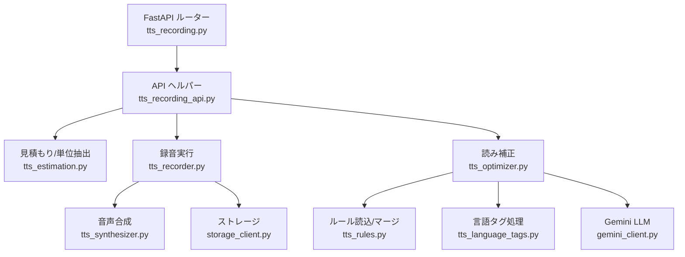
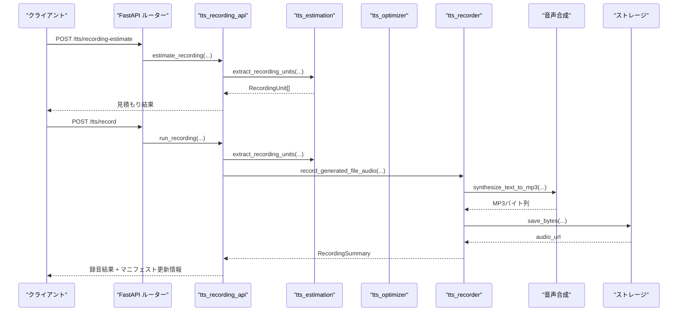
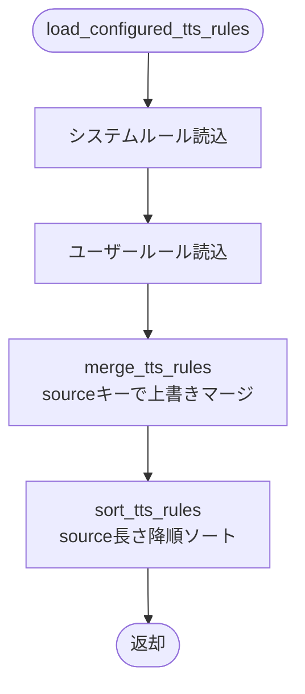
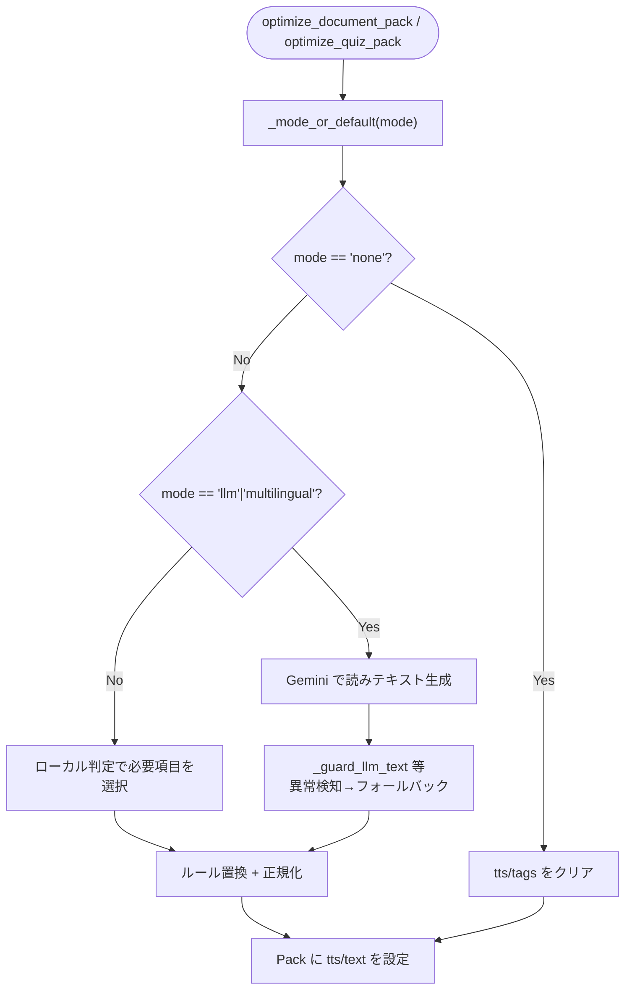
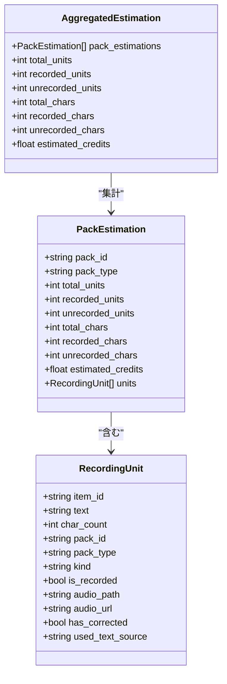
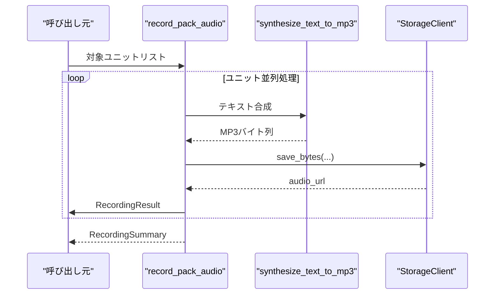
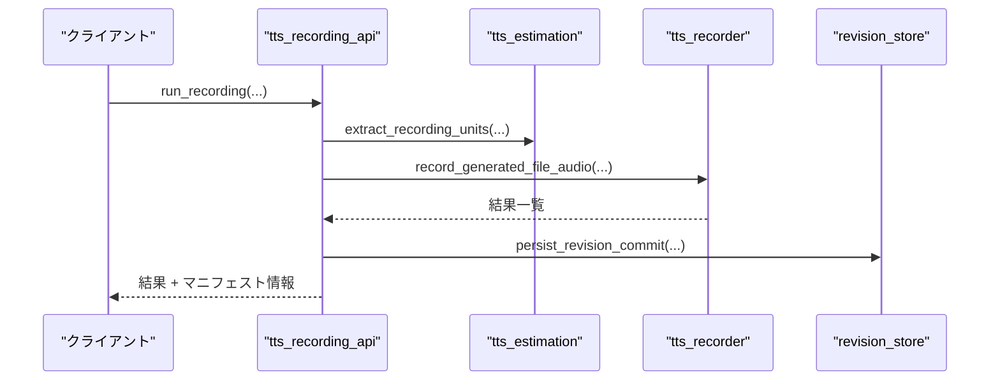
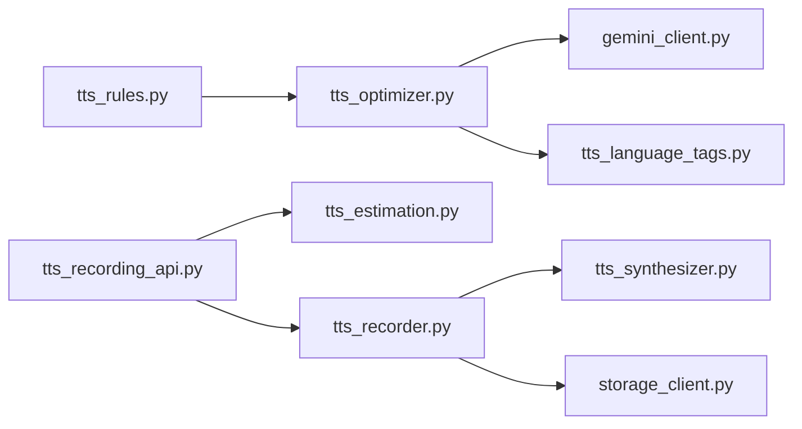

# TTS 録音・読み補正パイプライン

<cite>
**この文書で参照しているファイル**
- [tts_rules.py](file://app/services/tts_rules.py)
- [tts_optimizer.py](file://app/services/tts_optimizer.py)
- [tts_estimation.py](file://app/services/tts_estimation.py)
- [tts_recorder.py](file://app/services/tts_recorder.py)
- [tts_recording_api.py](file://app/services/tts_recording_api.py)
- [tts_recording.py](file://app/routes/tts_recording.py)
- [common.py](file://app/schemas/common.py)
</cite>

## 目次
1. [概要](#概要)
2. [プロジェクト構造と役割分担](#プロジェクト構造と役割分担)
3. [コアコンポーネント](#コアコンポーネント)
4. [アーキテクチャ全体像](#アーキテクチャ全体像)
5. [詳細コンポーネント分析](#詳細コンポーネント分析)
6. [依存関係と結合度](#依存関係と結合度)
7. [パフォーマンス特性](#パフォーマンス特性)
8. [トラブルシューティング](#トラブルシューティング)
9. [結論](#結論)
10. [付録：モード切替と優先順位のクイックリファレンス](#付録モード切替と優先順位のクイックリファレンス)

## 概要
本ドキュメントは、Sokqa Studio の TTS パイプラインにおける「システムルール＞ユーザールールの優先順位」「モード切替」を軸に、以下のモジュールの流れを解説します。

- ルール管理: `tts_rules.py`
- 読み補正とLLM連携: `tts_optimizer.py`
- 録音対象の抽出と見積もり: `tts_estimation.py`
- 音声合成・保存・アセットURL貼付: `tts_recorder.py`
- API層（見積もり/録音/リセット）: `tts_recording_api.py`
- FastAPIルーター: `tts_recording.py`

また、`TtsReadingMode` と設定値によるモード切替が、どの段階でルール適用やLLM呼び出しに影響するかを明確にします。

## プロジェクト構造と役割分担
TTS パイプラインは「ルール定義 → 読み補正 → 録音対象抽出 → 音声合成 → 保存・マニフェスト更新」という流れで構成されます。

**図出典**
- [tts_recording.py:1-61](file://app/routes/tts_recording.py#L1-L61)
- [tts_recording_api.py:54-192](file://app/services/tts_recording_api.py#L54-L192)
- [tts_estimation.py:283-290](file://app/services/tts_estimation.py#L283-L290)
- [tts_recorder.py:96-186](file://app/services/tts_recorder.py#L96-L186)
- [tts_optimizer.py:1808-2043](file://app/services/tts_optimizer.py#L1808-L2043)
- [tts_rules.py:12-73](file://app/services/tts_rules.py#L12-L73)

**セクション出典**
- [tts_recording.py:1-61](file://app/routes/tts_recording.py#L1-L61)
- [tts_recording_api.py:54-192](file://app/services/tts_recording_api.py#L54-L192)

## コアコンポーネント
- ルール管理: システムルールとユーザールールを読み込み、ソース文字列の重複キーでマージしてソートする。
- 読み補正: モードに応じてルールのみ適用、またはLLMによる読みテキスト生成＋ガード処理を行う。
- 録音単位抽出: ドキュメント・クイズパックから録音対象を列挙し、既録音フラグと文字数を算出する。
- 録音実行: 並列合成、MP3保存、Pack JSONへのアセットURL貼付、マニフェスト更新。
- API: 見積もり、録音実行、録音リセットのエンドポイントを提供。

**セクション出典**
- [tts_rules.py:12-73](file://app/services/tts_rules.py#L12-L73)
- [tts_optimizer.py:1808-2043](file://app/services/tts_optimizer.py#L1808-L2043)
- [tts_estimation.py:283-290](file://app/services/tts_estimation.py#L283-L290)
- [tts_recorder.py:96-186](file://app/services/tts_recorder.py#L96-L186)
- [tts_recording_api.py:54-192](file://app/services/tts_recording_api.py#L54-L192)

## アーキテクチャ全体像
TTS パイプラインは、API層から呼び出されるサービス関数群によって構成され、ルールとモードに基づいて読み補正パスと録音パスが選択されます。

**図出典**
- [tts_recording.py:22-48](file://app/routes/tts_recording.py#L22-L48)
- [tts_recording_api.py:54-192](file://app/services/tts_recording_api.py#L54-L192)
- [tts_estimation.py:283-290](file://app/services/tts_estimation.py#L283-L290)
- [tts_recorder.py:96-186](file://app/services/tts_recorder.py#L96-L186)

## 詳細コンポーネント分析

### ルール管理: tts_rules.py
- システムルールとユーザールールを別ファイルから読み込み、同じ `source` キーを持つ場合は後勝ちでマージする。
- ソートは `source` の長さ降順で行い、長い一致を優先する。
- 設定で指定されたパスが存在しない場合や空の場合は警告を出しつつ空ルールとして扱う。

**図出典**
- [tts_rules.py:12-73](file://app/services/tts_rules.py#L12-L73)

**セクション出典**
- [tts_rules.py:12-73](file://app/services/tts_rules.py#L12-L73)

### 読み補正: tts_optimizer.py
- モード決定: `_mode_or_default` で引数モードを設定値でデフォルト化し、`normalize_tts_reading_mode` により `auto` を `llm` に変換する。
- ルール適用: `rule` モードではシステム＋ユーザ＋追加ルールをマージして辞書ベース置換を行う。
- LLM連携: `llm`/`multilingual` モードでは Gemini を呼び出し、読みテキストを生成した後、ガード処理で異常パターンを検知して辞書ベース読みへフォールバックする。
- 言語タグ: `multilingual` モードでは `[ja-JP]` 等のタグを保持・操作し、非デフォルト言語スパンにはルール適用を制限する。

**図出典**
- [tts_optimizer.py:1808-2043](file://app/services/tts_optimizer.py#L1808-L2043)
- [tts_optimizer.py:574-581](file://app/services/tts_optimizer.py#L574-L581)
- [tts_optimizer.py:1668-1685](file://app/services/tts_optimizer.py#L1668-L1685)

**セクション出典**
- [tts_optimizer.py:1808-2043](file://app/services/tts_optimizer.py#L1808-L2043)
- [tts_optimizer.py:574-581](file://app/services/tts_optimizer.py#L574-L581)
- [tts_optimizer.py:1668-1685](file://app/services/tts_optimizer.py#L1668-L1685)
- [common.py:10-10](file://app/schemas/common.py#L10-L10)
- [common.py:50-55](file://app/schemas/common.py#L50-L55)

### 録音単位抽出と見積もり: tts_estimation.py
- ドキュメント・クイズパックから `RecordingUnit` を生成し、各ユニットの文字数・既録音フラグ・使用済みテキストソースを記録する。
- `extract_recording_units` は pack タイプに応じて適切な抽出関数を呼び出す。
- 見積もりは未録音ユニットの文字数合計に単価を乗じてクレジットを推計する。

**図出典**
- [tts_estimation.py:21-66](file://app/services/tts_estimation.py#L21-L66)
- [tts_estimation.py:283-290](file://app/services/tts_estimation.py#L283-L290)
- [tts_estimation.py:293-381](file://app/services/tts_estimation.py#L293-L381)

**セクション出典**
- [tts_estimation.py:21-66](file://app/services/tts_estimation.py#L21-L66)
- [tts_estimation.py:283-290](file://app/services/tts_estimation.py#L283-L290)
- [tts_estimation.py:293-381](file://app/services/tts_estimation.py#L293-L381)

### 録音実行: tts_recorder.py
- `record_generated_file_audio` / `record_pack_audio` が録音の中心ロジック。
- 対象ユニットごとに音声合成を実行し、MP3をストレージに保存またはURLを解決する。
- 成功したユニットの audioPath/audioUrl を Pack JSON に貼付け、`assetBaseUrl` を設定する。
- エラー時は構造化されたエラーコード・メッセージ・提案を返す。

**図出典**
- [tts_recorder.py:96-186](file://app/services/tts_recorder.py#L96-L186)
- [tts_recorder.py:189-238](file://app/services/tts_recorder.py#L189-L238)
- [tts_recorder.py:261-277](file://app/services/tts_recorder.py#L261-L277)

**セクション出典**
- [tts_recorder.py:96-186](file://app/services/tts_recorder.py#L96-L186)
- [tts_recorder.py:189-238](file://app/services/tts_recorder.py#L189-L238)
- [tts_recorder.py:261-277](file://app/services/tts_recorder.py#L261-L277)

### API層: tts_recording_api.py
- `estimate_recording`: 見積もり用。対象Packを読み込み、`extract_recording_units` で単位を抽出し、クレジット推計を返す。
- `run_recording`: 録音実行。対象をチャンク分割して並列録音し、成功したアセットをマニフェストにコミットする。
- `reset_recording`: 録音URL/パスをクリアし、必要に応じてマニフェストを更新する。

**図出典**
- [tts_recording_api.py:54-192](file://app/services/tts_recording_api.py#L54-L192)
- [tts_recording_api.py:195-261](file://app/services/tts_recording_api.py#L195-L261)

**セクション出典**
- [tts_recording_api.py:54-192](file://app/services/tts_recording_api.py#L54-L192)
- [tts_recording_api.py:195-261](file://app/services/tts_recording_api.py#L195-L261)

### FastAPIルーター: tts_recording.py
- `/tts/voices`, `/tts/recording-estimate`, `/tts/record`, `/tts/recording-reset` エンドポイントを公開。
- 例外をHTTPステータスに変換し、フロントエンドへ一貫したレスポンスを返す。

**セクション出典**
- [tts_recording.py:1-61](file://app/routes/tts_recording.py#L1-L61)

## 依存関係と結合度
- `tts_recording_api.py` は `tts_estimation.py` と `tts_recorder.py` に強く依存し、両者を協調させてワークフローを制御する。
- `tts_optimizer.py` は `tts_rules.py` からルールを取得し、`gemini_client.py` や `tts_language_tags.py` 等を介してLLM連携とタグ処理を行う。
- `tts_recorder.py` は `tts_synthesizer.py` と `storage_client.py` に依存し、外部サービスとのI/Oを抽象化する。
- ルールマージは `source` キーでの一意性を前提としており、システムルールとユーザールールの衝突は後勝ちで解決される。

**図出典**
- [tts_rules.py:12-73](file://app/services/tts_rules.py#L12-L73)
- [tts_optimizer.py:1808-2043](file://app/services/tts_optimizer.py#L1808-L2043)
- [tts_recording_api.py:54-192](file://app/services/tts_recording_api.py#L54-L192)
- [tts_recorder.py:96-186](file://app/services/tts_recorder.py#L96-L186)

**セクション出典**
- [tts_rules.py:12-73](file://app/services/tts_rules.py#L12-L73)
- [tts_optimizer.py:1808-2043](file://app/services/tts_optimizer.py#L1808-L2043)
- [tts_recording_api.py:54-192](file://app/services/tts_recording_api.py#L54-L192)
- [tts_recorder.py:96-186](file://app/services/tts_recorder.py#L96-L186)

## パフォーマンス特性
- 録音は `ThreadPoolExecutor` で並列実行され、最大並列度は設定値に基づく。
- LLM呼び出しはバッチ化とチャンク分割を行い、超過サイズの場合でもリトライ付きで安定させる。
- 見積もりは純粋計算のみで外部I/Oを伴わないため高速。

[このセクションは一般的なガイダンスを含むため、特定のファイル解析に基づくものではありません]

## トラブルシューティング
- 録音失敗時のエラー分類: 文が長すぎる場合とそれ以外でエラーコード・メッセージ・提案を分ける。
- LLMフォールバック: ガード処理で想定外の文字体系や編集痕跡を検知した場合、辞書ベース読みへ戻す。
- ルールなし環境: ファイルが見つからない場合や空の場合は警告を出しつつ空ルールとして処理する。

**セクション出典**
- [tts_recorder.py:261-277](file://app/services/tts_recorder.py#L261-L277)
- [tts_optimizer.py:448-504](file://app/services/tts_optimizer.py#L448-L504)
- [tts_rules.py:34-48](file://app/services/tts_rules.py#L34-L48)

## 結論
TTS パイプラインは「ルール管理 → 読み補正 → 録音単位抽出 → 音声合成 → 保存・マニフェスト更新」の明確な階層で構成されています。モード切替により、ルールのみ適用、LLMによる高度な読み補正、多言語タグ対応のいずれかのパスを選択でき、システムルールがユーザールールより優先される設計です。これにより、品質保証と柔軟なカスタマイズを両立しています。

[このセクションは総括であり、特定のファイル解析に基づくものではありません]

## 付録：モード切替と優先順位のクイックリファレンス
- モード定義: `TtsReadingMode = Literal["none", "rule", "llm", "multilingual"]`
- `auto` は内部で `llm` に正規化される。
- ルール優先順位: システムルール ＞ ユーザールール（同じ `source` キーの場合、ユーザールールが上書き）。
- モードごとの動作:
  - `none`: TTSフィールドをクリア。
  - `rule`: システム＋ユーザ＋追加ルールをマージして辞書置換のみ。
  - `llm`: Gemini で読みテキスト生成＋ガード処理。
  - `multilingual`: LLM＋言語タグ保持・操作。

**セクション出典**
- [common.py:10-10](file://app/schemas/common.py#L10-L10)
- [common.py:50-55](file://app/schemas/common.py#L50-L55)
- [tts_rules.py:63-73](file://app/services/tts_rules.py#L63-L73)
- [tts_optimizer.py:1684-1685](file://app/services/tts_optimizer.py#L1684-L1685)
- [tts_optimizer.py:1808-2043](file://app/services/tts_optimizer.py#L1808-L2043)