# デプロイ・CI（Cloud Run / GitHub Actions）とテスト戦略

<cite>
**この文書で参照しているファイル**
- [Dockerfile](file://Dockerfile)
- [.github/workflows/deploy-cloud-run.yml](file://.github/workflows/deploy-cloud-run.yml)
- [.gitignore](file://.gitignore)
- [main.py](file://main.py)
- [tests/conftest.py](file://tests/conftest.py)
- [tests/test_pack_importer.py](file://tests/test_pack_importer.py)
- [tests/test_quality_checker.py](file://tests/test_quality_checker.py)
- [tests/test_tts_synthesizer.py](file://tests/test_tts_synthesizer.py)
- [tests/test_storage_r2.py](file://tests/test_storage_r2.py)
- [tests/test_gemini_client.py](file://tests/test_gemini_client.py)
</cite>

## 更新概要
**変更内容**
- Cloud Run デプロイワークフローのトリガー設定を更新：push トリガーを無効化し、手動実行のみ有効化
- ローカル運用期間中のデプロイポリシーに関する日本語コメントを追加
- GitHub Actions UI からの「Run workflow」ボタンによる手動デプロイ手順を説明
- **.gitignore の更新**: 日本語 repowiki メタデータディレクトリ (.qoder/repowiki/ja/meta/) をバージョン管理から除外する設定を追加

## 目次
1. [導入](#導入)
2. [プロジェクト構造](#プロジェクト構造)
3. [コアコンポーネント](#コアコンポーネント)
4. [アーキテクチャ概要](#アーキテクチャ概要)
5. [詳細コンポーネント分析](#詳細コンポーネント分析)
6. [依存関係分析](#依存関係分析)
7. [パフォーマンス考慮事項](#パフォーマンス考慮事項)
8. [トラブルシューティングガイド](#トラブルシューティングガイド)
9. [結論](#結論)

## 導入
本ドキュメントは、Sokqa Studio の Cloud Run へのデプロイフローと、GitHub Actions による CI/CD、および tests/ 配下の pytest テスト戦略を解説します。具体的には以下の点を明確にします。

- Dockerfile が FastAPI アプリケーションをどのようにコンテナ化し、Cloud Run で実行可能にするか
- .github/workflows/deploy-cloud-run.yml が **手動実行時のみ** Workload Identity を使って GCP に認証し、Cloud Run サービスを更新する流れ
- tests/ 配下のテストが、ローカルストレージやモック LLM、R2 ストレージのスタブなどを使って、生成・品質チェック・TTS・保存系ロジックをどう検証しているか
- バージョン管理システムでの不要なメタデータの除外設定

**更新** 本番リリースまではローカル環境でのみ運用するため、自動デプロイを無効化し、開発者が意図的に手動実行する方式に変更しました。また、ドキュメントシステムの効率化のため、日本語 repowiki メタデータをバージョン管理から除外する設定を追加しました。

## プロジェクト構造
Sokqa Studio は FastAPI ベースのバックエンドと web/index.html の単一ページフロントエンドから構成されます。バックエンドのエントリポイントではルーターをマウントし、静的な生成物ディレクトリを公開しています。

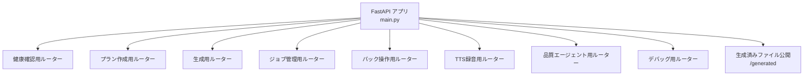

**セクション出典**
- [main.py:11-39](file://main.py#L11-L39)

## コアコンポーネント
- コンテナイメージ: Python slim イメージ上に requirements.txt をインストールし、uvicorn で FastAPI アプリを実行
- デプロイパイプライン: **手動実行時のみ** GitHub Actions から Workload Identity で GCP に認証し、Cloud Run サービスを更新
- テスト基盤: conftest.py で全テスト前に設定をローカルストレージとモック LLM に固定し、外部書き込みを防ぐ
- バージョン管理: .gitignore により不要なメタデータや一時ファイルを除外

**セクション出典**
- [Dockerfile:1-14](file://Dockerfile#L1-L14)
- [.github/workflows/deploy-cloud-run.yml:1-26](file://.github/workflows/deploy-cloud-run.yml#L1-L26)
- [tests/conftest.py:1-15](file://tests/conftest.py#L1-L15)
- [.gitignore:27-29](file://.gitignore#L27-L29)

## アーキテクチャ概要
Cloud Run へのデプロイは、**GitHub Actions UI から手動実行された場合のみ**トリガーされ、Workload Identity Provider を使用してサービスアカウントとして認証後、google-github-actions/deploy-cloudrun で指定サービス名・リージョンへデプロイします。

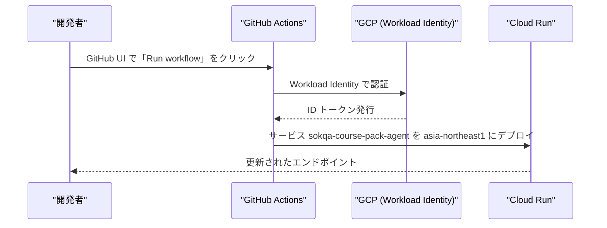

**図出典**
- [.github/workflows/deploy-cloud-run.yml:6-25](file://.github/workflows/deploy-cloud-run.yml#L6-L25)

**セクション出典**
- [.github/workflows/deploy-cloud-run.yml:6-25](file://.github/workflows/deploy-cloud-run.yml#L6-L25)

## 詳細コンポーネント分析

### Dockerfile によるコンテナ化
- ベースイメージ: python:3.12-slim
- 環境変数: PYTHONDONTWRITEBYTECODE=1、PYTHONUNBUFFERED=1
- 依存インストール: requirements.txt を先にコピーして pip install し、キャッシュを活用
- アプリ配置: カレントディレクトリ全体をコピー
- 実行コマンド: uvicorn で main:app を 0.0.0.0:8080 で起動

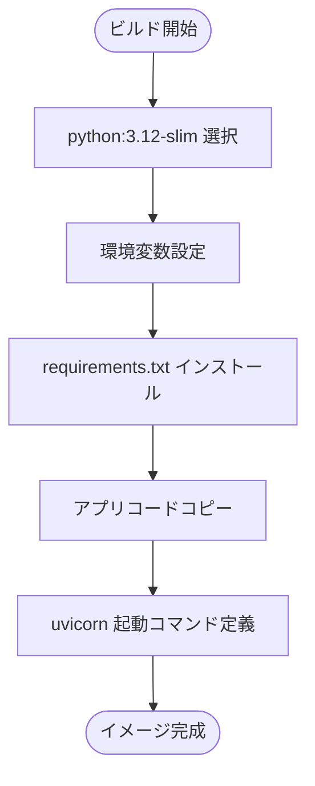

**セクション出典**
- [Dockerfile:1-14](file://Dockerfile#L1-L14)

### Cloud Run デプロイワークフロー
- **トリガー**: workflow_dispatch のみ（push トリガーは無効化）
- **運用方針**: 本番リリースまではローカルのみで運用するため、自動デプロイを停止
- **実行方法**: GitHub Actions UI から「Run workflow」ボタンで手動実行
- 認証: google-github-actions/auth で Workload Identity Provider を使用
- デプロイ: google-github-actions/deploy-cloudrun で service=sokqa-course-pack-agent、region=asia-northeast1

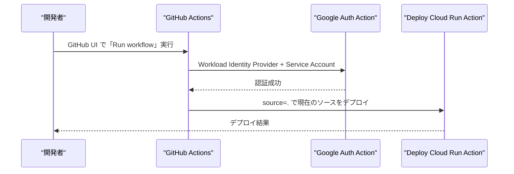

**図出典**
- [.github/workflows/deploy-cloud-run.yml:1-26](file://.github/workflows/deploy-cloud-run.yml#L1-L26)

**セクション出典**
- [.github/workflows/deploy-cloud-run.yml:1-26](file://.github/workflows/deploy-cloud-run.yml#L1-L26)

### バージョン管理設定
- .gitignore により、環境変数ファイル、仮想環境、ログファイル、一時ファイルなどを除外
- AI ツールのメタデータディレクトリ (.trae/, .codex/, .agents/) を除外
- Qoder 関連では `.qoder/` 直下を原則除外しつつ `repowiki/`（content・wiki_plan.yaml）は追跡対象に含め、その中でもツール状態ファイルの `ja/meta/` のみ除外
- 音声ファイル (*.mp3, *.wav, *.ogg, *.m4a) を除外

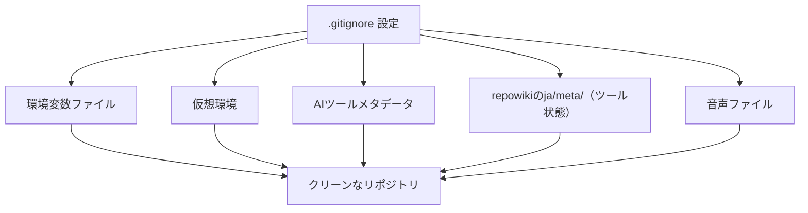

**セクション出典**
- [.gitignore:1-31](file://.gitignore#L1-L31)

### テスト基盤と共通設定
- conftest.py では全テスト前に settings を変更し、Gemini プロバイダを mock、ストレージバックエンドを local、ローカルストレージディレクトリを tmp_path に固定
- これにより、テスト中に実際の R2/GCS やユーザーの packs ディレクトリに書き込まれないよう安全に実行できる

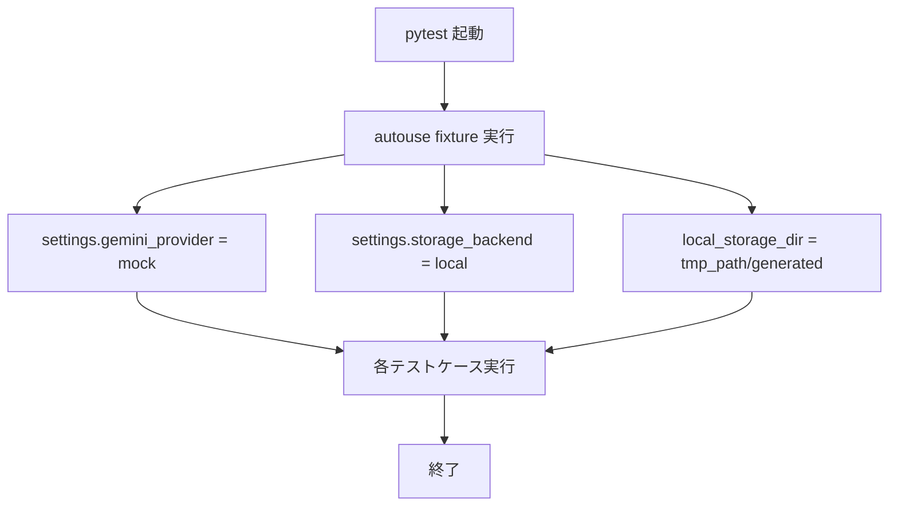

**セクション出典**
- [tests/conftest.py:6-15](file://tests/conftest.py#L6-L15)

### パッケージインポート関連テスト
- /packs/import エンドポイントを TestClient で呼び出し、インポート時の動作を検証
- 音声 URL をクリアしつつ tts.text は保持する挙動を確認
- 既存マニフェストへの追加時、revision が更新され itemOrder が反映されることを確認
- マニフェット編集で項目順序変更と削除を行い、履歴が残ることを確認

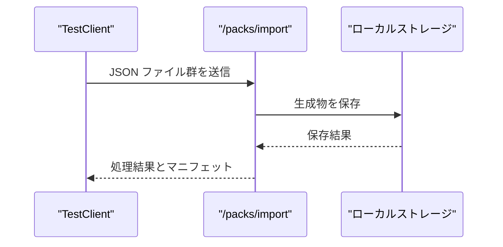

**セクション出典**
- [tests/test_pack_importer.py:21-200](file://tests/test_pack_importer.py#L21-L200)

### 品質チェック関連テスト
- テキスト品質チェックと TTS 品質チェックの両方を TestClient で実行
- モック LLM からのレスポンスに基づき、カテゴリや重大度、位置情報などを検証
- プロンプト生成ロジックの断言も含まれ、多言語モードや正規表現ルール、置換指示などが正しく適用されることを確認

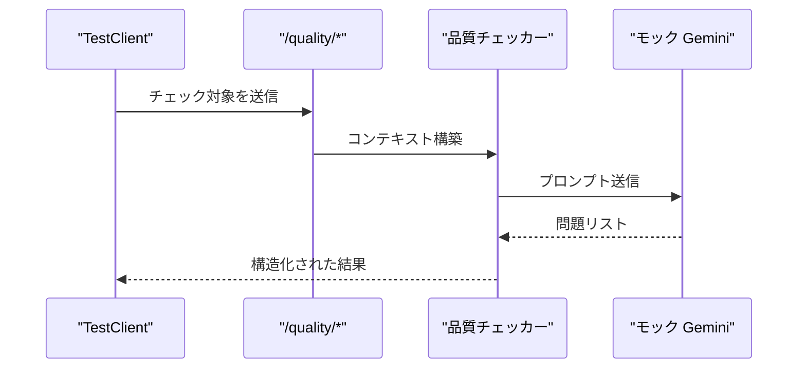

**セクション出典**
- [tests/test_quality_checker.py:102-113](file://tests/test_quality_checker.py#L102-L113)
- [tests/test_quality_checker.py:191-206](file://tests/test_quality_checker.py#L191-L206)

### TTS 合成関連テスト
- _audio_config_kwargs が Chirp3 HD ボイスではピッチを除外し、スピーキングレートを制限する
- Neural2 ボイスではピッチとスピーキングレートをそのまま渡す
- これにより、モデル固有の制約が正しく適用されることを検証

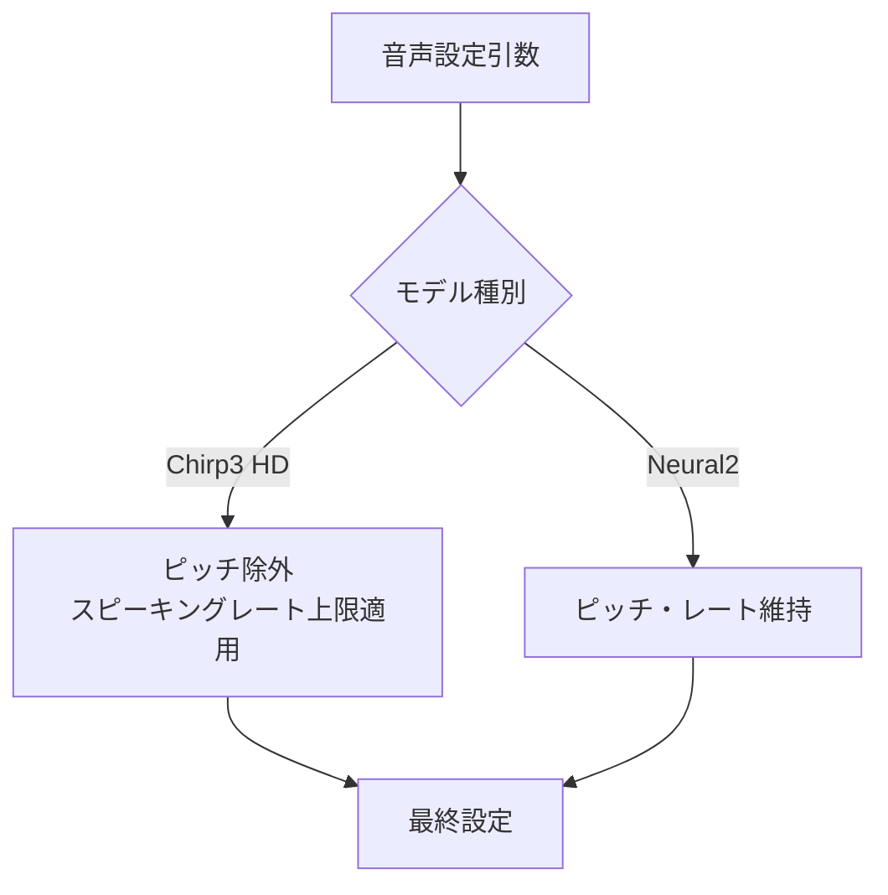

**セクション出典**
- [tests/test_tts_synthesizer.py:4-27](file://tests/test_tts_synthesizer.py#L4-L27)

### R2 ストレージ関連テスト
- boto3 クライアントをスタブ化し、R2 へのオブジェクト保存・読み込み・一覧取得・コピーなどの挙動を検証
- latest.json がない場合や権限エラー、ネットワークエラーが適切に伝播することを確認
- ページネーション処理が正しく複数ページを読み込むことも検証

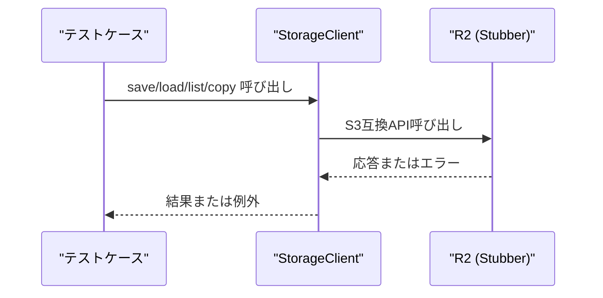

**セクション出典**
- [tests/test_storage_r2.py:26-48](file://tests/test_storage_r2.py#L26-L48)
- [tests/test_storage_r2.py:70-115](file://tests/test_storage_r2.py#L70-L115)
- [tests/test_storage_r2.py:117-147](file://tests/test_storage_r2.py#L117-L147)
- [tests/test_storage_r2.py:189-233](file://tests/test_storage_r2.py#L189-L233)

### Gemini クライアント関連テスト
- JSON レスポンスの解析、囲み付き JSON の抽出、壊れた JSON の修復、失敗時のメタデータ保存
- デバッグプロンプト記録の有効・無効切り替えとバッファクリア
- generate_json で application/json MIME タイプとスキーマが正しく設定されることを確認

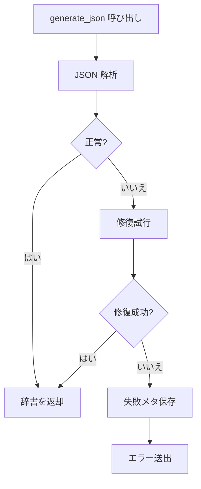

**セクション出典**
- [tests/test_gemini_client.py:20-75](file://tests/test_gemini_client.py#L20-L75)
- [tests/test_gemini_client.py:139-194](file://tests/test_gemini_client.py#L139-L194)

## 依存関係分析
- Dockerfile は requirements.txt に基づいてパッケージをインストールし、uvicorn で FastAPI アプリを実行
- main.py は app/routes 配下のルーターをマウントし、/generated で生成ファイルを公開
- テストは fastapi.testclient を使い、実際の HTTP サーバーなしでエンドポイントを呼び出す
- R2 テストは boto3 Stubber で外部通信をシミュレートし、ネットワークアクセスを伴わない

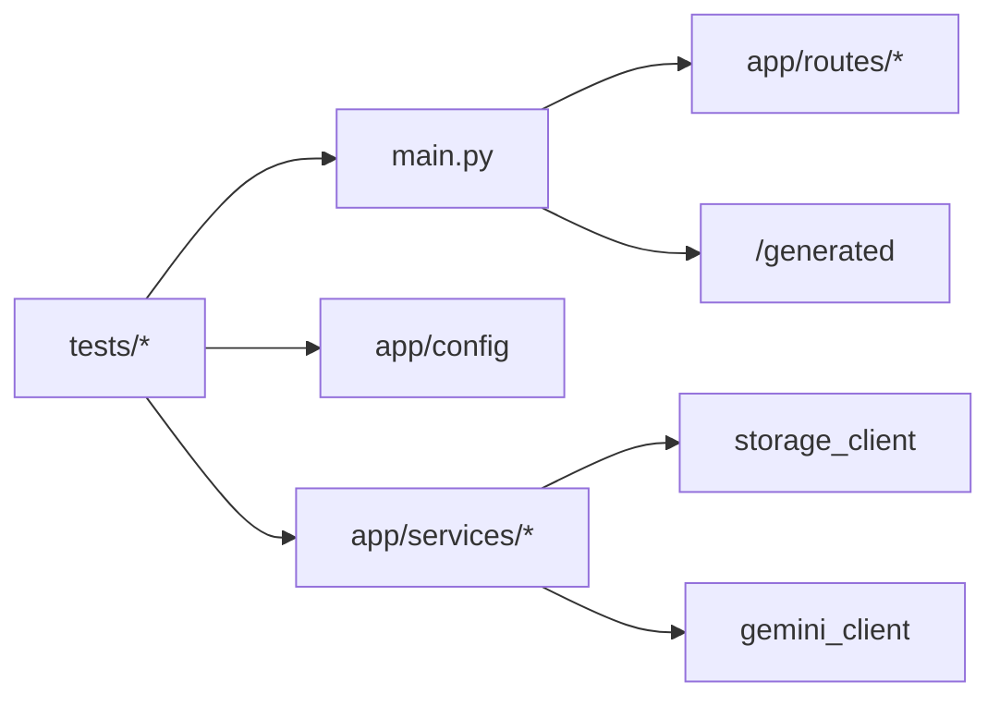

**セクション出典**
- [main.py:22-34](file://main.py#L22-L34)
- [tests/test_storage_r2.py:13-18](file://tests/test_storage_r2.py#L13-L18)
- [tests/test_gemini_client.py:10-17](file://tests/test_gemini_client.py#L10-L17)

## パフォーマンス考慮事項
- Dockerfile では requirements.txt を先にコピーして pip install することでレイヤーキャッシュを活用し、ビルド時間を短縮
- Cloud Run デプロイは最小限のステップで、Workload Identity 経由で安全に認証し、素早くイメージをデプロイ
- テストはローカルストレージとモック LLM を使うため、外部依存による遅延や不安定性を排除
- .gitignore により不要なファイルがコミットされないため、リポジトリサイズと転送時間の最適化

## トラブルシューティングガイド
- **デプロイ失敗の場合**: Workload Identity Provider と Service Account のシークレット設定を確認し、リージョンとサービス名が正しいか確認
- **手動デプロイの実行方法**: GitHub リポジトリの Actions タブから deploy-cloud-run ワークフローを選択し、「Run workflow」ボタンをクリック
- **テスト失敗の場合**: conftest.py で設定されている storage_backend と gemini_provider が意図通り適用されているか確認
- R2 アクセスエラー: テスト内では ClientError が適切に伝播することを確認しており、本番でも同様のエラーハンドリングが必要
- **バージョン管理の問題**: .gitignore 設定により日本語 repowiki メタデータが除外されているため、意図しないメタデータのコミットを防止

**セクション出典**
- [.github/workflows/deploy-cloud-run.yml:11-25](file://.github/workflows/deploy-cloud-run.yml#L11-L25)
- [tests/test_storage_r2.py:117-147](file://tests/test_storage_r2.py#L117-L147)
- [.gitignore:27-29](file://.gitignore#L27-L29)

## 結論
- Dockerfile は FastAPI アプリケーションを簡潔にコンテナ化し、Cloud Run で実行可能な形式に整えています
- GitHub Actions ワークフローは、**本番リリースまでの間、手動実行のみ有効化**し、Workload Identity を使用した安全な認証と、指定サービスへのデプロイを実現しています
- tests/ 配下の pytest テストは、ローカルストレージとモック LLM、R2 スタブを用いて、生成・品質・TTS・保存系のロジックを網羅的に検証しており、外部依存の影響を抑えつつ信頼性の高いテストスイートを提供しています
- **.gitignore の更新**により、日本語 repowiki メタデータを含む不要なファイルが自動的に除外され、リポジトリのクリーンネスと管理の容易さが向上しています
- **運用方針**: 開発中はローカル環境でのみ運用し、本番リリース時に初めて自動デプロイを有効化する計画です