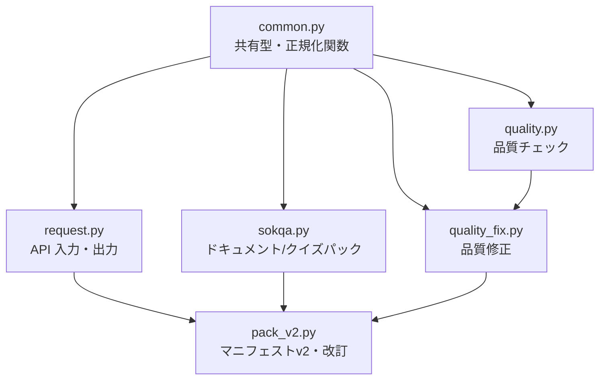
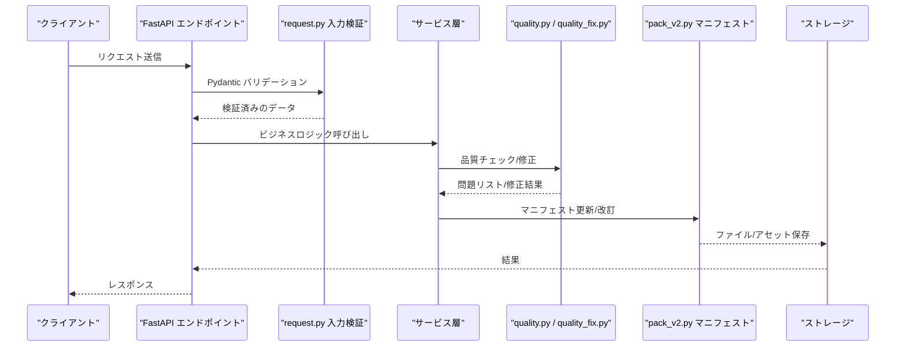
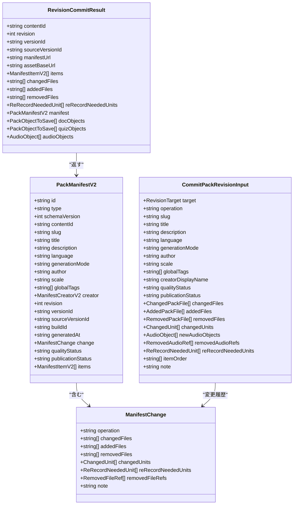
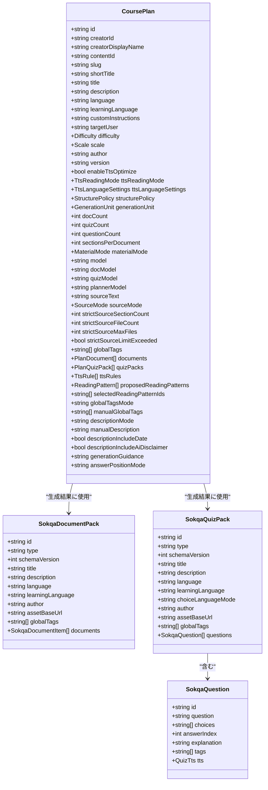
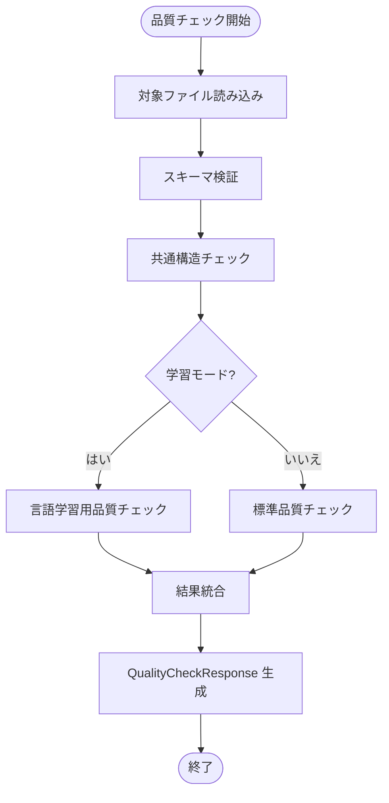
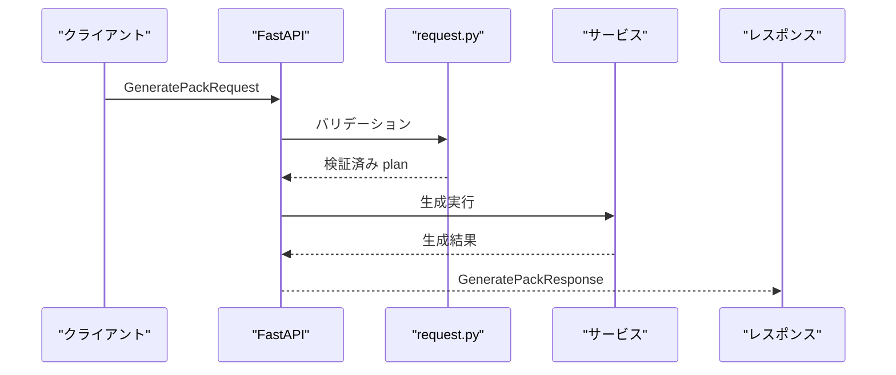
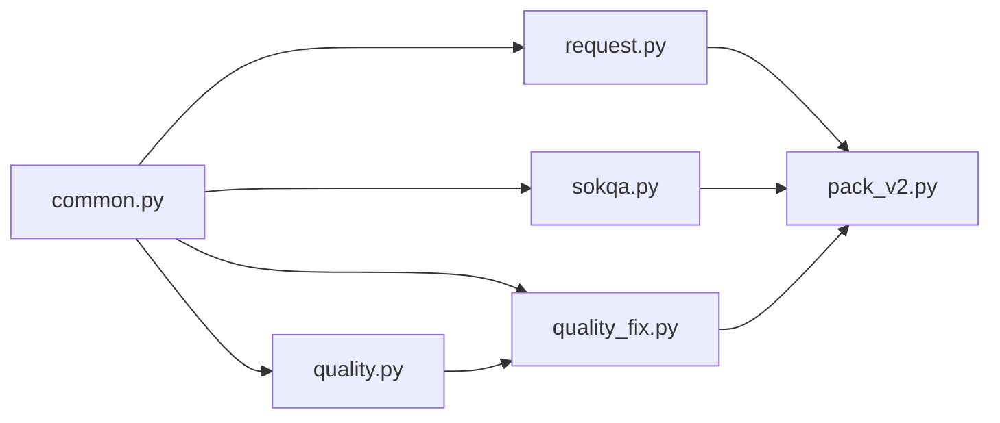

# データスキーマ定義（PackV2 / Sokqa / Quality / Request）

<cite>
**この文書で参照したファイル**
- [app/schemas/common.py](file://app/schemas/common.py)
- [app/schemas/pack_v2.py](file://app/schemas/pack_v2.py)
- [app/schemas/sokqa.py](file://app/schemas/sokqa.py)
- [app/schemas/quality.py](file://app/schemas/quality.py)
- [app/schemas/quality_fix.py](file://app/schemas/quality_fix.py)
- [app/schemas/request.py](file://app/schemas/request.py)
- [app/schemas/pack_sources.py](file://app/schemas/pack_sources.py)
</cite>

## 目次
1. [概要](#概要)
2. [プロジェクト構造とスキーマの役割分担](#プロジェクト構造とスキーマの役割分担)
3. [コアモデル一覧](#コアモデル一覧)
4. [アーキテクチャ概要](#アーキテクチャ概要)
5. [詳細コンポーネント分析](#詳細コンポーネント分析)
6. [依存関係分析](#依存関係分析)
7. [パフォーマンスと検証コスト](#パフォーマンスと検証コスト)
8. [トラブルシューティングガイド](#トラブルシューティングガイド)
9. [結論](#結論)
10. [付録：フィールド制約まとめ](#付録フィールド制約まとめ)

## 概要
本ドキュメントは、app/schemas 配下の Pydantic モデルが表現する「pack」「quiz」「manifest」「quality」「request」のデータ構造と検証ルールを体系的に整理する。特に以下を対象とする。
- PackV2 マニフェストと改訂フロー
- Sokqa ドキュメントパック・クイズパックの構造
- 品質チェック・自動修正の要求・応答モデル
- API リクエスト・レスポンスの共通型とバリデーション

## プロジェクト構造とスキーマの役割分担
- common.py: 共有リテラル型（難度・スケール・TTSモードなど）、言語コード正規化、TtsRule などの基盤型
- pack_v2.py: マニフェスト v2、改訂コミット入力、アセット参照、変更履歴メタ
- sokqa.py: ドキュメントパック・クイズパック本体、生成結果ラッパ、検証結果、TTSレポート
- quality.py: 品質チェックの要求・応答、問題項目の構造
- quality_fix.py: 品質自動修正の要求・応答、適用済み/保留/未適用修正
- request.py: API エンドポイント入出力の主要なリクエスト・レスポンス型
- pack_sources.py: sources.json 出典台帳のスキーマ（参考）

**図のソース**
- [app/schemas/common.py:1-124](file://app/schemas/common.py#L1-L124)
- [app/schemas/request.py:1-537](file://app/schemas/request.py#L1-L537)
- [app/schemas/sokqa.py:1-366](file://app/schemas/sokqa.py#L1-L366)
- [app/schemas/quality.py:1-39](file://app/schemas/quality.py#L1-L39)
- [app/schemas/quality_fix.py:1-109](file://app/schemas/quality_fix.py#L1-L109)
- [app/schemas/pack_v2.py:1-227](file://app/schemas/pack_v2.py#L1-L227)

**セクションのソース**
- [app/schemas/common.py:1-124](file://app/schemas/common.py#L1-L124)
- [app/schemas/request.py:1-537](file://app/schemas/request.py#L1-L537)
- [app/schemas/sokqa.py:1-366](file://app/schemas/sokqa.py#L1-L366)
- [app/schemas/quality.py:1-39](file://app/schemas/quality.py#L1-L39)
- [app/schemas/quality_fix.py:1-109](file://app/schemas/quality_fix.py#L1-L109)
- [app/schemas/pack_v2.py:1-227](file://app/schemas/pack_v2.py#L1-L227)

## コアモデル一覧
- 共通型
  - TtsRule, TtsLanguageSettings, ReadingPattern
  - スケール・難度・生成単位・素材モード・TTS読み取りモードなどのリテラル型
- PackV2
  - ManifestItemV2, PackManifestV2, PackLatestV2
  - RevisionTarget, ChangedPackFile, AddedPackFile, RemovedPackFile
  - CommitPackRevisionInput, RevisionCommitResult
  - AudioObject, RemovedAudioRef, ReRecordNeededUnit
- Sokqa
  - CoursePlan, PlanDocument, PlanQuizPack
  - SokqaDocumentPack, SokqaDocumentItem, DocumentTts
  - SokqaQuizPack, SokqaQuestion, QuizTts
  - GeneratedFile, ValidationResult, ValidationErrorItem
  - TtsReport, TtsReportItem, TtsRevisionDetail
  - GeneratePackResponse, PackRevisionResponse
- Quality
  - QualityCategory, QualitySeverity, QualityLocation, QualityIssue
  - QualityCheckRequest, QualityCheckResponse
- QualityFix
  - AppliedFix, PendingFix, UnappliedFix
  - QualityFixRequest, QualityFixResponse
  - QualityFixApplyRequest, QualityFixApplyResponse
  - QualityFixSaveFile, QualityFixSaveRequest, QualityFixSaveResponse
  - ReRecordNeededUnit
- Request
  - PlanPackRequest, GeneratePackRequest, ValidatePackRequest
  - ImportPackRequest, ImportPackResponse
  - EditPackManifestRequest, EditPackManifestResponse
  - DeletePackRequest, DeletePackResponse
  - OptimizeTtsRequest, ReviseTtsRequest, SaveTtsRulesRequest
  - TtsRecordingTarget, RevisePackTtsRequest, EstimateTtsRecordingRequest, RunTtsRecordingRequest, ResetTtsRecordingRequest
- PackSources
  - PackSourceRef, PackGeneratedBy, PackSourcesFile

**セクションのソース**
- [app/schemas/common.py:1-124](file://app/schemas/common.py#L1-L124)
- [app/schemas/pack_v2.py:1-227](file://app/schemas/pack_v2.py#L1-L227)
- [app/schemas/sokqa.py:1-366](file://app/schemas/sokqa.py#L1-L366)
- [app/schemas/quality.py:1-39](file://app/schemas/quality.py#L1-L39)
- [app/schemas/quality_fix.py:1-109](file://app/schemas/quality_fix.py#L1-L109)
- [app/schemas/request.py:1-537](file://app/schemas/request.py#L1-L537)
- [app/schemas/pack_sources.py:1-36](file://app/schemas/pack_sources.py#L1-L36)

## アーキテクチャ概要
スキーマは「入力検証 → 生成・品質処理 → 保存・マニフェスト更新」の流れで連携する。
- 入力側: request.py がエンドポイント入力を統一的に検証し、common.py の正規化関数で値を標準化
- 内容側: sokqa.py がドキュメント/クイズのコンテンツ構造を厳密に定義し、TTS関連パスや選択肢数を検証
- 品質側: quality.py で問題検出、quality_fix.py で自動修正の提案・適用
- マニフェスト側: pack_v2.py で改訂・アセット参照・変更履歴を管理し、一貫性を保証

**図のソース**
- [app/schemas/request.py:1-537](file://app/schemas/request.py#L1-L537)
- [app/schemas/quality.py:1-39](file://app/schemas/quality.py#L1-L39)
- [app/schemas/quality_fix.py:1-109](file://app/schemas/quality_fix.py#L1-L109)
- [app/schemas/pack_v2.py:1-227](file://app/schemas/pack_v2.py#L1-L227)

## 詳細コンポーネント分析

### PackV2 マニフェストと改訂フロー
- PackManifestV2: パックのマニフェスト。必須ID、バージョン、ビルド情報、変更履歴、品質・公開ステータス、アイテムリストを含む。items の logicalId は一意であることが強制される。
- ManifestChange: 改訂操作の種類、変更/追加/削除されたファイル、ユニット変更、再録音が必要なユニット、削除されたファイル参照、メモ。
- CommitPackRevisionInput: 改訂コミット入力。対象ターゲット、操作種別、メタ更新、ファイル変更、オーディオオブジェクト、ユニット変更、再録音指示、アイテム順序、メモ。
- RevisionCommitResult: 改訂結果。新しいバージョン情報、マニフェストURL、アセットベースURL、変更ファイル一覧、再録音指示、マニフェスト、保存対象オブジェクト。

**図のソース**
- [app/schemas/pack_v2.py:24-227](file://app/schemas/pack_v2.py#L24-L227)

**セクションのソース**
- [app/schemas/pack_v2.py:24-227](file://app/schemas/pack_v2.py#L24-L227)

### Sokqa ドキュメントパック・クイズパック
- CoursePlan: 教材設計プラン。目標・難易度・スケール・言語設定・TTS設定・構造ポリシー・生成単位・ドキュメント/クイズ数・素材モード・モデル指定・グローバルタグ・説明モードなど。
- SokqaDocumentPack/SokqaDocumentItem: ドキュメントパックとその項目。テキスト非空、TTSパス相対性、言語コード正規化。
- SokqaQuizPack/SokqaQuestion: クイズパックとその質問。選択肢数は4、重複なし、正解インデックス範囲、解説非空。
- QuizTts/DocumentTts: TTS関連フィールド。audioPath は相対パスのみ許可。

**図のソース**
- [app/schemas/sokqa.py:38-262](file://app/schemas/sokqa.py#L38-L262)

**セクションのソース**
- [app/schemas/sokqa.py:38-262](file://app/schemas/sokqa.py#L38-L262)

### 品質チェック・自動修正
- QualityIssue: カテゴリ・重大度・信頼度・場所・抜粋・問題説明・提案・原文。
- QualityCheckRequest/Response: チェック対象、最大問題数、結果。
- QualityFixRequest/Response: 自動修正の提案・適用結果、再録音指示、ファイル検証ステータス。
- AppliedFix/PendingFix/UnappliedFix: 修正の分類と状態。

**図のソース**
- [app/schemas/quality.py:1-39](file://app/schemas/quality.py#L1-L39)

**セクションのソース**
- [app/schemas/quality.py:1-39](file://app/schemas/quality.py#L1-L39)
- [app/schemas/quality_fix.py:1-109](file://app/schemas/quality_fix.py#L1-L109)

### API リクエスト・レスポンス
- PlanPackRequest/GeneratePackRequest: 計画生成・パッケージ生成の入力。言語コード正規化、TTSモード正規化、素材モードマッピング。
- ValidatePackRequest/ImportPackRequest: パック検証・インポート。既存宛先時の targetContentId 必須。
- Edit/DeletePackRequest: マニフェメント編集・削除。
- Tts系: Optimize/Revise/Estimate/Run/Reset 各種リクエスト。TtsRecordingTarget は一時生成IDと保存済みパックの排他条件を強制。

**図のソース**
- [app/schemas/request.py:285-397](file://app/schemas/request.py#L285-L397)
- [app/schemas/sokqa.py:333-366](file://app/schemas/sokqa.py#L333-L366)

**セクションのソース**
- [app/schemas/request.py:26-537](file://app/schemas/request.py#L26-L537)
- [app/schemas/sokqa.py:333-366](file://app/schemas/sokqa.py#L333-L366)

### 出典台帳（sources.json）
- PackSourcesFile: スキーマバージョン、出典リスト、生成情報。
- PackSourceRef: 出典名、URL、ライセンス、利用形態、引用許容、帰属必要、メモ。
- PackGeneratedBy: LLM/ドラフト作成者/日付/追加情報。

**セクションのソース**
- [app/schemas/pack_sources.py:1-36](file://app/schemas/pack_sources.py#L1-L36)

## 依存関係分析
- common.py は他のスキーマで広く再利用されるリテラル型と正規化関数を提供。
- request.py は common.py と sokqa.py、pack_v2.py を組み合わせて API 入出力を構成。
- sokqa.py は pack_v2.py のマニフェストを生成結果に含める。
- quality.py は request.py の TtsRecordingTarget を使用。
- quality_fix.py は quality.py と sokqa.py、request.py を組み合わせて修正ワークフローを表現。
- pack_v2.py は変更履歴とアセット参照を一貫して管理。

**図のソース**
- [app/schemas/common.py:1-124](file://app/schemas/common.py#L1-L124)
- [app/schemas/request.py:1-537](file://app/schemas/request.py#L1-L537)
- [app/schemas/sokqa.py:1-366](file://app/schemas/sokqa.py#L1-L366)
- [app/schemas/quality.py:1-39](file://app/schemas/quality.py#L1-L39)
- [app/schemas/quality_fix.py:1-109](file://app/schemas/quality_fix.py#L1-L109)
- [app/schemas/pack_v2.py:1-227](file://app/schemas/pack_v2.py#L1-L227)

**セクションのソース**
- [app/schemas/common.py:1-124](file://app/schemas/common.py#L1-L124)
- [app/schemas/request.py:1-537](file://app/schemas/request.py#L1-L537)
- [app/schemas/sokqa.py:1-366](file://app/schemas/sokqa.py#L1-L366)
- [app/schemas/quality.py:1-39](file://app/schemas/quality.py#L1-L39)
- [app/schemas/quality_fix.py:1-109](file://app/schemas/quality_fix.py#L1-L109)
- [app/schemas/pack_v2.py:1-227](file://app/schemas/pack_v2.py#L1-L227)

## パフォーマンスと検証コスト
- Pydantic バリデーションは JSON 解析と同時に実行され、エラー発生時に即座に拒否するため、後段での無駄な処理を防ぐ。
- 大規模なファイルや多数のユニットを含む場合、品質チェックの件数制限（maxIssues）により応答サイズと処理時間を抑制。
- マニフェストの logicalId 一意性チェックは O(n) であり、アイテム数が増加しても実用上の問題になりにくい。
- TTSパスの相対性チェックは文字列処理のため軽量。

[このセクションでは具体的なファイル解析を行わないため、ソースは記載しない]

## トラブルシューティングガイド
- 言語コード不正: validate_language_code で BCP-47 風コード以外を拒否。ja/en/ko/pt-BR/es-419 などが想定。
- 選択肢数・正解インデックス: SokqaQuestion で choices が4つ、answerIndex が0〜3、重複なし、解説非空。
- TTSパス不正: audioPath は相対パスのみ。絶対パスや URL スキーム、.. を禁止。
- 一時生成ID制約: TtsRecordingTarget で temporaryGenerationId を使う場合、保存済みパックとの併用不可かつ creatorId 必須。
- インポート時既存宛先: destination="existing" のとき targetContentId 必須。
- マニフェスト logicalId 重複: PackManifestV2 で items の logicalId が重複するとエラー。

**セクションのソース**
- [app/schemas/common.py:31-41](file://app/schemas/common.py#L31-L41)
- [app/schemas/sokqa.py:218-239](file://app/schemas/sokqa.py#L218-L239)
- [app/schemas/sokqa.py:26-35](file://app/schemas/sokqa.py#L26-L35)
- [app/schemas/request.py:499-507](file://app/schemas/request.py#L499-L507)
- [app/schemas/request.py:421-425](file://app/schemas/request.py#L421-L425)
- [app/schemas/pack_v2.py:94-99](file://app/schemas/pack_v2.py#L94-L99)

## 結論
app/schemas 配下の Pydantic モデルは、pack/quiz/manifest/quality/request の各領域で明確な境界を持ち、共通型と正規化関数を通じて整合性を担保している。これにより、生成・品質・保存の各段階で堅牢な検証が行われ、マニフェスト改訂とアセット参照の一貫性が保たれる。運用時は言語コード・TTSパス・選択肢数・logicalId 一意性などに注意し、エラーメッセージを活用して迅速に対応できる。

[このセクションでは具体的なファイル解析を行わないため、ソースは記載しない]

## 付録：フィールド制約まとめ
- 言語コード: BCP-47 風コードのみ許可、一部正規化
- TTS読み取りモード: none/rule/llm/multilingual、auto は llm にマッピング
- 素材モード: reference/source_only/strict、document_reference/document_only はマッピング
- 構造ポリシー: listening/summary/reading/japanese_learning/standard、standard/sequential は summary にマッピング
- 難度: beginner/standard/advanced
- スケール: quick/standard/auto/large
- 生成単位: document/quiz/pack
- TTSルール: source/reading/note の長さ制限
- クイズ質問: choices=4、answerIndex 0-3、重複なし、解説非空
- TTSパス: 相対パスのみ、URL/..禁止
- マニフェスト: logicalId 一意、revision>=1、versionId/buildId/generatedAt 必須
- インポート: existing 宛先には targetContentId 必須
- 一時生成ID: creatorId 必須、保存済みパックと併用不可

**セクションのソース**
- [app/schemas/common.py:7-84](file://app/schemas/common.py#L7-L84)
- [app/schemas/common.py:86-116](file://app/schemas/common.py#L86-L116)
- [app/schemas/sokqa.py:218-239](file://app/schemas/sokqa.py#L218-L239)
- [app/schemas/sokqa.py:26-35](file://app/schemas/sokqa.py#L26-L35)
- [app/schemas/pack_v2.py:70-99](file://app/schemas/pack_v2.py#L70-L99)
- [app/schemas/request.py:421-425](file://app/schemas/request.py#L421-L425)
- [app/schemas/request.py:499-507](file://app/schemas/request.py#L499-L507)