# バックエンド API 構成（FastAPI ルーター）

<cite>
**本ドキュメントで参照したファイル**
- [main.py](file://main.py)
- [health.py](file://app/routes/health.py)
- [plan.py](file://app/routes/plan.py)
- [generate.py](file://app/routes/generate.py)
- [jobs.py](file://app/routes/jobs.py)
- [packs.py](file://app/routes/packs.py)
- [tts_recording.py](file://app/routes/tts_recording.py)
- [quality_agents.py](file://app/routes/quality_agents.py)
- [debug.py](file://app/routes/debug.py)
</cite>

## 目次
1. [概要](#概要)
2. [プロジェクト構造とルーターの役割](#プロジェクト構造とルーターの役割)
3. [コアコンポーネント一覧](#コアコンポーネント一覧)
4. [アーキテクチャ全体図](#アーキテクチャ全体図)
5. [詳細コンポーネント分析](#詳細コンポーネント分析)
6. [依存関係分析](#依存関係分析)
7. [パフォーマンス考慮事項](#パフォーマンス考慮事項)
8. [トラブルシューティングガイド](#トラブルシューティングガイド)
9. [結論](#結論)

## 概要
Sokqa Studio は FastAPI ベースのバックエンドであり、教材パックの「設計→生成→品質チェック・修正→TTS録音→Pack共有」を支援するAPIを提供します。本ドキュメントでは、`main.py` と `app/routes` 配下の各ルーター（health, plan, generate, jobs, packs, tts_recording, quality_agents, debug）の責務と公開エンドポイントの一覧を整理し、呼び出しの流れやエラーハンドリング方針も併せて説明します。

## プロジェクト構造とルーターの役割
`main.py` で FastAPI アプリケーションを定義し、`app.routes` 配下のルーターをマウントしています。また、起動時に実行時の設定をログ出力し、`/generated` に生成ファイルを静的に公開しています。

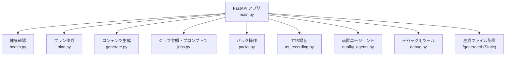

**図出典**
- [main.py:11-39](file://main.py#L11-L39)

**セクション出典**
- [main.py:11-39](file://main.py#L11-L39)

## コアコンポーネント一覧
| ルーター | タグ | 主な責務 | 主要エンドポイント |
|---|---|---|---|
| health | health | サービスの死活監視 | GET /health |
| plan | planning | パックの計画（CoursePlan）作成、条件提案 | POST /plan-pack, POST /api/plan-suggest-conditions |
| generate | generation | コンテンツ生成の実行 | POST /generate-pack |
| jobs | jobs | ジョブ結果取得、マニフェスト取得、プロンプトZIPダウンロード | GET /jobs/{job_id}, GET /jobs/{job_id}/manifest, GET /jobs/{job_id}/prompts/download |
| packs | packs | パック一覧・ファイル取得、インポート、マニフェット編集、削除、TTSルール改訂、JSON ZIPエクスポート | GET /packs, GET /packs/file, POST /packs/import, POST /packs/edit-manifest, POST /packs/delete, POST /packs/revise-tts, POST /packs/export-json-zip |
| tts_recording | tts-recording | TTSボイス一覧、録音見積もり、録音実行、録音リセット | GET /tts/voices, POST /tts/recording-estimate, POST /tts/record, POST /tts/recording-reset |
| quality_agents | quality-agents | テキスト/TTSの品質チェック、修正案生成・適用、バージョン保存 | POST /quality/text-check, POST /quality/tts-check, POST /quality/text-fix, POST /quality/text-fix/apply, POST /quality/tts-fix, POST /quality/tts-fix/llm, POST /quality/save-version |
| debug | debug | ファイル検証・修復、TTS最適化、TTSルール管理、Gemini接続テスト | POST /debug/validate-pack, POST /debug/repair-pack, POST /debug/optimize-tts, POST /debug/revise-tts, GET /debug/tts-rules, PUT /debug/tts-rules, GET /debug/test-gemini |

**セクション出典**
- [health.py:1-10](file://app/routes/health.py#L1-L10)
- [plan.py:1-23](file://app/routes/plan.py#L1-L23)
- [generate.py:1-25](file://app/routes/generate.py#L1-L25)
- [jobs.py:1-88](file://app/routes/jobs.py#L1-L88)
- [packs.py:1-96](file://app/routes/packs.py#L1-L96)
- [tts_recording.py:1-61](file://app/routes/tts_recording.py#L1-L61)
- [quality_agents.py:1-145](file://app/routes/quality_agents.py#L1-L145)
- [debug.py:1-68](file://app/routes/debug.py#L1-L68)

## アーキテクチャ全体図
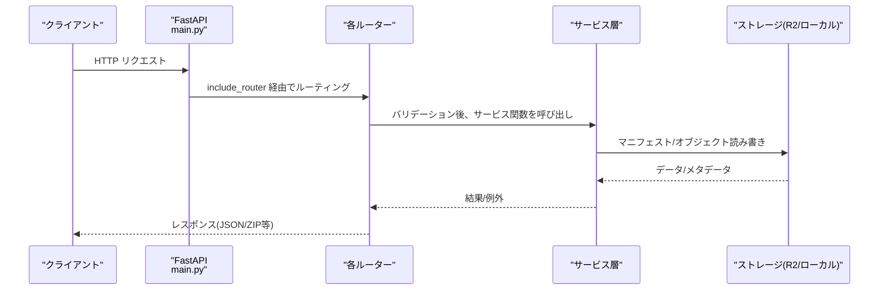

**図出典**
- [main.py:22-34](file://main.py#L22-L34)
- [packs.py:20-43](file://app/routes/packs.py#L20-L43)
- [jobs.py:15-28](file://app/routes/jobs.py#L15-L28)

## 詳細コンポーネント分析

### health ルーター
- 責務: シンプルなヘルスチェックエンドポイントを提供し、外部モニタリングやロードバランサによる死活判定に利用されます。
- エンドポイント:
  - GET /health → 正常系は {"status": "ok"} を返す。

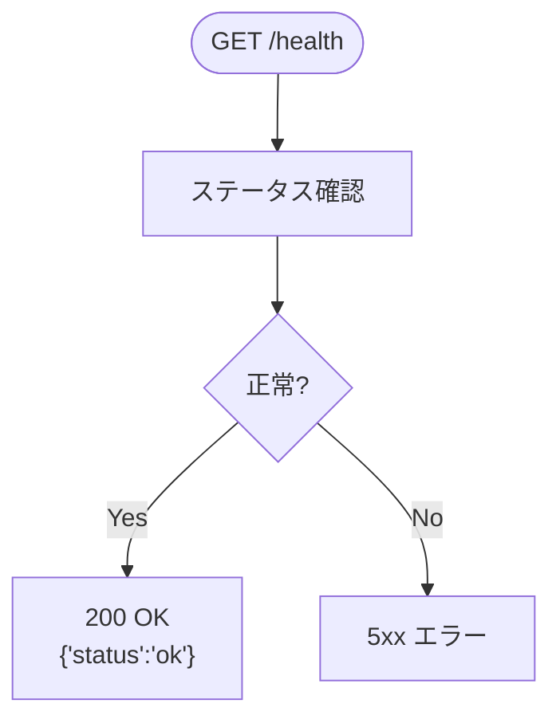

**図出典**
- [health.py:7-9](file://app/routes/health.py#L7-L9)

**セクション出典**
- [health.py:1-10](file://app/routes/health.py#L1-L10)

### plan ルーター
- 責務: パックの学習計画（コースプラン）を作成し、条件提案を支援します。
- エンドポイント:
  - POST /plan-pack → CoursePlan を返す
  - POST /api/plan-suggest-conditions → 条件候補を返す（失敗時は 503）

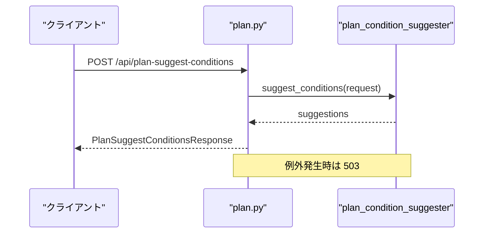

**図出典**
- [plan.py:17-22](file://app/routes/plan.py#L17-L22)

**セクション出典**
- [plan.py:1-23](file://app/routes/plan.py#L1-L23)

### generate ルーター
- 責務: コンテンツ生成を実行します。内部では戦略パターンにより生成処理を解決し、フォールバック文書の破損を検知した場合、安全のために中断して 502 を返します。
- エンドポイント:
  - POST /generate-pack → GeneratePackResponse を返す

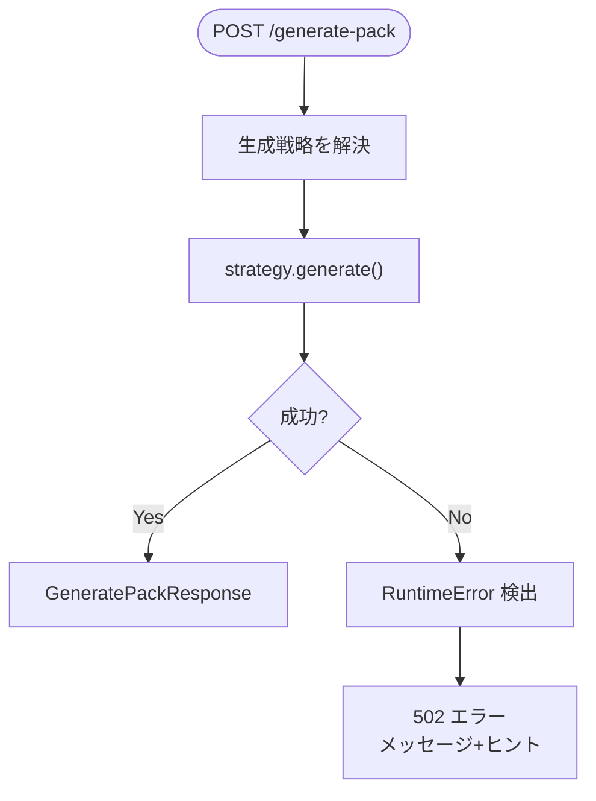

**図出典**
- [generate.py:11-24](file://app/routes/generate.py#L11-L24)

**セクション出典**
- [generate.py:1-25](file://app/routes/generate.py#L1-L25)

### jobs ルーター
- 責務: 生成ジョブの結果取得、マニフェスト取得、デバッグ用プロンプトのZIPダウンロードを提供します。
- エンドポイント:
  - GET /jobs/{job_id} → ジョブ結果
  - GET /jobs/{job_id}/manifest → マニフェスト
  - GET /jobs/{job_id}/prompts/download → プロンプト全文をZIPでダウンロード（DEBUG_PROMPTS_ENABLED が有効な場合のみ意味を持つ）

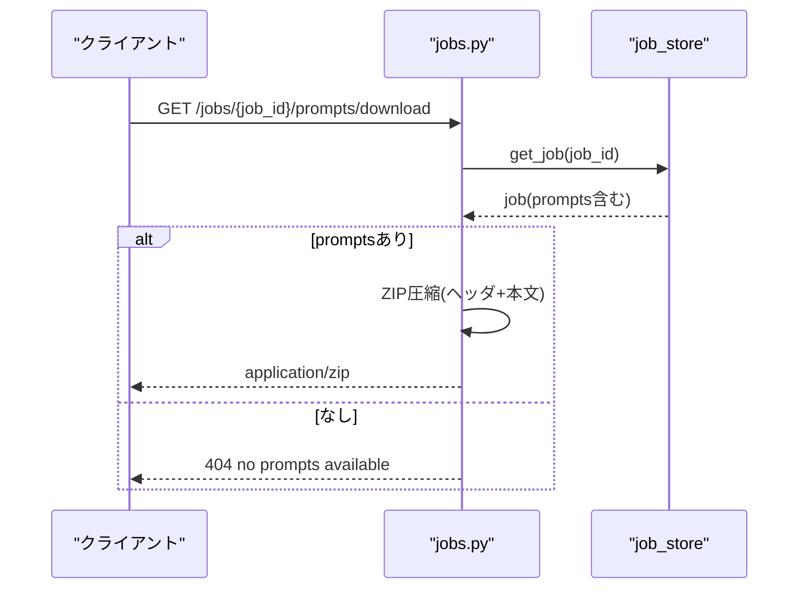

**図出典**
- [jobs.py:66-87](file://app/routes/jobs.py#L66-L87)

**セクション出典**
- [jobs.py:1-88](file://app/routes/jobs.py#L1-L88)

### packs ルーター
- 責務: パックの一覧表示、ファイル取得、インポート、マニフェスト編集、削除、TTSルール改訂、JSON ZIPエクスポートを行います。R2(Cloudflare)との統合やローカルのドラフト源に対する操作をラップします。
- エンドポイント:
  - GET /packs → パック一覧（キャッシュ制御付き）
  - GET /packs/file → マニフェストから対象ファイルを取得
  - POST /packs/import → パックファイルのインポート
  - POST /packs/edit-manifest → マニフェスト編集
  - POST /packs/delete → パックバージョン削除
  - POST /packs/revise-tts → TTSルール改訂
  - POST /packs/export-json-zip → JSON ZIPエクスポート

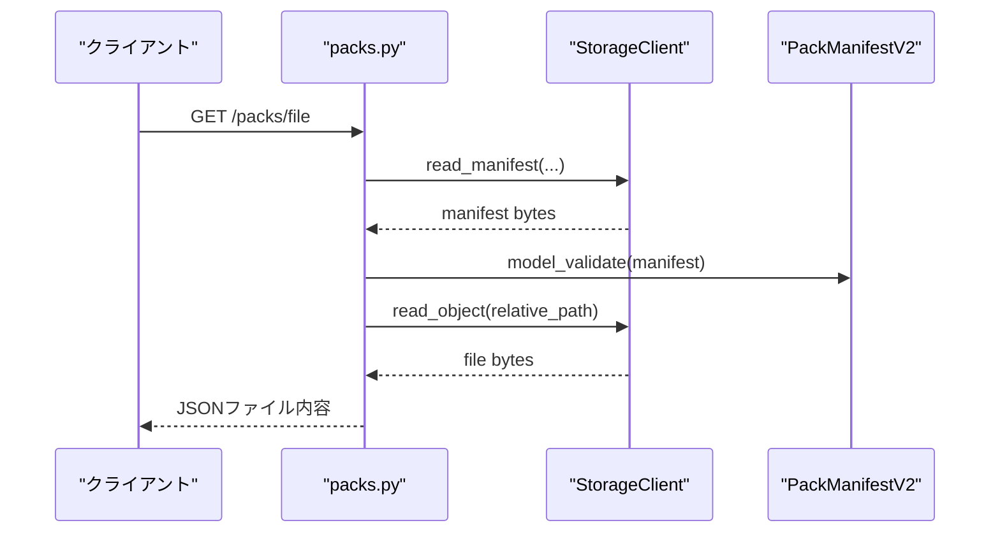

**図出典**
- [packs.py:29-43](file://app/routes/packs.py#L29-L43)

**セクション出典**
- [packs.py:1-96](file://app/routes/packs.py#L1-L96)

### tts_recording ルーター
- 責務: Google Cloud Text-to-Speech のボイス一覧取得、録音見積もり、録音実行、録音リセットを提供します。
- エンドポイント:
  - GET /tts/voices → ボイス一覧
  - POST /tts/recording-estimate → 録音見積もり
  - POST /tts/record → 録音実行
  - POST /tts/recording-reset → 録音リセット（エイリアスとして /recording_reset, /reset-recording も提供）

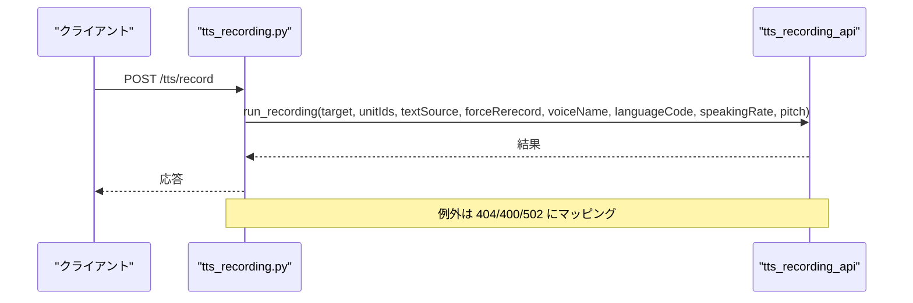

**図出典**
- [tts_recording.py:32-48](file://app/routes/tts_recording.py#L32-L48)

**セクション出典**
- [tts_recording.py:1-61](file://app/routes/tts_recording.py#L1-L61)

### quality_agents ルーター
- 責務: テキストおよびTTSの品質チェック、修正案の生成・適用、変更のバージョン保存を行います。
- エンドポイント:
  - POST /quality/text-check → テキスト品質チェック
  - POST /quality/tts-check → TTS品質チェック
  - POST /quality/text-fix → テキスト修正案生成
  - POST /quality/text-fix/apply → テキスト修正案適用
  - POST /quality/tts-fix → TTS修正案生成
  - POST /quality/tts-fix/llm → LLMを用いたTTS修正案生成
  - POST /quality/save-version → 変更をバージョン保存

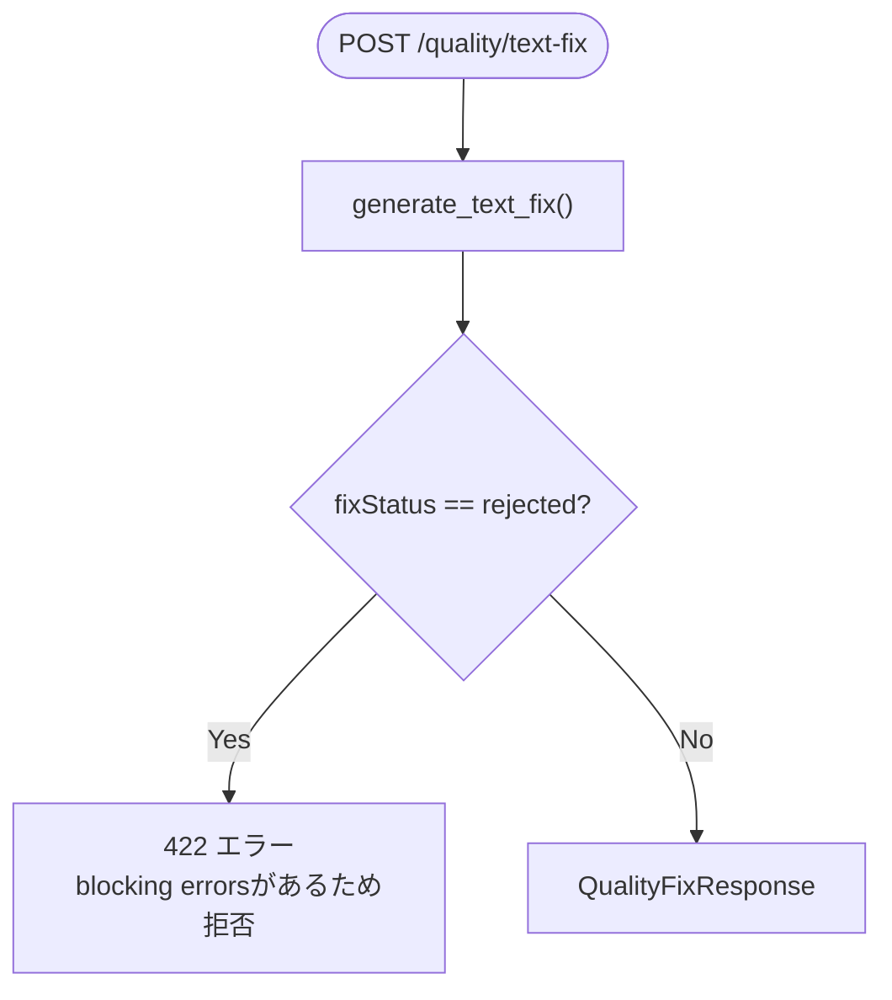

**図出典**
- [quality_agents.py:60-76](file://app/routes/quality_agents.py#L60-L76)

**セクション出典**
- [quality_agents.py:1-145](file://app/routes/quality_agents.py#L1-L145)

### debug ルーター
- 責務: ファイル検証・修復、TTS最適化、TTSルール管理、Gemini接続テストなど、開発・運用支援のためのデバッグ用APIを提供します。
- エンドポイント:
  - POST /debug/validate-pack → ファイル検証
  - POST /debug/repair-pack → ファイル修復
  - POST /debug/optimize-tts → TTS最適化
  - POST /debug/revise-tts → ジョブのTTS改訂
  - GET /debug/tts-rules → システムTTSルール取得
  - PUT /debug/tts-rules → システムTTSルール保存
  - GET /debug/test-gemini → Gemini接続テスト

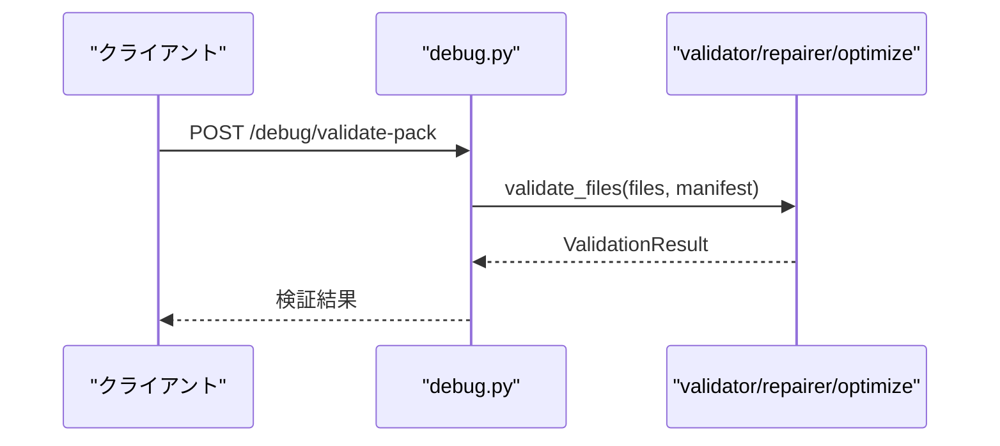

**図出典**
- [debug.py:24-27](file://app/routes/debug.py#L24-L27)

**セクション出典**
- [debug.py:1-68](file://app/routes/debug.py#L1-L68)

## 依存関係分析
- main.py は各ルーターを include_router しており、アプリケーションのエントリポイントとして機能します。
- 各ルーターは app.schemas.request および app.schemas.sokqa などのスキーマ型を使用して入出力を明示し、app.services 配下のビジネスロジックを呼び出します。
- packs, jobs, tts_recording, quality_agents, debug はいずれもストレージや外部サービス（R2、Google TTS、Gemini）へのアクセスを伴うため、ネットワークI/Oや外部依存のエラーがHTTPステータコードにマッピングされています。

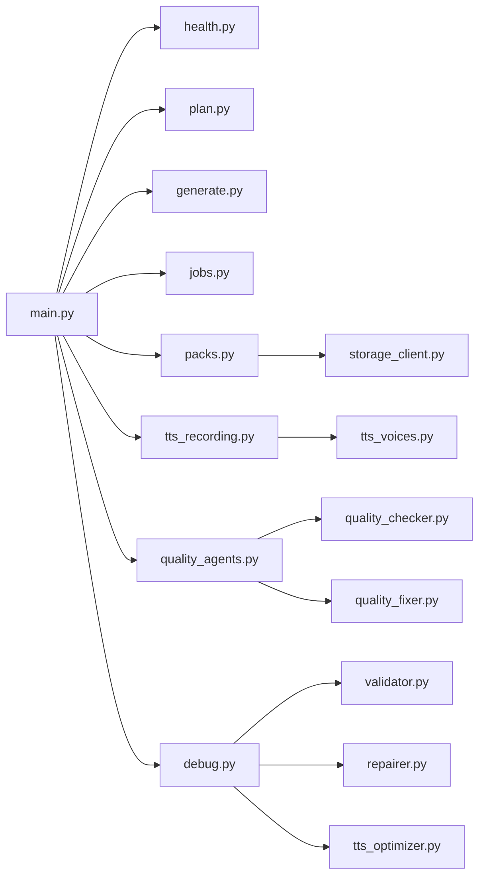

**図出典**
- [main.py:22-29](file://main.py#L22-L29)
- [packs.py:7-14](file://app/routes/packs.py#L7-L14)
- [tts_recording.py:3-5](file://app/routes/tts_recording.py#L3-L5)
- [quality_agents.py:12-22](file://app/routes/quality_agents.py#L12-L22)
- [debug.py:13-18](file://app/routes/debug.py#L13-L18)

**セクション出典**
- [main.py:22-29](file://main.py#L22-L29)
- [packs.py:7-14](file://app/routes/packs.py#L7-L14)
- [tts_recording.py:3-5](file://app/routes/tts_recording.py#L3-L5)
- [quality_agents.py:12-22](file://app/routes/quality_agents.py#L12-L22)
- [debug.py:13-18](file://app/routes/debug.py#L13-L18)

## パフォーマンス考慮事項
- キャッシュ制御: `/packs` ではレスポンスヘッダーに `Cache-Control: no-store` を設定し、常に最新状態を取得するよう強制しています。これにより、リスト表示の鮮度を保証できます。
- ストリーミング: プロンプトZIPダウンロードはストリーミングレスポンスで実装されており、大量のプロンプトを含む場合でもメモリ効率よく送信できます。
- 外部依存: TTSボイス一覧やGemini接続テストは外部サービスへの通信を伴うため、タイムアウトや一時的な障害に対して 502 エラーを返す設計です。フロントエンド側での再試行やユーザーへのフィードバックが必要です。

[このセクションは一般的なパフォーマンス考慮事項を示しており、特定のファイル解析に基づくものではありません]

## トroubleシューティングガイド
- 404 エラー: ジョブが見つからない場合、またはパックファイルが存在しない場合に発生します。該当IDの確認と、生成フローの完了状況を確認してください。
- 400 エラー: リクエストパラメータのバリデーション失敗時（例：言語コードの長さ不足、不正な値）。入力値を見直してください。
- 422 エラー: 品質修正案がブロックするエラーを含んでいるため拒否された場合。修正案の詳細を確認し、問題のある箇所を修正してから再適用してください。
- 502 エラー: 外部サービス（TTS/Gemini）や内部生成プロセスで予期せぬエラーが発生した場合。少し時間を置いて再生成するか、条件を変更して再試行してください。
- 503 エラー: 計画条件提案で内部エラーが発生した場合。環境設定や外部サービスの可用性を確認してください。

**セクション出典**
- [jobs.py:15-28](file://app/routes/jobs.py#L15-L28)
- [packs.py:20-43](file://app/routes/packs.py#L20-L43)
- [tts_recording.py:11-19](file://app/routes/tts_recording.py#L11-L19)
- [quality_agents.py:28-41](file://app/routes/quality_agents.py#L28-L41)
- [generate.py:11-24](file://app/routes/generate.py#L11-L24)
- [plan.py:17-22](file://app/routes/plan.py#L17-L22)

## 結論
本ドキュメントでは、`main.py` と `app/routes` 配下の各ルーターの責務とエンドポイントを整理しました。FastAPI アプリケーションは明確にモジュール分割されており、各ルーターが特定フェーズのAPIを提供することで、教材制作フロー全体をシームレスにサポートしています。外部サービスとの連携部分では適切なエラーハンドリングが行われており、運用面でも監視・デバッグ用のエンドポイントが用意されています。

[このセクションは総括であり、特定のファイル解析に基づくものではありません]