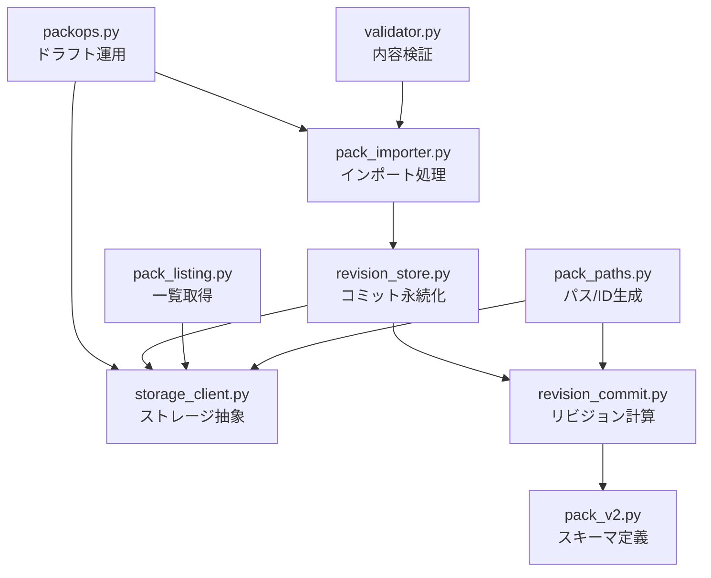
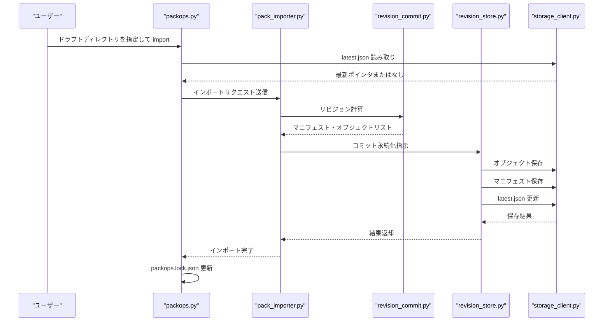
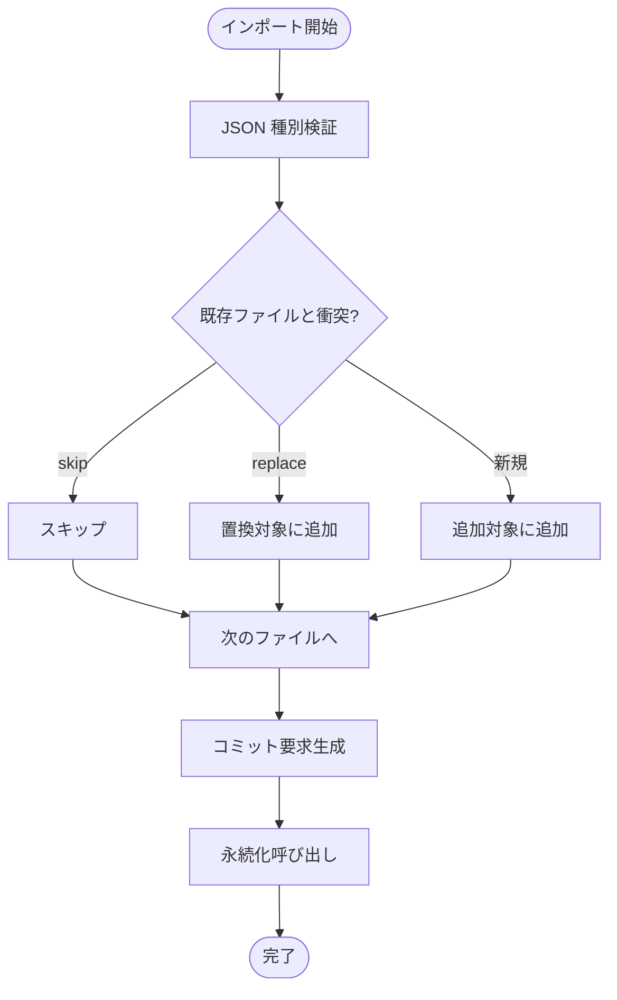
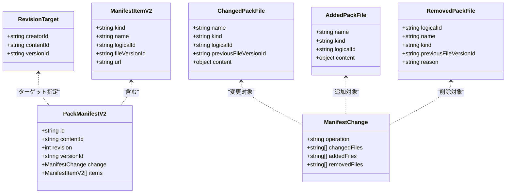
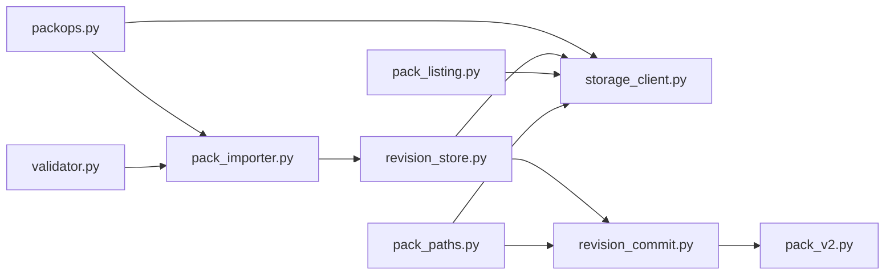
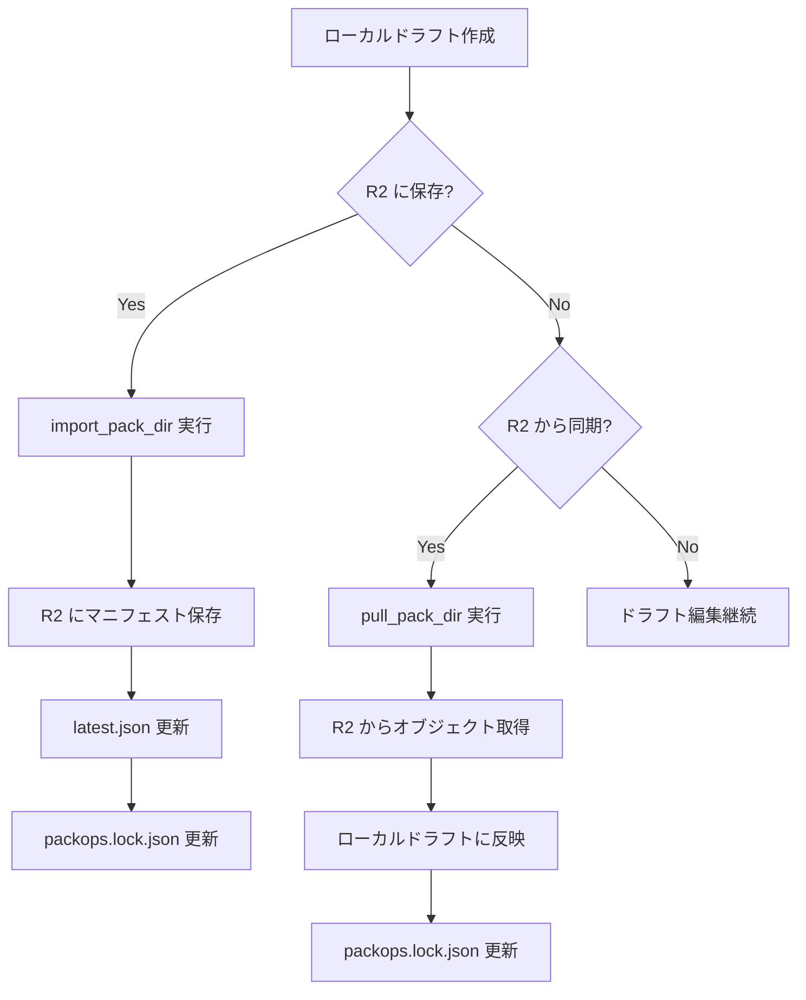

# パック保存・リビジョン管理・R2同期運用

<cite>
**この文書で参照したファイル**
- [pack_importer.py](file://app/services/pack_importer.py)
- [pack_listing.py](file://app/services/pack_listing.py)
- [revision_store.py](file://app/services/revision_store.py)
- [revision_commit.py](file://app/services/revision_commit.py)
- [storage_client.py](file://app/services/storage_client.py)
- [packops.py](file://app/services/packops.py)
- [pack_v2.py](file://app/schemas/pack_v2.py)
- [pack_paths.py](file://app/services/pack_paths.py)
- [validator.py](file://app/services/validator.py)
- [packops.lock.json](file://packs/pm_zeroichi_v1/packops.lock.json)
</cite>

## 目次
1. [概要](#概要)
2. [プロジェクト構造と役割分担](#プロジェクト構造と役割分担)
3. [コアコンポーネント](#コアコンポーネント)
4. [アーキテクチャ全体像](#アーキテクチャ全体像)
5. [詳細コンポーネント分析](#詳細コンポーネント分析)
6. [依存関係図](#依存関係図)
7. [パフォーマンス特性](#パフォーマンス特性)
8. [トラブルシューティング](#トラブルシューティング)
9. [結論](#結論)
10. [付録：単方向同期ワークフロー](#付録：単方向同期ワークフロー)

## 概要
本ドキュメントは、Sokqa Studio のパック保存・リビジョン管理・R2 正典との単方向同期戦略を、以下のサービス層に焦点を当てて解説する。

- `pack_importer.py`：インポート時のスキーマ検証・衝突解決・メタデータ合成・コミット呼び出し
- `pack_listing.py`：ストレージ上のパック一覧取得と最新ポインタ読み取り、バックフィル対応
- `revision_store.py`：コミット結果の永続化（オブジェクト・マニフェスト・最新ポインタ）
- `revision_commit.py`：差分ベースのリビジョン構築、マニフェメント生成、整合性チェック
- `storage_client.py`：ローカル/GCS/R2 抽象化ストレージクライアント
- `packops.py`：ドラフト源（`packs/<slug>/`）と R2 正典間の pull/import/validate 運用ロジック

設計方針として、R2(Cloudflare) が学習パックの「正典」であり、ローカルの `packs/` は「ドラフト源」として扱われる。同期は pull 一方向＋JSON スナップショットのみで、双方向同期は採用しない。また、`packops.lock.json` はローカルドラフトが対応する配置版のスナップショットを記録し、乖離検出の根拠となる。

**セクションソース**
- [packops.py:1-9](file://app/services/packops.py#L1-L9)
- [packops.lock.json:1-12](file://packs/pm_zeroichi_v1/packops.lock.json#L1-L12)

## プロジェクト構造と役割分担
各モジュールは責務ごとに分離され、ストレージ抽象化、スキーマ検証、リビジョン計算、運用ロジックが明確に分かれている。

**図出典**
- [packops.py:159-225](file://app/services/packops.py#L159-L225)
- [pack_importer.py:20-105](file://app/services/pack_importer.py#L20-L105)
- [revision_store.py:15-56](file://app/services/revision_store.py#L15-L56)
- [revision_commit.py:43-154](file://app/services/revision_commit.py#L43-L154)
- [storage_client.py:33-151](file://app/services/storage_client.py#L33-L151)
- [pack_listing.py:20-112](file://app/services/pack_listing.py#L20-L112)
- [pack_paths.py:29-89](file://app/services/pack_paths.py#L29-L89)
- [validator.py:109-130](file://app/services/validator.py#L109-L130)

**セクションソース**
- [packops.py:1-362](file://app/services/packops.py#L1-L362)
- [pack_importer.py:1-246](file://app/services/pack_importer.py#L1-L246)
- [revision_store.py:1-83](file://app/services/revision_store.py#L1-L83)
- [revision_commit.py:1-311](file://app/services/revision_commit.py#L1-L311)
- [storage_client.py:1-703](file://app/services/storage_client.py#L1-L703)
- [pack_listing.py:1-341](file://app/services/pack_listing.py#L1-L341)
- [pack_paths.py:1-154](file://app/services/pack_paths.py#L1-L154)
- [validator.py:1-493](file://app/services/validator.py#L1-L493)
- [pack_v2.py:1-227](file://app/schemas/pack_v2.py#L1-L227)

## コアコンポーネント
- **インポート層**：`pack_importer.py` はアップロードされた JSON をスキーマ検証し、既存マニフェストとの衝突を skip/replace で処理、タイトルやメタデータを合成してコミットへ渡す。
- **リビジョン計算層**：`revision_commit.py` は変更・追加・削除ファイルを統合し、新しい `PackManifestV2` とオブジェクトパス、ハッシュ、順序を生成する。
- **永続化層**：`revision_store.py` は計算結果をストレージに書き込み、`latest.json` ポインタを更新する。
- **ストレージ抽象層**：`storage_client.py` は local/gcs/r2 実装を統一インターフェースで提供し、パス生成や公開 URL 設定も担う。
- **一覧取得層**：`pack_listing.py` は `latest.json` またはマニフェストからパック項目を取得し、フォールバックでバックフィルを行う。
- **運用層**：`packops.py` はドラフトディレクトリを読み取り、R2 正典との乖離をチェックしながら import/pull を実行し、`packops.lock.json` を更新する。

**セクションソース**
- [pack_importer.py:20-105](file://app/services/pack_importer.py#L20-L105)
- [revision_commit.py:43-154](file://app/services/revision_commit.py#L43-L154)
- [revision_store.py:15-56](file://app/services/revision_store.py#L15-L56)
- [storage_client.py:33-151](file://app/services/storage_client.py#L33-L151)
- [pack_listing.py:20-112](file://app/services/pack_listing.py#L20-L112)
- [packops.py:159-310](file://app/services/packops.py#L159-L310)

## アーキテクチャ全体像
以下は、ドラフト源から R2 正典への保存フローと、一覧取得時のフォールバック動作を示す。

**図出典**
- [packops.py:159-225](file://app/services/packops.py#L159-L225)
- [pack_importer.py:20-105](file://app/services/pack_importer.py#L20-L105)
- [revision_commit.py:43-154](file://app/services/revision_commit.py#L43-L154)
- [revision_store.py:15-56](file://app/services/revision_store.py#L15-L56)
- [storage_client.py:76-144](file://app/services/storage_client.py#L76-L144)

## 詳細コンポーネント分析

### インポート処理：pack_importer.py
`import_pack_files` は受信した JSON ファイルを種別ごとに検証し、既存マニフェストとの衝突戦略に基づいて追加・置換を決定する。タイトルやメタデータはインポート元または既存情報から合成される。最終的に `persist_revision_commit` を呼び出してコミットを確定する。

**図出典**
- [pack_importer.py:20-105](file://app/services/pack_importer.py#L20-L105)
- [pack_importer.py:120-147](file://app/services/pack_importer.py#L120-L147)

**セクションソース**
- [pack_importer.py:20-105](file://app/services/pack_importer.py#L20-L105)
- [pack_importer.py:108-147](file://app/services/pack_importer.py#L108-L147)
- [pack_importer.py:173-225](file://app/services/pack_importer.py#L173-L225)

### リビジョン計算：revision_commit.py
`build_revision_commit` は変更・追加・削除ファイルの集合を受け取り、整合性チェックを行った上で新しいマニフェストを構築する。論理 ID の重複チェック、前バージョン ID の一致確認、アイテム順序の再計算などが行われる。

**図出典**
- [pack_v2.py:123-190](file://app/schemas/pack_v2.py#L123-L190)
- [pack_v2.py:59-92](file://app/schemas/pack_v2.py#L59-L92)
- [revision_commit.py:43-154](file://app/services/revision_commit.py#L43-L154)

**セクションソース**
- [revision_commit.py:43-154](file://app/services/revision_commit.py#L43-L154)
- [revision_commit.py:157-180](file://app/services/revision_commit.py#L157-L180)
- [revision_commit.py:207-285](file://app/services/revision_commit.py#L207-L285)

### 永続化：revision_store.py
`persist_revision_commit` は計算されたオブジェクト・マニフェスト・音声ファイルをストレージに保存し、`latest.json` ポインタを更新する。失敗時は警告ログを出力し、処理は継続する。

**セクションソース**
- [revision_store.py:15-56](file://app/services/revision_store.py#L15-L56)
- [revision_store.py:64-82](file://app/services/revision_store.py#L64-L82)

### ストレージ抽象：storage_client.py
`StorageClient` は local/gcs/r2 の実装を内部で切り替え、共通インターフェースを提供する。R2 実装では boto3 を使用し、GCS タイプの API でオブジェクト操作を行う。パス生成や公開 URL 設定も担う。

**セクションソース**
- [storage_client.py:33-151](file://app/services/storage_client.py#L33-L151)
- [storage_client.py:412-584](file://app/services/storage_client.py#L412-L584)
- [storage_client.py:587-607](file://app/services/storage_client.py#L587-L607)

### 一覧取得：pack_listing.py
`list_generated_packs` はストレージからクリエイターごとのパックプレフィックスを取得し、各コンテンツの最新ポインタを読み取る。`latest.json` が存在しない場合はマニフェストからバックフィルを実行する。

**セクションソース**
- [pack_listing.py:20-112](file://app/services/pack_listing.py#L20-L112)
- [pack_listing.py:126-187](file://app/services/pack_listing.py#L126-L187)
- [pack_listing.py:190-230](file://app/services/pack_listing.py#L190-L230)

### 運用層：packops.py
`packops.py` はドラフトディレクトリを読み取り、R2 正典との乖離をチェックしながら import/pull を実行する。`packops.lock.json` はローカルドラフトが対応する配置版のスナップショットを記録し、pull/import の整合性チェックに使用される。

**セクションソース**
- [packops.py:1-362](file://app/services/packops.py#L1-L362)
- [packops.lock.json:1-12](file://packs/pm_zeroichi_v1/packops.lock.json#L1-L12)

## 依存関係図
各モジュール間の依存関係を可視化する。

**図出典**
- [packops.py:28-34](file://app/services/packops.py#L28-L34)
- [pack_importer.py:13-17](file://app/services/pack_importer.py#L13-L17)
- [revision_store.py:7-10](file://app/services/revision_store.py#L7-L10)
- [revision_commit.py:9-36](file://app/services/revision_commit.py#L9-L36)
- [pack_listing.py:12-15](file://app/services/pack_listing.py#L12-L15)

**セクションソース**
- [packops.py:28-34](file://app/services/packops.py#L28-L34)
- [pack_importer.py:13-17](file://app/services/pack_importer.py#L13-L17)
- [revision_store.py:7-10](file://app/services/revision_store.py#L7-L10)
- [revision_commit.py:9-36](file://app/services/revision_commit.py#L9-L36)
- [pack_listing.py:12-15](file://app/services/pack_listing.py#L12-L15)

## パフォーマンス特性
- **ストレージ一覧取得**：`pack_listing.py` は `latest.json` の読み取りを優先し、存在しない場合にマニフェストスキャンによるバックフィルを行う。これにより、通常時は最小限の I/O で一覧を取得できる。
- **R2 クライアントキャッシュ**：`storage_client.py` は R2 クライアントを LRU キャッシュで保持し、接続オーバーヘッドを削減する。
- **タイムスタンプ保証**：`pack_paths.py` はバージョン ID 生成時に秒単位での一意性を保証し、同時書き込み時の競合を防ぐ。
- **バッチ保存**：`revision_store.py` はオブジェクトを一括で保存し、マニフェストと最新ポインタを最後に更新することで、部分的な状態が外部に漏れるのを防ぐ。

**セクションソース**
- [pack_listing.py:43-112](file://app/services/pack_listing.py#L43-L112)
- [storage_client.py:587-607](file://app/services/storage_client.py#L587-L607)
- [pack_paths.py:20-31](file://app/services/pack_paths.py#L20-L31)
- [revision_store.py:31-56](file://app/services/revision_store.py#L31-L56)

## トラブルシューティング
- **インポート失敗**：`pack_importer.py` は不正な JSON 種別や必須フィールド不足を検出し、エラーメッセージを返す。
- **リビジョン競合**：`revision_commit.py` は `previousFileVersionId` の不一致や論理 ID の重複を検出し、`RevisionCommitError` を発生させる。
- **ストレージアクセスエラー**：`storage_client.py` は R2/GCS のアクセス拒否やキー不存在を適切に例外に変換し、呼び出し元に通知する。
- **ドラフト乖離**：`packops.py` は `packops.lock.json` と R2 の最新バージョンを比較し、不一致の場合は pull を強制する前に警告を出す。

**セクションソース**
- [pack_importer.py:25-47](file://app/services/pack_importer.py#L25-L47)
- [revision_commit.py:157-180](file://app/services/revision_commit.py#L157-L180)
- [storage_client.py:500-528](file://app/services/storage_client.py#L500-L528)
- [packops.py:183-190](file://app/services/packops.py#L183-L190)

## 結論
本システムは、R2 を正典ストレージとし、ローカルドラフトとの間で pull 一方向の同期を実現している。`pack_importer.py` と `revision_commit.py` がリビジョン管理の中核を担い、`storage_client.py` がストレージ抽象化を提供する。`packops.py` は運用上の整合性を保ちつつ、ドラフトと正典の乖離を検出・修正する役割を果たす。この設計により、教材パックの生成・品質チェック・共有フローが安定して運用可能となっている。

## 付録：単方向同期ワークフロー
以下は、R2 正典とローカルドラフト間の単方向同期のワークフローを示す。

**図出典**
- [packops.py:159-225](file://app/services/packops.py#L159-L225)
- [packops.py:270-310](file://app/services/packops.py#L270-L310)
- [packops.lock.json:1-12](file://packs/pm_zeroichi_v1/packops.lock.json#L1-L12)