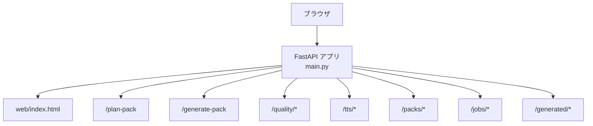
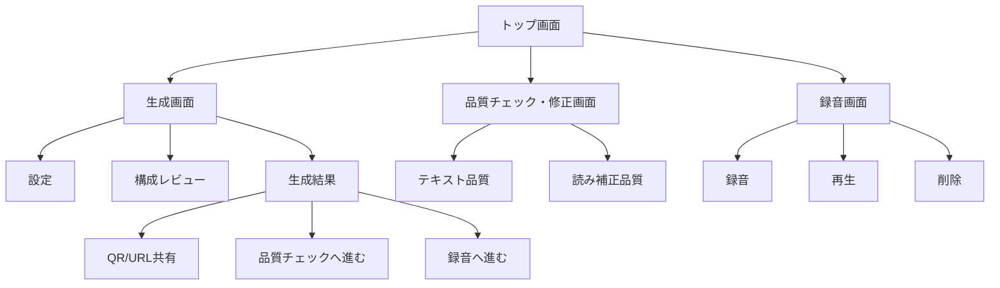
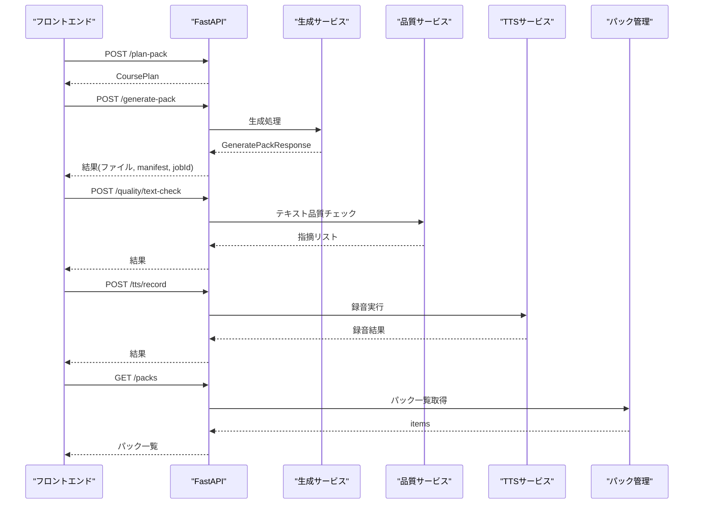
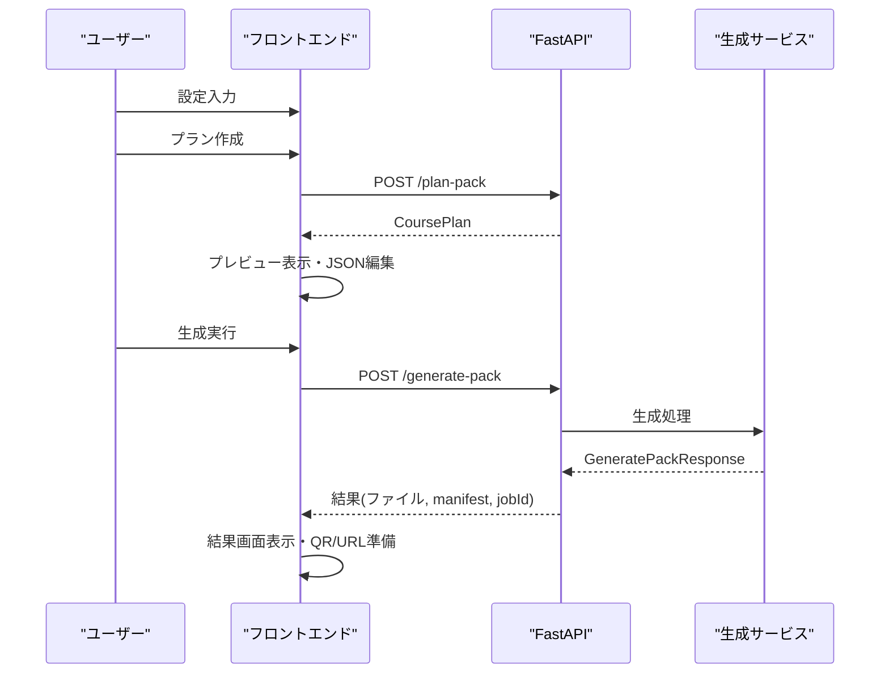
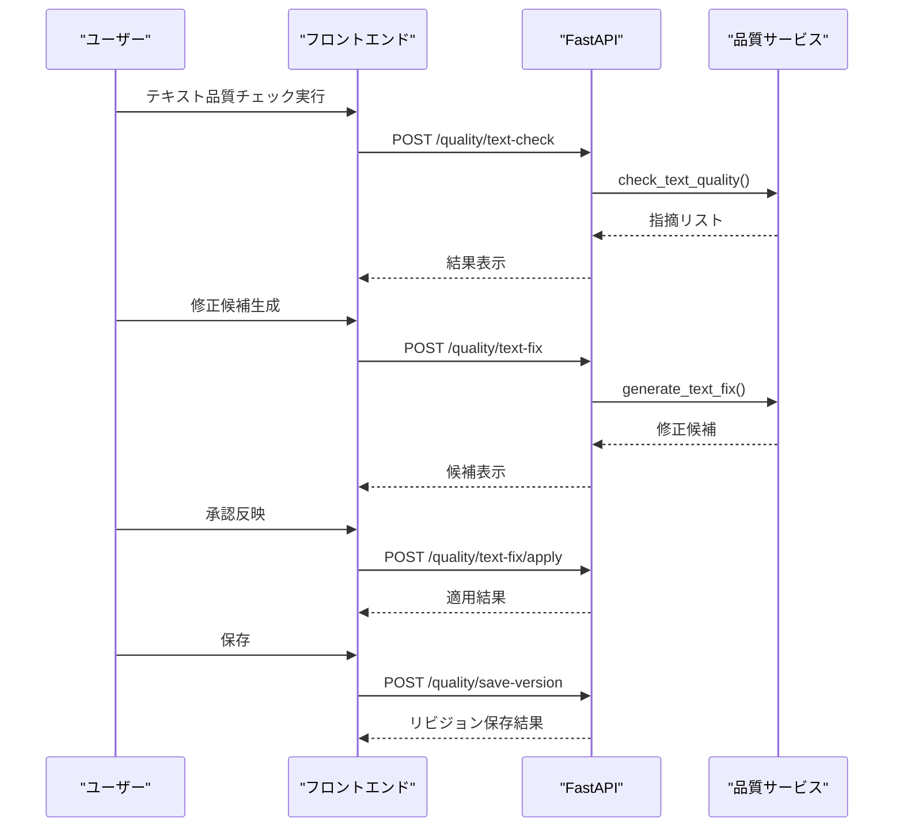
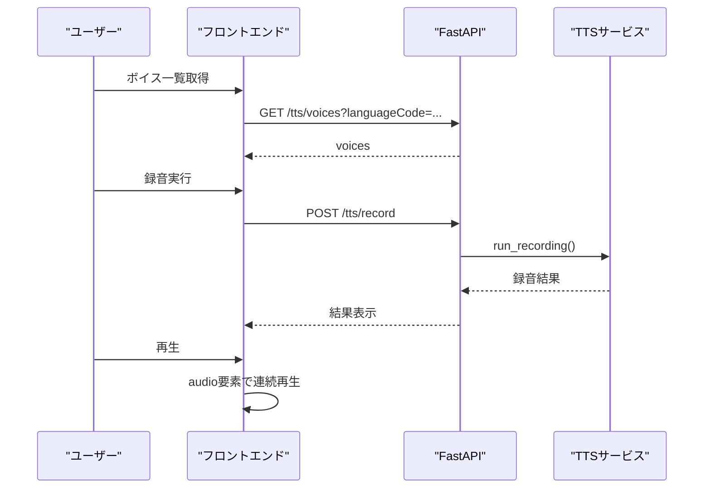
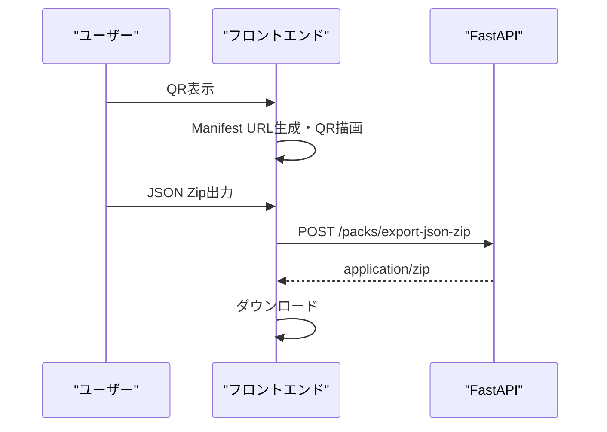
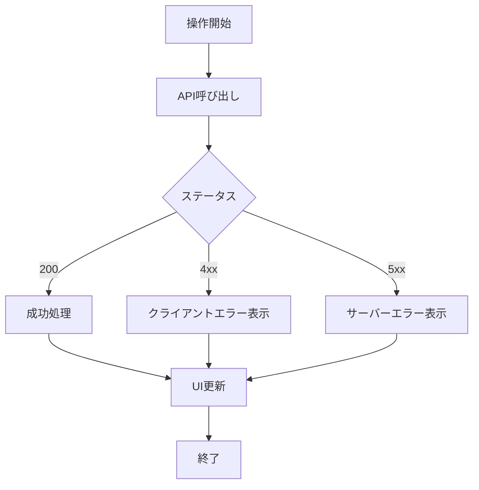

# フロントエンド（web/index.html）

<cite>
**この文書で参照しているファイル**
- [main.py](file://main.py)
- [web/index.html](file://web/index.html)
- [app/routes/plan.py](file://app/routes/plan.py)
- [app/routes/generate.py](file://app/routes/generate.py)
- [app/routes/quality_agents.py](file://app/routes/quality_agents.py)
- [app/routes/tts_recording.py](file://app/routes/tts_recording.py)
- [app/routes/packs.py](file://app/routes/packs.py)
- [app/routes/jobs.py](file://app/routes/jobs.py)
- [README.md](file://README.md)
</cite>

## 目次
1. [概要](#概要)
2. [プロジェクト構造と単一HTMLの役割](#プロジェクト構造と単一htmlの役割)
3. [画面構成の全体像](#画面構成の全体像)
4. [バックエンドAPIとの接続一覧](#バックエンドapiとの接続一覧)
5. [生成UIとフロー](#生成uiとフロー)
6. [品質チェック・修正UIとフロー](#品質チェック・修正uiとフロー)
7. [録音UIとフロー](#録音uiとフロー)
8. [共有UIとQR/Manifest連携](#共有uiとqrmanifest連携)
9. [状態管理とエラーハンドリング](#状態管理とエラーハンドリング)
10. [パフォーマンスとUXの留意点](#パフォーマンスとuxの留意点)
11. [トラブルシューティング](#トラブルシューティング)
12. [結論](#結論)

## 概要
Sokqa Studioは、FastAPIバックエンドと「web/index.html」1枚のバニラJSフロントエンドで構成されるWebアプリです。教材制作のワークフローを「プラン作成→生成→品質チェック・修正→TTS録音→共有」という流れで扱い、単一HTML内でタブとダイアログによる画面遷移を実現しています。本ドキュメントでは、この単一HTMLが提供する画面構成と、各工程でバックエンドAPIにどのように接続するかを体系的に解説します。

**セクションソース**
- [README.md:13-84](file://README.md#L13-L84)
- [main.py:11-39](file://main.py#L11-L39)

## プロジェクト構造と単一HTMLの役割
- ルートURL「/」はFastAPIにより「web/index.html」を配信するよう定義されています。これによりSPAフレームワークを使わず、ブラウザから直接Studio UIが開きます。
- バックエンドのAPIルーターは「plan」「generate」「jobs」「packs」「tts_recording」「quality_agents」「debug」など機能ごとに分割され、フロントエンドはこれらのエンドポイントへJSONリクエストを送信します。
- 生成された一時ファイルやZIPなどは「/generated」マウント配下に公開されます。

**図出典**
- [main.py:22-39](file://main.py#L22-L39)

**セクションソース**
- [main.py:11-39](file://main.py#L11-L39)
- [README.md:61-84](file://README.md#L61-L84)

## 画面構成の全体像
「web/index.html」には、以下の主要な画面領域が含まれます。

- 上部ツールバー
  - パック保存先プロファイル切替（審査用／公式公開用／開発用）
  - パック切り替えボタン
- ワークフローナビゲーション
  - STEP 01: パック生成
  - STEP 02: 品質チェック・修正
  - STEP 03: 録音
- 対象パック情報パネル
  - パックアイコン、名称、種別、リビジョン、ステータス表示
  - バージョン情報、パック編集、別のパックへの切り替え、未選択にする操作
- 生成画面
  - 設定タブ：テーマ、言語、規模、元資料、読み上げオプション、追加条件
  - 構成レビュータブ：プランプレビューとJSON編集
  - 生成結果タブ：ステータス、ファイル数、バリデーション結果、QR/URL共有、品質チェック・録音への遷移
- 品質チェック・修正画面
  - テキスト品質タブ：チェック実行、修正候補生成、承認反映、保存
  - 読み補正品質タブ：TTS品質チェック、LLMによる補正提案、保存
- 録音画面
  - 録音タブ：ユニット選択、テキストソース、音声選択、一括録音
  - 再生タブ：連続再生、速度調整
  - 削除タブ：録音済み選択、選択削除、全削除
- ダイアログ
  - パック切り替えダイアログ：一覧更新、インポート、衝突戦略、順序変更
  - パック編集ダイアログ：項目の並び替え・削除、新しいリビジョンとして保存
  - JSONエディタダイアログ：整形・検証・新しいリビジョンとして保存
  - バージョン情報ダイアログ：QRコード、インポート用URL、JSON Zip出力
  - 共通TTS辞書ダイアログ：ルール追加・JSON上書き・保存

[この図は概念図であり、特定のソースファイルを直接可視化しているわけではありません]

**セクションソース**
- [web/index.html:666-1122](file://web/index.html#L666-L1122)

## バックエンドAPIとの接続一覧
フロントエンドは主に「requestJson」「requestBlob」関数を通じてHTTP通信を行います。主なエンドポイントは以下の通りです。

- プラン作成
  - POST /plan-pack
  - POST /api/plan-suggest-conditions
- 生成
  - POST /generate-pack
  - GET /jobs/{job_id}
  - GET /jobs/{job_id}/prompts/download
- 品質
  - POST /quality/text-check
  - POST /quality/tts-check
  - POST /quality/text-fix
  - POST /quality/text-fix/apply
  - POST /quality/tts-fix
  - POST /quality/tts-fix/llm
  - POST /quality/save-version
- TTS録音
  - GET /tts/voices
  - POST /tts/recording-estimate
  - POST /tts/record
  - POST /tts/recording-reset
- パック管理
  - GET /packs
  - GET /packs/file
  - POST /packs/import
  - POST /packs/edit-manifest
  - POST /packs/delete
  - POST /packs/revise-tts
  - POST /packs/export-json-zip

**図出典**
- [app/routes/plan.py:12-22](file://app/routes/plan.py#L12-L22)
- [app/routes/generate.py:11-24](file://app/routes/generate.py#L11-L24)
- [app/routes/quality_agents.py:28-144](file://app/routes/quality_agents.py#L28-L144)
- [app/routes/tts_recording.py:11-60](file://app/routes/tts_recording.py#L11-L60)
- [app/routes/packs.py:20-95](file://app/routes/packs.py#L20-L95)
- [app/routes/jobs.py:15-87](file://app/routes/jobs.py#L15-L87)

**セクションソース**
- [web/index.html:4625-4776](file://web/index.html#L4625-L4776)
- [web/index.html:5090-5172](file://web/index.html#L5090-L5172)

## 生成UIとフロー
- 設定画面でテーマ・言語・規模・元資料・TTSオプション・追加条件を入力し、「プランを作成」を押すとバックエンドへ計画案をリクエストします。
- 構成レビュー画面でプランプレビューを確認し、必要に応じてJSONを編集できます。
- 「生成」を実行すると、バックエンドでドキュメント・クイズ・マニフェストが生成され、結果画面でステータス・ファイル数・バリデーション結果が表示されます。
- 生成結果画面から「品質チェックへ進む」「録音へ進む」へ遷移可能です。また、自動品質チェック有効時は生成完了後に品質チェックフローが起動します。

**図出典**
- [web/index.html:4625-4776](file://web/index.html#L4625-L4776)
- [app/routes/plan.py:12-22](file://app/routes/plan.py#L12-L22)
- [app/routes/generate.py:11-24](file://app/routes/generate.py#L11-L24)

**セクションソース**
- [web/index.html:720-920](file://web/index.html#L720-L920)
- [web/index.html:4625-4776](file://web/index.html#L4625-L4776)

## 品質チェック・修正UIとフロー
- テキスト品質タブでは「実行」で本文の品質チェックを行い、指摘リストを表示します。「候補生成」で修正案をLLMに依頼し、「承認反映」で適用、「保存」で新しいリビジョンとして保存します。
- 読み補正品質タブではTTS品質チェックを実行し、LLMによる補正提案やルールベースの修正を行います。適用後、「保存」でマニフェストを更新します。
- テキスト工程をスキップする操作も提供されており、ワークフローの柔軟性を確保しています。

**図出典**
- [app/routes/quality_agents.py:28-144](file://app/routes/quality_agents.py#L28-L144)

**セクションソース**
- [web/index.html:922-968](file://web/index.html#L922-L968)
- [web/index.html:5090-5097](file://web/index.html#L5090-L5097)

## 録音UIとフロー
- 録音タブでは、対象パックを選択してユニット一覧を表示し、未録音のみを選択したり、一括録音を実行できます。
- 再生タブでは、選択した録音を連続再生し、速度調整が可能です。
- 削除タブでは、録音済みの選択削除や全削除ができます。
- TTSボイス一覧はバックエンドから取得し、言語コードに基づいてフィルタリングされます。

**図出典**
- [app/routes/tts_recording.py:11-60](file://app/routes/tts_recording.py#L11-L60)

**セクションソース**
- [web/index.html:970-1028](file://web/index.html#L970-L1028)
- [web/index.html:5098-5153](file://web/index.html#L5098-L5153)

## 共有UIとQR/Manifest連携
- 生成結果画面またはバージョン情報ダイアログから、インポート用QRコードとManifest URLを表示できます。
- QRモードは「パック全体」または「このファイル」を選択可能で、Sokqaアプリへの導線を提供します。
- JSON Zip出力により、最新リビジョンのマニフェストと関連ファイルをダウンロードできます。

**図出典**
- [web/index.html:1072-1099](file://web/index.html#L1072-L1099)
- [app/routes/packs.py:83-95](file://app/routes/packs.py#L83-L95)

**セクションソース**
- [web/index.html:1072-1099](file://web/index.html#L1072-L1099)
- [web/index.html:4778-4799](file://web/index.html#L4778-L4799)

## 状態管理とエラーハンドリング
- フロントエンドはグローバル変数で現在のタブ、生成状態、品質状態、録音状態などを管理しています。
- エラー表示は「status」や進捗バーを用いて通知し、ユーザーにフィードバックします。
- バックエンドからのHTTPステータコード（400, 404, 422, 502, 503）に応じたエラーメッセージを提示します。
- ジョブIDを活用して生成結果やプロンプトのダウンロードを行うことで、長時間処理でも安定した体験を提供します。

[この図は概念図であり、特定のソースファイルを直接可視化しているわけではありません]

**セクションソース**
- [web/index.html:1160-1196](file://web/index.html#L1160-L1196)
- [web/index.html:4544-4623](file://web/index.html#L4544-L4623)

## パフォーマンスとUXの留意点
- 単一HTMLでの実装のため、DOM操作とイベントリスナーの肥大化に注意が必要です。
- 大量のJSONデータやZIPダウンロードは非同期処理とし、進捗表示でユーザーに状況を伝えます。
- TTS録音時のバッチ処理は、ユニット数を制限し、見積もりを表示することで負荷を抑制します。
- クリエイタープロファイルの切替時にパック一覧を再取得し、キャッシュを適切に更新します。

[このセクションは一般的なガイドラインであり、特定のファイル分析に基づくものではありません]

## トroubleシューティング
- 生成失敗時：502エラーが発生した場合、フォールバック文書の保存を避けるため、再生成かパラメータ調整を促すメッセージを表示します。
- 品質チェック失敗時：404や400エラーの場合は対象ファイルや入力の確認を行います。
- TTS録音失敗時：400エラーの場合は言語コードや音声名の妥当性を確認します。
- パック操作失敗時：404エラーの場合は存在しないリビジョンやcontentIdを指定していない可能性があります。

**セクションソース**
- [app/routes/generate.py:11-24](file://app/routes/generate.py#L11-L24)
- [app/routes/quality_agents.py:28-144](file://app/routes/quality_agents.py#L28-L144)
- [app/routes/tts_recording.py:11-60](file://app/routes/tts_recording.py#L11-L60)
- [app/routes/packs.py:20-95](file://app/routes/packs.py#L20-L95)

## 結論
「web/index.html」は、生成・品質・録音・共有のすべてのUIを単一ページで提供し、FastAPIバックエンドの各ルーティングとシームレスに連携しています。ユーザーはタブとダイアログによる直感的な操作で教材制作フローを進められ、バックエンドは堅牢なエラーハンドリングとジョブ管理によって安定した処理を支えています。この構成により、SPAフレームワークなしでも高機能なクリエイター向けスタジオを実現しています。

[このセクションは総括であり、特定のファイル分析に基づくものではありません]