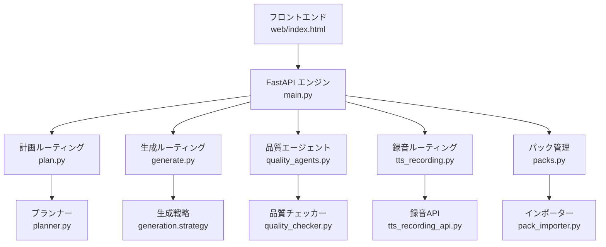
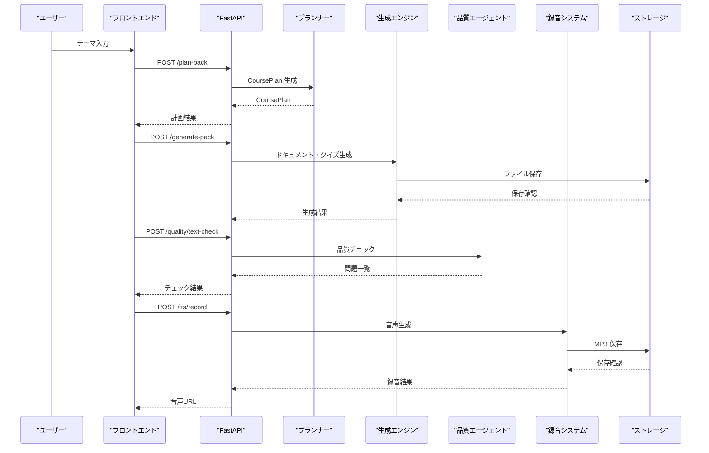
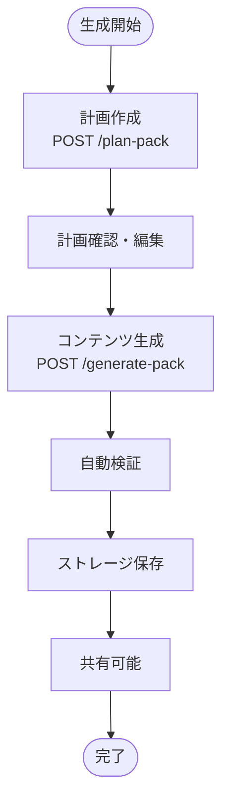
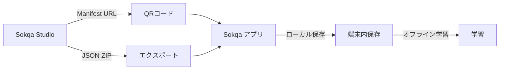
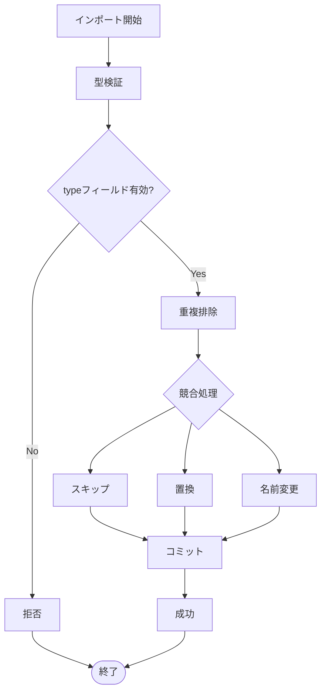
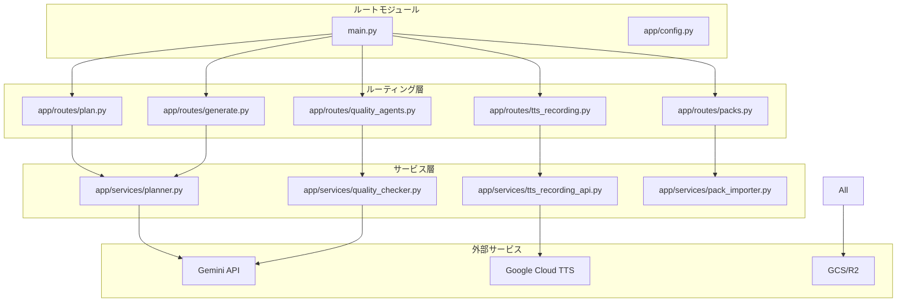

# プロジェクト概要と制作ワークフロー

<cite>
**この文書で参照したファイル**
- [README.md](file://README.md)
- [SPEC.md](file://docs/SPEC.md)
- [PROJECT_OVERVIEW.md](file://docs/PROJECT_OVERVIEW.md)
- [main.py](file://main.py)
- [app/config.py](file://app/config.py)
- [app/routes/plan.py](file://app/routes/plan.py)
- [app/routes/generate.py](file://app/routes/generate.py)
- [app/routes/quality_agents.py](file://app/routes/quality_agents.py)
- [app/routes/tts_recording.py](file://app/routes/tts_recording.py)
- [app/routes/packs.py](file://app/routes/packs.py)
- [app/services/planner.py](file://app/services/planner.py)
- [app/services/quality_checker.py](file://app/services/quality_checker.py)
- [app/services/tts_recording_api.py](file://app/services/tts_recording_api.py)
- [app/services/pack_importer.py](file://app/services/pack_importer.py)
</cite>

## 目次
1. [導入](#導入)
2. [プロジェクト構造](#プロジェクト構造)
3. [コアコンポーネント](#コアコンポーネント)
4. [アーキテクチャ概要](#アーキテクチャ概要)
5. [詳細コンポーネント分析](#詳細コンポーネント分析)
6. [依存関係分析](#依存関係分析)
7. [パフォーマンス考慮事項](#パフォーマンス考慮事項)
8. [トラブルシューティングガイド](#トラブルシューティングガイド)
9. [結論](#結論)
10. [付録](#付録)

## 導入
Sokqa Studio は、AI エージェントを活用して学習パックの企画・生成・品質チェック・修正・音声化・共有までを統合する Web アプリです。テーマを入力すると、教材設計案が作成され、ドキュメントとクイズが生成され、品質チェックで本文と読み上げテキストの問題が指摘され、必要に応じて修正候補が提案されます。その後、Google Cloud Text-to-Speech を使って音声を生成し、QR や Manifest URL で Sokqa アプリへ配布できます。

主な解決課題は以下の通りです。
- 学習パックを手作業で作成する負担を減らす
- ドキュメントとクイズの構成、生成、検証、修復、TTS 最適化、保存を一つの制作ラインとして扱う
- 読み上げ品質、本文品質、録音状態、共有 URL をリリース前に確認できるようにする
- パック更新時に revision と version を残し、Sokqa アプリ側が最新パックを参照しやすくする

教材制作の4ステップは「生成 → 共有 → 品質チェック → 録音」です。生成直後から QR や Manifest URL で共有でき、品質チェックや録音後もいつでも共有可能です。

**セクション出典**
- [README.md:13-33](file://README.md#L13-L33)
- [PROJECT_OVERVIEW.md:11-16](file://docs/PROJECT_OVERVIEW.md#L11-L16)

## プロジェクト構造
Sokqa Studio は FastAPI バックエンドと web/index.html の単一 HTML フロントエンドで構成されます。SPA フレームワークは使用しません。

**図出典**
- [main.py:22-29](file://main.py#L22-L29)
- [app/routes/plan.py:12-14](file://app/routes/plan.py#L12-L14)
- [app/routes/generate.py:11-16](file://app/routes/generate.py#L11-L16)
- [app/routes/quality_agents.py:28-47](file://app/routes/quality_agents.py#L28-L47)
- [app/routes/tts_recording.py:22-44](file://app/routes/tts_recording.py#L22-L44)
- [app/routes/packs.py:20-48](file://app/routes/packs.py#L20-L48)

**セクション出典**
- [main.py:11-39](file://main.py#L11-L39)
- [PROJECT_OVERVIEW.md:84-113](file://docs/PROJECT_OVERVIEW.md#L84-L113)

## コアコンポーネント
Sokqa Studio の主要なコンポーネントは以下の通りです。

### プランナー（Planner）
テーマ、対象ユーザー、難易度、スケール、言語、カスタム指示などを入力として CoursePlan を生成します。Planner は pack language に基づいてタイトル、説明、ドキュメントタイトル、クイズラベルを生成します。

### 生成エンジン（Generator）
CoursePlan を受け取り、ドキュメント JSON、クイズ JSON、Manifest を生成します。Strategy モードによって Standard または Language Learning の生成ロジックが選択されます。

### 品質エージェント（Quality Agents）
Text Quality Checker と TTS Quality Checker が実装されています。Text Quality Checker は事実誤り、スタイル、リークの検出を担当し、TTS Quality Checker は読み間違い、表記揺れ、二重発話、TTS テキスト不一致を検出します。

### 録音システム（TTS Recording）
Google Cloud Text-to-Speech を使用して MP3 音声を生成し、audio path / audio URL を各 JSON に反映します。見積もり、実行、リセットの機能を提供します。

### パック管理（Pack Management）
リスト表示、インポート、エクスポート、削除、マニフェスト編集などの操作を提供します。

**セクション出典**
- [app/services/planner.py:121-180](file://app/services/planner.py#L121-L180)
- [app/routes/generate.py:11-16](file://app/routes/generate.py#L11-L16)
- [app/services/quality_checker.py:97-102](file://app/services/quality_checker.py#L97-L102)
- [app/routes/tts_recording.py:22-44](file://app/routes/tts_recording.py#L22-L44)
- [app/routes/packs.py:20-96](file://app/routes/packs.py#L20-L96)

## アーキテクチャ概要
Sokqa Studio は HTML/JavaScript フロントエンド、FastAPI バックエンド、Google Cloud を組み合わせた制作支援システムです。

**図出典**
- [app/routes/plan.py:12-14](file://app/routes/plan.py#L12-L14)
- [app/routes/generate.py:11-16](file://app/routes/generate.py#L11-L16)
- [app/routes/quality_agents.py:28-47](file://app/routes/quality_agents.py#L28-L47)
- [app/routes/tts_recording.py:32-44](file://app/routes/tts_recording.py#L32-L44)

**セクション出典**
- [README.md:61-84](file://README.md#L61-L84)
- [PROJECT_OVERVIEW.md:84-137](file://docs/PROJECT_OVERVIEW.md#L84-L137)

## 詳細コンポーネント分析

### 教材制作ワークフロー
Sokqa Studio の教材制作は4つの段階で進行します。

#### 1. 生成（Generate）
`POST /plan-pack` で CoursePlan を作成し、`POST /generate-pack` で document JSON、quiz JSON、manifest を生成します。生成は Gemini 利用時と mock 利用時の両方に対応しています。

**図出典**
- [app/routes/plan.py:12-14](file://app/routes/plan.py#L12-L14)
- [app/routes/generate.py:11-16](file://app/routes/generate.py#L11-L16)

#### 2. 共有（Share）
生成完了後はすぐに QR コードまたは共有 URL を利用して学習パックを配布できます。品質チェックや録音は必要に応じて実行できます。

#### 3. 品質チェック（Quality Check）
AI が本文・クイズ・読み上げテキストをチェックし、必要に応じて修正候補を提案します。Text Quality Checker と TTS Quality Checker が独立して動作します。

#### 4. 録音（Recording）
Cloud Text-to-Speech を利用して録音対象を一括音声化します。高品質な MP3 を教材へ反映できます。

**セクション出典**
- [README.md:29-59](file://README.md#L29-L59)
- [PROJECT_OVERVIEW.md:25-83](file://docs/PROJECT_OVERVIEW.md#L25-L83)

### Sokqa アプリとの関係
Sokqa Studio は、学習アプリ Sokqa 向けの学習パック制作ツールです。Studio で作成した学習パックは Sokqa アプリへインポートできます。Sokqa アプリはログイン不要で、端末内に保存した学習パックを使ってローカル完結・オフライン学習できます。

**図出典**
- [README.md:175-182](file://README.md#L175-L182)

### インポート検証
pack_importer.py は Sokqa アプリへのインポート時にスキーマ type フィールドを厳密検証し、不正な manifest や reading-whitelist.json 等を拒否します。

**図出典**
- [app/services/pack_importer.py:20-105](file://app/services/pack_importer.py#L20-L105)

**セクション出典**
- [app/services/pack_importer.py:20-105](file://app/services/pack_importer.py#L20-L105)

## 依存関係分析
Sokqa Studio の主要な依存関係は以下の通りです。

**図出典**
- [main.py:22-29](file://main.py#L22-L29)
- [app/routes/plan.py:1-7](file://app/routes/plan.py#L1-L7)
- [app/routes/generate.py:1-6](file://app/routes/generate.py#L1-L6)
- [app/routes/quality_agents.py:1-22](file://app/routes/quality_agents.py#L1-L22)
- [app/routes/tts_recording.py:1-6](file://app/routes/tts_recording.py#L1-L6)
- [app/routes/packs.py:1-14](file://app/routes/packs.py#L1-L14)

**セクション出典**
- [main.py:22-29](file://main.py#L22-L29)
- [app/config.py:8-56](file://app/config.py#L8-L56)

## パフォーマンス考慮事項
- TTS 録音は `cloud_tts_recording_request_max_units` でバッチサイズを制限し、大量のユニットを分割して処理します
- 品質チェックは `MAX_QUALITY_INPUT_CHARS` で入力長を制限し、LLM 呼び出しの負荷を制御します
- ストレージは local、GCS、R2 のバックエンドをサポートし、環境に応じた最適な保存先を選択できます
- Gemini モデルはタスク別に個別指定可能で、ドキュメント生成、クイズ生成、プランニング、品質チェック、修正で異なるモデルを使用できます

**セクション出典**
- [app/config.py:50-56](file://app/config.py#L50-L56)
- [app/services/quality_checker.py:28-31](file://app/services/quality_checker.py#L28-L31)
- [app/services/tts_recording_api.py:78-118](file://app/services/tts_recording_api.py#L78-L118)

## トラブルシューティングガイド
- **生成失敗**: `RuntimeError` は 502 エラーとして返却され、フォールバック文書の保存を回避します
- **品質チェックエラー**: `QualityCheckError` は 502 エラーとして返却され、詳細メッセージが含まれます
- **ファイルが見つからない**: `FileNotFoundError` は 404 エラーとして返却されます
- **バリデーションエラー**: `ValueError` は 400 エラーとして返却され、原因を示す詳細メッセージが含まれます
- **インポート失敗**: 不正なスキーマタイプは ValueError として拒否されます

**セクション出典**
- [app/routes/generate.py:17-24](file://app/routes/generate.py#L17-L24)
- [app/routes/quality_agents.py:32-41](file://app/routes/quality_agents.py#L32-L41)
- [app/routes/tts_recording.py:26-30](file://app/routes/tts_recording.py#L26-L30)
- [app/routes/packs.py:46-50](file://app/routes/packs.py#L46-L50)

## 結論
Sokqa Studio は、AI エージェントを活用した教材制作のワークフローを統合的に提供します。生成・共有・品質チェック・録音の4ステップで、学習パックの制作から配布までを効率的に行えます。Sokqa アプリとの連携により、オフラインでの学習環境も実現可能です。

本システムは FastAPI ベースのモジュラーな設計を採用しており、拡張性と保守性を両立しています。Gemini API と Google Cloud TTS を活用することで、高品質な教材コンテンツを自動的に生成・最適化できます。

今後の改善点としては、UI の正式な情報設計の確定、管理者権限の仕様策定、本番運用時の制約条件の明確化などが挙げられます。

## 付録

### API エンドポイント一覧
- `/plan-pack`: 教材計画の作成
- `/generate-pack`: コンテンツの生成
- `/quality/text-check`: 本文品質チェック
- `/quality/tts-check`: TTS 品質チェック
- `/quality/text-fix`: 本文修正候補の生成
- `/quality/tts-fix`: TTS 修正の適用
- `/tts/recording-estimate`: 録音見積もり
- `/tts/record`: 音声録音の実行
- `/packs`: パック一覧の取得
- `/packs/import`: パックのインポート

**セクション出典**
- [app/routes/plan.py:12-22](file://app/routes/plan.py#L12-L22)
- [app/routes/generate.py:11-24](file://app/routes/generate.py#L11-L24)
- [app/routes/quality_agents.py:28-145](file://app/routes/quality_agents.py#L28-L145)
- [app/routes/tts_recording.py:11-61](file://app/routes/tts_recording.py#L11-L61)
- [app/routes/packs.py:20-96](file://app/routes/packs.py#L20-L96)