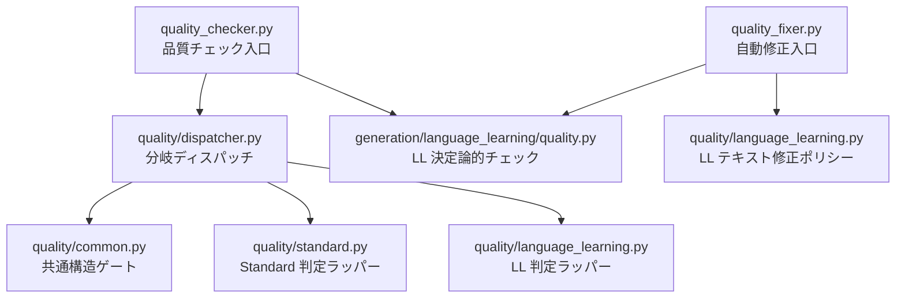
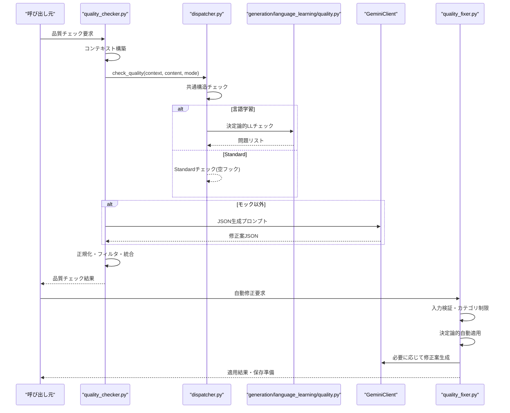
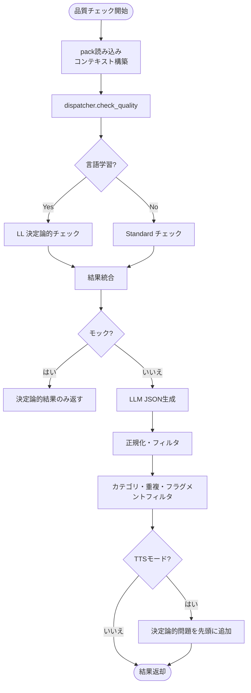
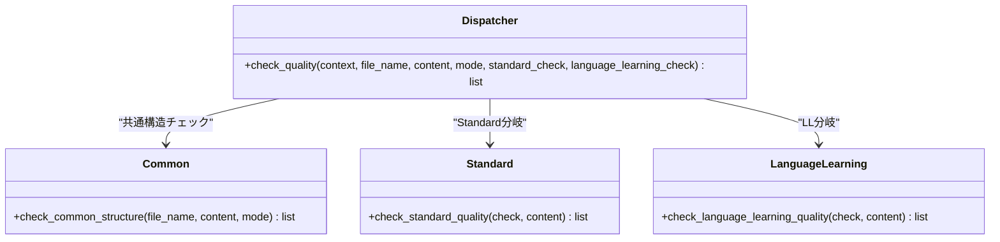
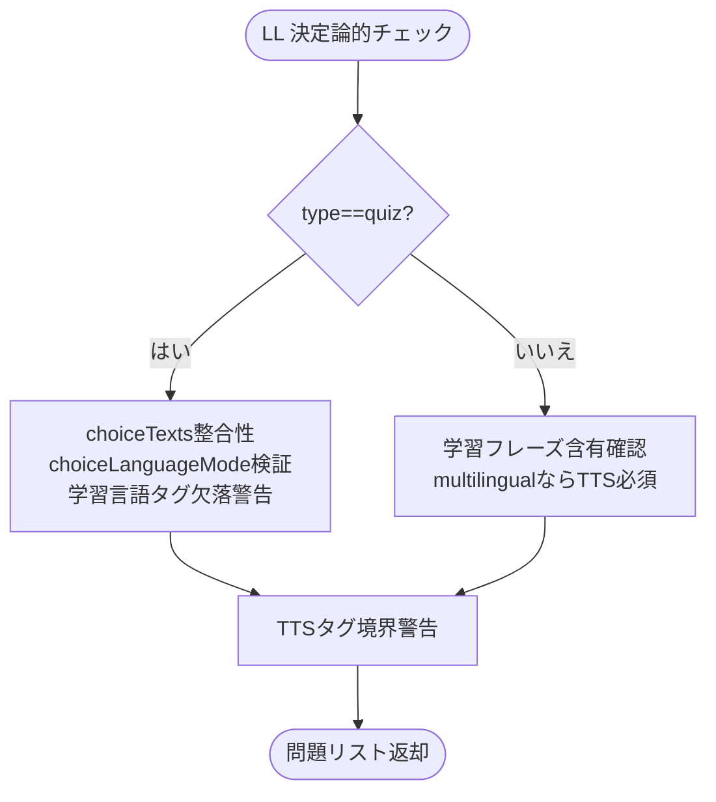
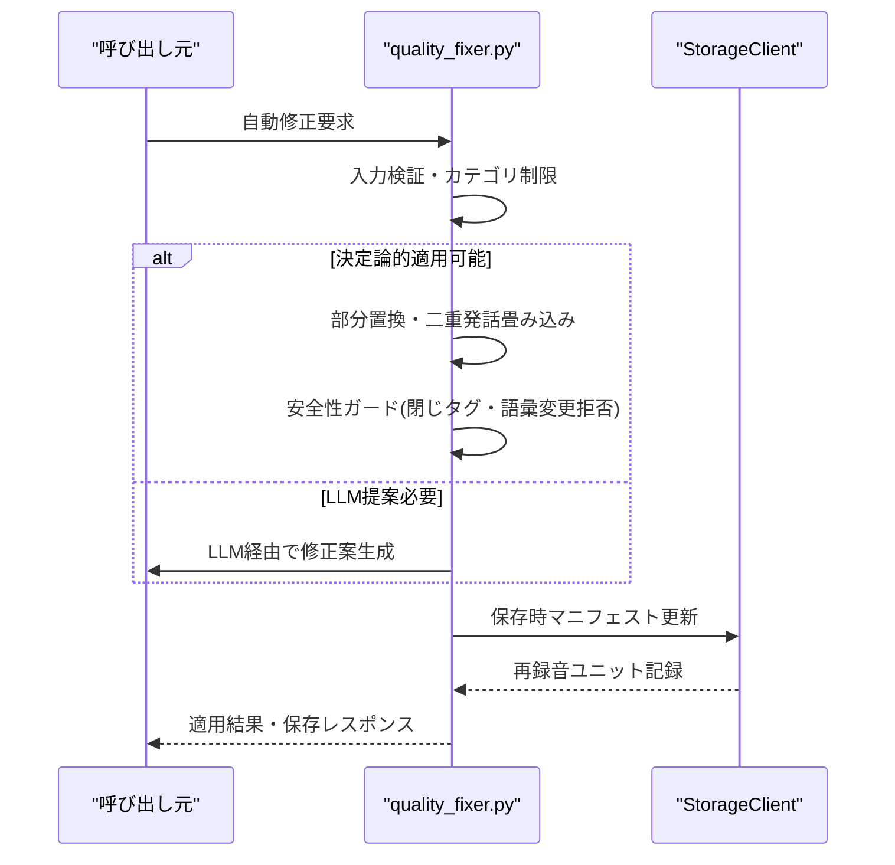
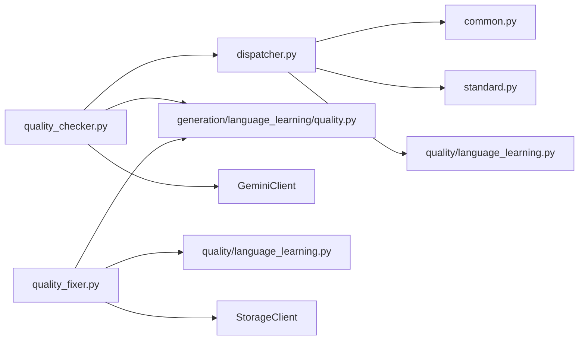

# 品質チェック・自動修正サブシステム

<cite>
**本ドキュメントで参照したファイル**
- [quality_checker.py](file://app/services/quality_checker.py)
- [quality_fixer.py](file://app/services/quality_fixer.py)
- [dispatcher.py](file://app/services/quality/dispatcher.py)
- [common.py](file://app/services/quality/common.py)
- [context.py](file://app/services/quality/context.py)
- [language_learning.py](file://app/services/quality/language_learning.py)
- [standard.py](file://app/services/quality/standard.py)
- [quality.py](file://app/services/generation/language_learning/quality.py)
- [generation_context.py](file://app/services/generation/context.py)
- [quality_schema.py](file://app/schemas/quality.py)
</cite>

## 目次
1. [概要](#概要)
2. [プロジェクト構造と役割分担の全体像](#プロジェクト構造と役割分担の全体像)
3. [コアコンポーネント](#コアコンポーネント)
4. [アーキテクチャ概要](#アーキテクチャ概要)
5. [詳細コンポーネント分析](#詳細コンポーネント分析)
6. [依存関係分析](#依存関係分析)
7. [パフォーマンス考慮事項](#パフォーマンス考慮事項)
8. [トラブルシューティングガイド](#トラブルシューティングガイド)
9. [結論](#結論)

## 概要
このサブシステムは、生成された教材コンテンツ（文章・クイズ）の品質を「検出」し、「修正案を提示・適用」する一連の処理を提供します。品質チェックでは共通構造検証と、Standard パック用ルール／言語学習用ルールを分岐して実行し、問題単位で構造化した結果を返します。自動修正では、決定論的に安全な TTS 関連問題を自動適用可能なものだけを選び出し、LLM を介さない高速パスと LLM による修正案生成パスの両方を提供します。また、保存時にテキスト変更や TTS 変更に応じて再録音が必要なユニットを記録し、マニフェスト更新まで連携します。

## プロジェクト構造と役割分担の全体像
品質チェック系は「入口エントリ」「ディスパッチャー」「共通構造」「Standard ルール」「言語学習ルール」に責務を分割しています。自動修正系は「TTS 自動修正」「テキスト修正提案」「適用・保存」に責務を分割しています。言語学習向け戦略は「決定論的 TTS 検証」「構造検証」「TTS タグ境界警告」を担います。

**図出典**
- [quality_checker.py:93-183](file://app/services/quality_checker.py#L93-L183)
- [dispatcher.py:12-25](file://app/services/quality/dispatcher.py#L12-L25)
- [common.py:8-18](file://app/services/quality/common.py#L8-L18)
- [standard.py:8-12](file://app/services/quality/standard.py#L8-L12)
- [language_learning.py:9-13](file://app/services/quality/language_learning.py#L9-L13)
- [quality.py:189-401](file://app/services/generation/language_learning/quality.py#L189-L401)
- [quality_fixer.py:103-187](file://app/services/quality_fixer.py#L103-L187)

**セクション出典**
- [quality_checker.py:93-183](file://app/services/quality_checker.py#L93-L183)
- [dispatcher.py:12-25](file://app/services/quality/dispatcher.py#L12-L25)
- [quality.py:189-401](file://app/services/generation/language_learning/quality.py#L189-L401)
- [quality_fixer.py:103-187](file://app/services/quality_fixer.py#L103-L187)

## コアコンポーネント
- quality_checker.py
  - 品質チェックのエントリポイント。pack の読み込み、コンテキスト構築、LLM モデル呼び出し、応答正規化、フィルタリング、ログ出力を担当。
  - Standard と Language Learning で異なるカテゴリ制約を適用し、TTS モードでは決定論的チェック結果を先頭に結合。
- quality/dispatcher.py
  - 共通構造チェックを実行後、コンテキストに基づいて Standard チェックまたは Language Learning チェックのいずれかを実行。
- generation/language_learning/quality.py
  - 語学教材固有の決定論的チェック：選択肢の言語状態、choiceTexts 整合性、学習フレーズ含有、TTS 必須条件、TTS タグ境界警告。
- quality_fixer.py
  - TTS 自動修正のプレビュー生成、LLM なし自動適用、LLM による修正案生成、承認済み修正の適用、保存時の再録音フラグ設定。
- quality/language_learning.py
  - 言語学習テキスト修正時の安全ポリシーと、ローカルカタカナからタグ付きラテンへの逆変換を検出して拒否するガード。
- quality/common.py, standard.py, context.py
  - 共通構造ゲートのフック、Standard ラッパー、QualityContext による Strategy 由来のモード判定。
- schemas/quality.py
  - 品質問題のスキーマ（カテゴリ、重大度、位置情報、抜粋、提案など）。

**セクション出典**
- [quality_checker.py:93-183](file://app/services/quality_checker.py#L93-L183)
- [dispatcher.py:12-25](file://app/services/quality/dispatcher.py#L12-L25)
- [quality.py:189-401](file://app/services/generation/language_learning/quality.py#L189-L401)
- [quality_fixer.py:103-187](file://app/services/quality_fixer.py#L103-L187)
- [language_learning.py:16-53](file://app/services/quality/language_learning.py#L16-L53)
- [common.py:8-18](file://app/services/quality/common.py#L8-L18)
- [standard.py:8-12](file://app/services/quality/standard.py#L8-L12)
- [quality_schema.py:1-39](file://app/schemas/quality.py#L1-L39)

## アーキテクチャ概要
品質チェックは「共通構造 → コンテキスト分岐 → カテゴリフィルタ → 結果統合」というパイプラインです。自動修正は「入力検証 → カテゴリ制限 → 決定論的自動適用 → LLM 提案 → 安全性検証 → 保存連携」となります。

**図出典**
- [quality_checker.py:93-183](file://app/services/quality_checker.py#L93-L183)
- [dispatcher.py:12-25](file://app/services/quality/dispatcher.py#L12-L25)
- [quality.py:189-401](file://app/services/generation/language_learning/quality.py#L189-L401)
- [quality_fixer.py:103-187](file://app/services/quality_fixer.py#L103-L187)

## 詳細コンポーネント分析

### quality_checker.py：品質チェックの統合窓口
- 機能
  - pack の読み込みと GenerationContext 構築により、Standard か Language Learning かを判断。
  - dispatcher に共通構造チェック＋内容チェックを委譲。
  - モック環境では LLM 呼び出しを省略し、決定論的チェック結果のみを返す。
  - LLM からの JSON 応答を正規化し、カテゴリ制限・重複除去・メタ提案フィルタ・フラグメント提案フィルタなどを適用。
  - TTS モードでは決定論的チェック結果を先頭に結合し、max_issues で上限制御。
- 重要ポイント
  - カテゴリ集合が text モードと tts モードで異なり、tts モードでは reading/double_utterance/notation/tts_text_mismatch/tts_language_boundary が対象。
  - 多言語パックでは閉じタグを含む提案や学習言語スパンのカタカナ化を除外。
  - 既存の読み補正済みや未発話記号の読み提案はフィルタリング。

**図出典**
- [quality_checker.py:93-183](file://app/services/quality_checker.py#L93-L183)
- [quality_checker.py:234-329](file://app/services/quality_checker.py#L234-L329)

**セクション出典**
- [quality_checker.py:93-183](file://app/services/quality_checker.py#L93-L183)
- [quality_checker.py:234-329](file://app/services/quality_checker.py#L234-L329)

### quality/dispatcher.py：Standard vs 言語学習の分岐
- 共通構造チェックを必ず実行し、その後にコンテキストに応じた内容チェックを呼び出す。
- Standard チェックは空フックとして残されており、将来のルール追加点として設計されている。
- 言語学習チェックは外部関数に委譲し、呼び出し側が具体的なルール実装を持つ。

**図出典**
- [dispatcher.py:12-25](file://app/services/quality/dispatcher.py#L12-L25)
- [common.py:8-18](file://app/services/quality/common.py#L8-L18)
- [standard.py:8-12](file://app/services/quality/standard.py#L8-L12)
- [language_learning.py:9-13](file://app/services/quality/language_learning.py#L9-L13)

**セクション出典**
- [dispatcher.py:12-25](file://app/services/quality/dispatcher.py#L12-L25)

### generation/language_learning/quality.py：言語学習向け戦略
- deterministic_tts_issues
  - クイズ限定：choiceTexts の長さ整合性、choiceLanguageMode による選択肢言語状態の検証、学習言語スパンの TTS タグ欠落警告。
- tts_language_boundary_issues
  - TTS タグ区間の空区間や非デフォルト言語タグ内に日本語文法要素が含まれる場合を警告。
- deterministic_ll_structure_issues
  - ドキュメント：学習フレーズ含有と multilingual での TTS 必須。
  - クイズ：問題文・選択肢・解説に学習フレーズが一切ない場合は ll_structure 警告。

**図出典**
- [quality.py:189-401](file://app/services/generation/language_learning/quality.py#L189-L401)

**セクション出典**
- [quality.py:189-401](file://app/services/generation/language_learning/quality.py#L189-L401)

### quality_fixer.py：自動修正の入口と適用フロー
- generate_tts_fix / generate_text_fix
  - カテゴリ制限（TTS は reading/double_utterance/notation/tts_text_mismatch、テキストは factual/style/leak）を適用。
  - モック時は LLM 呼び出しを省略し、決定論的自動適用のみでプレビューを返す。
- _generate_tts_fix_without_llm
  - excerpt 一致に基づく部分置換、二重発話畳み込み、語彙変更の回避、閉じタグの拒否、多言語パックでの不正修正拒否を経て自動適用。
- apply_auto_quality_fixes
  - 生成パイプライン内で直接 content を受け取り、言語学習モードかつ決定論的安全な TTS 問題のみを自動適用。
- save_quality_fix_version
  - テキスト変更と TTS 変更を検出し、再録音が必要なユニットをマニフェストに記録。

**図出典**
- [quality_fixer.py:103-187](file://app/services/quality_fixer.py#L103-L187)
- [quality_fixer.py:192-403](file://app/services/quality_fixer.py#L192-L403)
- [quality_fixer.py:405-486](file://app/services/quality_fixer.py#L405-L486)
- [quality_fixer.py:536-646](file://app/services/quality_fixer.py#L536-L646)

**セクション出典**
- [quality_fixer.py:103-187](file://app/services/quality_fixer.py#L103-L187)
- [quality_fixer.py:192-403](file://app/services/quality_fixer.py#L192-L403)
- [quality_fixer.py:405-486](file://app/services/quality_fixer.py#L405-L486)
- [quality_fixer.py:536-646](file://app/services/quality_fixer.py#L536-L646)

### quality/language_learning.py：言語学習テキスト修正ポリシー
- language_learning_text_fix_policy
  - 学習用語の削除禁止、TTS タグ境界の維持を明文化。
- is_local_katakana_to_tagged_latin_reversal
  - ローカルのカタカナ発音スパンが、新たにタグ付きラテン表示スパンへ置き換わるケースを拒否。これにより、学習表現の意図しない書き換えを防ぐ。

**セクション出典**
- [language_learning.py:16-53](file://app/services/quality/language_learning.py#L16-L53)

### スキーマ：品質問題の構造
- QualityIssue
  - カテゴリ、重大度、信頼度、位置情報、抜粋、問題説明、提案、元のテキスト。
- QualityCheckResponse
  - ファイル名、モデル、問題リスト、切り捨てフラグ。

**セクション出典**
- [quality_schema.py:1-39](file://app/schemas/quality.py#L1-L39)

## 依存関係分析
- quality_checker.py は dispatcher、LLM クライアント、言語検出、TTS 記録ターゲット、ストレージ、GenerationContext、言語学習品質モジュールに依存。
- dispatcher は common、standard、language_learning の各チェックモジュールに依存し、分岐ロジックのみを持つ。
- quality_fixer.py は quality_checker の再利用関数、言語学習品質モジュール、ストレージ、マニフェスト操作、再録音ユニット管理に依存。
- 言語学習品質モジュールはスキーマ、LLM JSON パースコンテキスト、言語検出ツールに依存。

**図出典**
- [quality_checker.py:93-183](file://app/services/quality_checker.py#L93-L183)
- [dispatcher.py:12-25](file://app/services/quality/dispatcher.py#L12-L25)
- [quality_fixer.py:103-187](file://app/services/quality_fixer.py#L103-L187)

**セクション出典**
- [quality_checker.py:93-183](file://app/services/quality_checker.py#L93-L183)
- [dispatcher.py:12-25](file://app/services/quality/dispatcher.py#L12-L25)
- [quality_fixer.py:103-187](file://app/services/quality_fixer.py#L103-L187)

## パフォーマンス考慮事項
- モック環境では LLM 呼び出しを省略し、決定論的チェックのみで高速に結果を返す。
- TTS モードでは決定論的チェック結果を先に結合し、max_issues で上限制御することで応答サイズを抑える。
- 自動修正は excerpt 一致に基づく部分置換を優先し、破壊的な全体上書きを避けることで安全かつ効率的。
- 二重発話畳み込みは正規化後の比較で判定し、不要な LLM 呼び出しを減らす。

[このセクションは一般的なガイダンスであり、特定のファイル解析を含みません]

## トroubleshootingガイド
- 品質チェックで異常終了する場合
  - LLM 呼び出し失敗時は QualityCheckError が発生。retry 機構があり、最終失敗時はエラーメッセージを確認。
  - 応答検証失敗時は ValidationError や ValueError が発生。スキーマ不整合や不正な JSON 構造の可能性。
- 自動修正が適用されない場合
  - カテゴリ制限により対象外の場合がある。TTS 自動修正は reading/double_utterance/notation/tts_text_mismatch のみ。
  - 閉じタグを含む修正や語彙変更とみなされる場合は拒否。
  - 多言語パックでは学習言語スパンのカタカナ化や閉じタグ付与は許可されない。
- 再録音が必要とマークされる理由
  - テキスト変更または TTS 変更があった場合、マニフェストに再録音ユニットとして記録される。

**セクション出典**
- [quality_checker.py:131-183](file://app/services/quality_checker.py#L131-L183)
- [quality_fixer.py:285-341](file://app/services/quality_fixer.py#L285-L341)
- [quality_fixer.py:536-646](file://app/services/quality_fixer.py#L536-L646)

## 結論
品質チェック・自動修正サブシステムは、共通構造検証を基盤とし、Standard と言語学習で明確に分岐する設計を採用しています。言語学習向け戦略は決定論的チェックを重視し、TTS タグと学習フレーズの整合性を保証します。自動修正は安全な範囲で自動適用し、LLM による提案は慎重にフィルタリングして適用します。これにより、教材生成の品質を一貫して担保しつつ、運用負荷を低減できます。