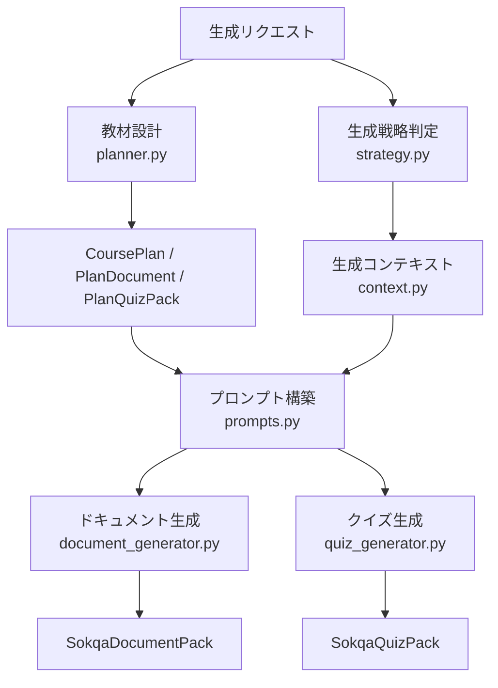
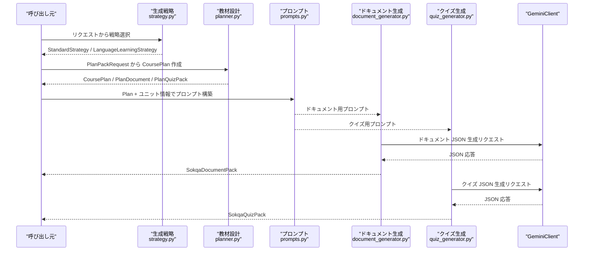
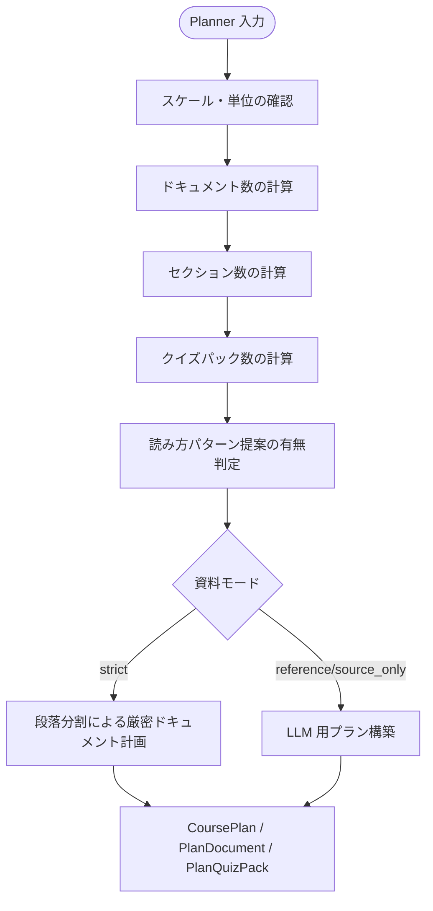
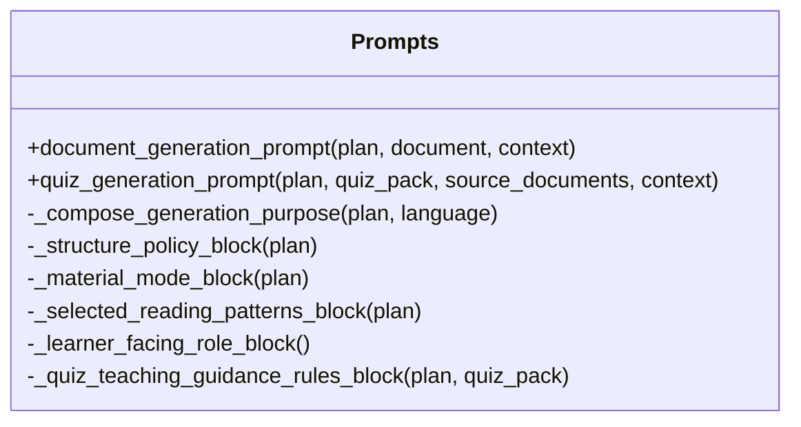
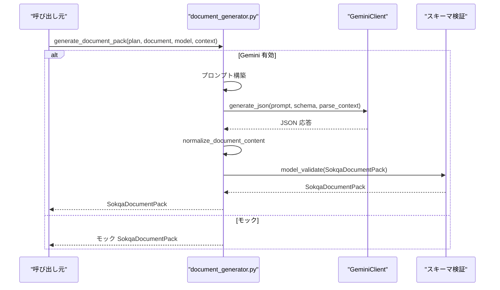
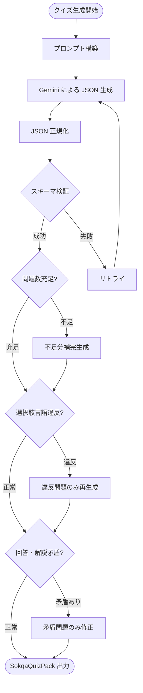
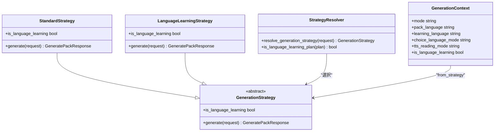
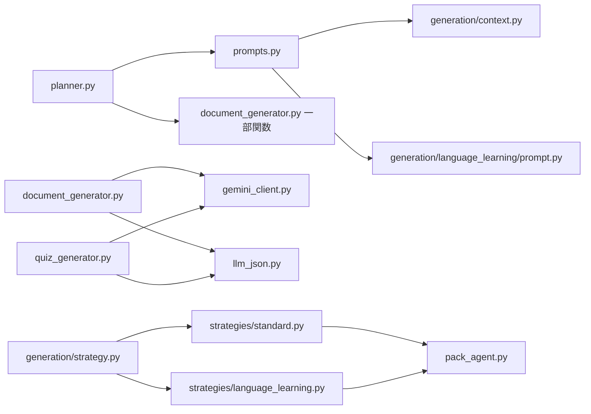

# 生成パイプライン: Planner・Prompt・Generator

<cite>
**本ドキュメントで参照したファイル**
- [app/services/planner.py](file://app/services/planner.py)
- [app/services/prompts.py](file://app/services/prompts.py)
- [app/services/document_generator.py](file://app/services/document_generator.py)
- [app/services/quiz_generator.py](file://app/services/quiz_generator.py)
- [app/services/generation/strategy.py](file://app/services/generation/strategy.py)
- [app/services/generation/context.py](file://app/services/generation/context.py)
- [app/services/generation/strategies/language_learning.py](file://app/services/generation/strategies/language_learning.py)
- [app/services/generation/strategies/standard.py](file://app/services/generation/strategies/standard.py)
</cite>

## 目次
1. [概要](#概要)
2. [プロジェクト構造と生成パイプラインの位置づけ](#プロジェクト構造と生成パイプラインの位置づけ)
3. [コアコンポーネント](#コアコンポーネント)
4. [アーキテクチャ全体像](#アーキテクチャ全体像)
5. [詳細コンポーネント分析](#詳細コンポーネント分析)
6. [依存関係分析](#依存関係分析)
7. [パフォーマンスと信頼性の特徴](#パフォーマンスと信頼性の特徴)
8. [トラブルシューティング](#トラブルシューティング)
9. [結論](#結論)

## 概要
このドキュメントは、Sokqa Studio の教材生成パイプラインにおいて、教材設計を行う Planner、LLM に投げるプロンプトを構築する Prompts、実際のドキュメントとクイズを生成する Document/Quiz Generator、そして標準教材か語学教材かを判定して処理を分岐する Generation Strategies の関係を解説します。

Planner はリクエストから「章構成」「セクション数」「クイズパックの数や範囲」などの CoursePlan を策定し、Prompts はその Plan と各ユニット情報に基づいて LLM への入力を組み立てます。Document/Quiz Generator は Gemini 経由で JSON を取得し、正規化・検証を経て最終的な教材データに仕上げます。Generation Strategies はリクエストまたは Plan から「通常教材」と「語学教材」を判定し、後続の品質チェックやプロンプト選択に影響する GenerationContext を提供します。

## プロジェクト構造と生成パイプラインの位置づけ
- Planner は `app/services/planner.py` で、CoursePlan や PlanDocument、PlanQuizPack を作成します。
- Prompts は `app/services/prompts.py` で、ドキュメント用とクイズ用のプロンプトを組み立てます。
- Document/Quiz Generator は `app/services/document_generator.py`、`app/services/quiz_generator.py` で、GeminiClient を呼び出し、JSON を正規化してパッケージにまとめます。
- Generation Strategies は `app/services/generation/strategy.py` および `strategies/standard.py`、`strategies/language_learning.py` で、リクエストから戦略を選択し、`generation/context.py` が Context を生成します。

**図出典**
- [app/services/planner.py:429-554](file://app/services/planner.py#L429-L554)
- [app/services/prompts.py:587-666](file://app/services/prompts.py#L587-L666)
- [app/services/document_generator.py:128-155](file://app/services/document_generator.py#L128-L155)
- [app/services/quiz_generator.py:56-119](file://app/services/quiz_generator.py#L56-L119)
- [app/services/generation/strategy.py:66-77](file://app/services/generation/strategy.py#L66-L77)
- [app/services/generation/context.py:37-54](file://app/services/generation/context.py#L37-L54)

**セクション出典**
- [app/services/planner.py:429-554](file://app/services/planner.py#L429-L554)
- [app/services/prompts.py:587-666](file://app/services/prompts.py#L587-L666)
- [app/services/document_generator.py:128-155](file://app/services/document_generator.py#L128-L155)
- [app/services/quiz_generator.py:56-119](file://app/services/quiz_generator.py#L56-L119)
- [app/services/generation/strategy.py:66-77](file://app/services/generation/strategy.py#L66-L77)
- [app/services/generation/context.py:37-54](file://app/services/generation/context.py#L37-L54)

## コアコンポーネント
- Planner：リクエストのテーマ、対象ユーザー、難易度、スケール、資料モードなどから、教材の章構成とクイズパックの計画を作成します。また、TTS 向け読み方パターン提案や、厳密な資料コピー用ドキュメント計画も扱います。
- Prompts：Plan と各ユニット情報から、学習者向けの本文・設問・選択肢・解説が出力されるよう、構造化ポリシー、資料モード、読取規則、言語ルール、品質ルールなどを組み立てたプロンプトを作成します。
- Document Generator：Gemini にドキュメント用プロンプトを送信し、返された JSON を正規化して SokqaDocumentPack に変換します。失敗時はリトライとログ記録を行います。
- Quiz Generator：Gemini にクイズ用プロンプトを送信し、返された JSON を正規化して SokqaQuizPack に変換します。不足問題の補完、選択肢言語違反の是正、回答と解説の矛盾修正などの品質ガードを実装しています。
- Generation Strategies：リクエストまたは Plan から「語学教材かどうか」を判定し、StandardStrategy または LanguageLearningStrategy を選択します。これにより、後続のプロンプト選択や品質処理の分岐が決まります。

**セクション出典**
- [app/services/planner.py:121-180](file://app/services/planner.py#L121-L180)
- [app/services/planner.py:429-554](file://app/services/planner.py#L429-L554)
- [app/services/prompts.py:587-666](file://app/services/prompts.py#L587-L666)
- [app/services/prompts.py:669-800](file://app/services/prompts.py#L669-L800)
- [app/services/document_generator.py:128-155](file://app/services/document_generator.py#L128-L155)
- [app/services/quiz_generator.py:56-119](file://app/services/quiz_generator.py#L56-L119)
- [app/services/generation/strategy.py:21-46](file://app/services/generation/strategy.py#L21-L46)
- [app/services/generation/strategy.py:66-77](file://app/services/generation/strategy.py#L66-L77)

## アーキテクチャ全体像
生成パイプラインは「設計 → プロンプト → 生成 → 正規化 → 品質ガード」の流れで動きます。Planner が CoursePlan を作り、Prompts が LLM への指示文を構築し、Document/Quiz Generator が Gemini を使って JSON を取得・正規化します。Generation Strategies は「標準教材」か「語学教材」かで後続の動作を制御します。

**図出典**
- [app/services/generation/strategy.py:66-77](file://app/services/generation/strategy.py#L66-L77)
- [app/services/planner.py:429-554](file://app/services/planner.py#L429-L554)
- [app/services/prompts.py:587-666](file://app/services/prompts.py#L587-L666)
- [app/services/document_generator.py:128-155](file://app/services/document_generator.py#L128-L155)
- [app/services/quiz_generator.py:56-119](file://app/services/quiz_generator.py#L56-L119)

## 詳細コンポーネント分析

### Planner：教材設計の中心
Planner はリクエストのスケール、単位、資料モード、TTS モード、言語、構造方針などを考慮して、以下のものを決定します。
- ドキュメント数：スケールや明示指定から計算し、クイズのみなら 0 にできます。
- セクション数：各ドキュメントの targetSectionCount を 35〜50 の範囲で調整し、固定値やハッシュベースの分散ロジックを使います。
- クイズパック数：ドキュメント数やスケールに応じて範囲別クイズと総合クイズを構成します。
- 読み方パターン提案：TTS モードが LLM 利用の場合、テーマに合った読み変換ルールを提案させます。
- 厳密資料モード：strict な資料コピーでは段落を分割し、LLM による書き換えなしでドキュメントを構成します。

**図出典**
- [app/services/planner.py:121-180](file://app/services/planner.py#L121-L180)
- [app/services/planner.py:227-276](file://app/services/planner.py#L227-L276)
- [app/services/planner.py:429-554](file://app/services/planner.py#L429-L554)
- [app/services/planner.py:731-747](file://app/services/planner.py#L731-L747)

**セクション出典**
- [app/services/planner.py:121-180](file://app/services/planner.py#L121-L180)
- [app/services/planner.py:227-276](file://app/services/planner.py#L227-L276)
- [app/services/planner.py:429-554](file://app/services/planner.py#L429-L554)
- [app/services/planner.py:731-747](file://app/services/planner.py#L731-L747)

### Prompts：プロンプト構築の責任
Prompts は Plan とユニット情報から、以下のようなブロックを組み合わせてプロンプトを作成します。
- 目的関数：教材の用途（聞き流し、要約、読解、日本語学習）に応じた執筆方針。
- 構造化ポリシー：listening、summary、reading、japanese_learning によって文体や構成を制御。
- 資料モード：strict、source_only、reference によって外部情報の許容度を設定。
- 読取規則：選択された TTS 読み方パターンを提示し、本文での表記保持を指示。
- 品質ルール：プレースホルダー禁止、言語純粋性、JSON 出力ルール、完成教材品質。
- 話者の姿勢：学習者へ直接語る形式を強制し、伝聞・引用調を排除。
- クイズ特有のルール：選択肢の言語モード、説明の一貫性、統合クイズの制約。

**図出典**
- [app/services/prompts.py:167-242](file://app/services/prompts.py#L167-L242)
- [app/services/prompts.py:587-666](file://app/services/prompts.py#L587-L666)
- [app/services/prompts.py:669-800](file://app/services/prompts.py#L669-L800)

**セクション出典**
- [app/services/prompts.py:167-242](file://app/services/prompts.py#L167-L242)
- [app/services/prompts.py:587-666](file://app/services/prompts.py#L587-L666)
- [app/services/prompts.py:669-800](file://app/services/prompts.py#L669-L800)

### Document Generator：ドキュメント生成の実行
Document Generator は Plan と PlanDocument からドキュメント JSON を生成します。
- GeminiProvider が有効なら LLM 経由、そうでなければモック生成を使用。
- JSON 取得時に LLM JSON パースエラーが発生するとリトライし、ログに詳細を記録。
- 返された JSON を normalize_document_content で統一し、id、type、schemaVersion、language、documents などを確定。
- 学習者向けテキストから言語タグや不要な空白を除去し、安全な内容に整形。
- strict モードでは資料段落をそのまま分割してドキュメントを作成。

**図出典**
- [app/services/document_generator.py:128-155](file://app/services/document_generator.py#L128-L155)
- [app/services/document_generator.py:158-220](file://app/services/document_generator.py#L158-L220)
- [app/services/document_generator.py:284-330](file://app/services/document_generator.py#L284-L330)
- [app/services/document_generator.py:101-125](file://app/services/document_generator.py#L101-L125)

**セクション出典**
- [app/services/document_generator.py:128-155](file://app/services/document_generator.py#L128-L155)
- [app/services/document_generator.py:158-220](file://app/services/document_generator.py#L158-L220)
- [app/services/document_generator.py:284-330](file://app/services/document_generator.py#L284-L330)
- [app/services/document_generator.py:101-125](file://app/services/document_generator.py#L101-L125)

### Quiz Generator：クイズ生成と品質ガード
Quiz Generator は Plan と PlanQuizPack、生成済みドキュメントからクイズ JSON を生成し、複数の品質ガードを通します。
- 初回生成で不足問題があれば補完生成。
- 語学教材で選択肢の言語モード違反があれば、該当問題のみ再生成して是正。
- 回答と解説の矛盾があれば、一括レビュー後に矛盾のある問題だけ修正。
- 正規化時に answerIndex のバランス調整やフィールド整形を行い、最終的に SokqaQuizPack に変換。

**図出典**
- [app/services/quiz_generator.py:56-119](file://app/services/quiz_generator.py#L56-L119)
- [app/services/quiz_generator.py:216-283](file://app/services/quiz_generator.py#L216-L283)
- [app/services/quiz_generator.py:286-416](file://app/services/quiz_generator.py#L286-L416)
- [app/services/quiz_generator.py:419-499](file://app/services/quiz_generator.py#L419-L499)
- [app/services/quiz_generator.py:502-565](file://app/services/quiz_generator.py#L502-L565)

**セクション出典**
- [app/services/quiz_generator.py:56-119](file://app/services/quiz_generator.py#L56-L119)
- [app/services/quiz_generator.py:216-283](file://app/services/quiz_generator.py#L216-L283)
- [app/services/quiz_generator.py:286-416](file://app/services/quiz_generator.py#L286-L416)
- [app/services/quiz_generator.py:419-499](file://app/services/quiz_generator.py#L419-L499)
- [app/services/quiz_generator.py:502-565](file://app/services/quiz_generator.py#L502-L565)

### Generation Strategies：標準教材と語学教材の分岐
Generation Strategies はリクエストから「語学教材かどうか」を判定し、適切な戦略クラスを選択します。
- 系統A：learningLanguage が存在し、packLanguage と異なる場合。
- 系統B：structurePolicy が japanese_learning で、packLanguage が ja 以外の場合。
- 判定結果に応じて StandardStrategy か LanguageLearningStrategy を返し、後続の Quality チェックやプロンプト選択に影響します。
- GenerationContext は戦略とリクエストから作成され、is_language_learning や tts_reading_mode などの情報を下流に伝播させます。

**図出典**
- [app/services/generation/strategy.py:21-46](file://app/services/generation/strategy.py#L21-L46)
- [app/services/generation/strategy.py:66-77](file://app/services/generation/strategy.py#L66-L77)
- [app/services/generation/strategies/standard.py:17-23](file://app/services/generation/strategies/standard.py#L17-L23)
- [app/services/generation/strategies/language_learning.py:17-23](file://app/services/generation/strategies/language_learning.py#L17-L23)
- [app/services/generation/context.py:13-54](file://app/services/generation/context.py#L13-L54)

**セクション出典**
- [app/services/generation/strategy.py:21-46](file://app/services/generation/strategy.py#L21-L46)
- [app/services/generation/strategy.py:66-77](file://app/services/generation/strategy.py#L66-L77)
- [app/services/generation/strategies/standard.py:17-23](file://app/services/generation/strategies/standard.py#L17-L23)
- [app/services/generation/strategies/language_learning.py:17-23](file://app/services/generation/strategies/language_learning.py#L17-L23)
- [app/services/generation/context.py:13-54](file://app/services/generation/context.py#L13-L54)

## 依存関係分析
Planner は Prompts と Document Generator の一部関数をインポートし、CoursePlan 作成時の制約や TTS モードを反映します。Prompts は GenerationContext を受け取り、語学教材の場合は language_learning.prompt へ委譲します。Document/Quiz Generator は GeminiClient、LlmJsonParseContext、pack_ids、tagging などを組み合わせて JSON を取得・正規化します。Generation Strategies は pack_agent.generate_pack を呼び出すことで既存の生成フローを再利用しつつ、後続の品質処理を制御可能にしています。

**図出典**
- [app/services/planner.py:11-22](file://app/services/planner.py#L11-L22)
- [app/services/prompts.py:1-7](file://app/services/prompts.py#L1-L7)
- [app/services/document_generator.py:6-16](file://app/services/document_generator.py#L6-L16)
- [app/services/quiz_generator.py:6-21](file://app/services/quiz_generator.py#L6-L21)
- [app/services/generation/strategy.py:11-14](file://app/services/generation/strategy.py#L11-L14)
- [app/services/generation/strategies/standard.py:11-14](file://app/services/generation/strategies/standard.py#L11-L14)
- [app/services/generation/strategies/language_learning.py:11-14](file://app/services/generation/strategies/language_learning.py#L11-L14)

**セクション出典**
- [app/services/planner.py:11-22](file://app/services/planner.py#L11-L22)
- [app/services/prompts.py:1-7](file://app/services/prompts.py#L1-L7)
- [app/services/document_generator.py:6-16](file://app/services/document_generator.py#L6-L16)
- [app/services/quiz_generator.py:6-21](file://app/services/quiz_generator.py#L6-L21)
- [app/services/generation/strategy.py:11-14](file://app/services/generation/strategy.py#L11-L14)
- [app/services/generation/strategies/standard.py:11-14](file://app/services/generation/strategies/standard.py#L11-L14)
- [app/services/generation/strategies/language_learning.py:11-14](file://app/services/generation/strategies/language_learning.py#L11-L14)

## パフォーマンスと信頼性の特徴
- Planner はスケールやリクエストからドキュメント数・セクション数・クイズパック数を決定論的に計算し、LLM への負荷を抑制します。
- Document/Quiz Generator は JSON 生成失敗時に最大 3 回までリトライし、遅延を挟みながら安定性を高めています。
- Quiz Generator は問題数不足や選択肢言語違反を検知し、必要な部分のみ再生成することで全体の再実行コストを抑えます。
- 正規化処理では学習者向けテキストから言語タグや不要な記号を除去し、スキーマ検証前に内容を安全に整えます。
- Generation Context は一度作成された戦略判断を下流に伝播させるため、重複判定や矛盾したモード切り替えを防ぎます。

[このセクションは一般的な性能・信頼性の特徴を示しており、特定のファイル実装の詳細解析ではありません]

## トroubleshooting
- ドキュメント生成失敗：GeminiClient の JSON 応答が不正な場合、LlmJsonParseError が発生し、リトライ後に最終エラーとしてスローされます。保存は行われず、原因ログが残ります。
- クイズ生成失敗：同様に JSON パースエラーやスキーマ検証エラーが発生すると、リトライ後に RuntimeError として上位へ伝搬します。
- 選択肢言語違反：語学教材で pack/learning/auto モードに反する選択肢が含まれる場合、該当問題のみ再生成して是正を試みます。是正失敗時は元のクイズを保持し警告ログを残します。
- 問題数不足：questionCount より少ない場合、不足分のみ補完生成します。補完失敗時は元のコンテンツを維持します。
- 回答と解説の矛盾：語学教材で矛盾が検出されると、該当問題のみ修正プロンプトで再生成し、整合性を回復しようとします。

**セクション出典**
- [app/services/document_generator.py:158-220](file://app/services/document_generator.py#L158-L220)
- [app/services/quiz_generator.py:122-162](file://app/services/quiz_generator.py#L122-L162)
- [app/services/quiz_generator.py:286-416](file://app/services/quiz_generator.py#L286-L416)
- [app/services/quiz_generator.py:419-499](file://app/services/quiz_generator.py#L419-L499)
- [app/services/quiz_generator.py:502-565](file://app/services/quiz_generator.py#L502-L565)

## 結論
Planner、Prompts、Document/Quiz Generator、Generation Strategies はそれぞれ明確な責務を持ち、連携して教材生成パイプラインを構成しています。Planner が設計し、Prompts が LLM への指示を構築し、Generator が JSON を取得・正規化してパッケージ化します。Generation Strategies は標準教材と語学教材を判定し、後続の品質処理やプロンプト選択に影響を与えます。この分離により、拡張性・保守性・信頼性が確保されており、教材の品質と生成の安定性を両立させています。