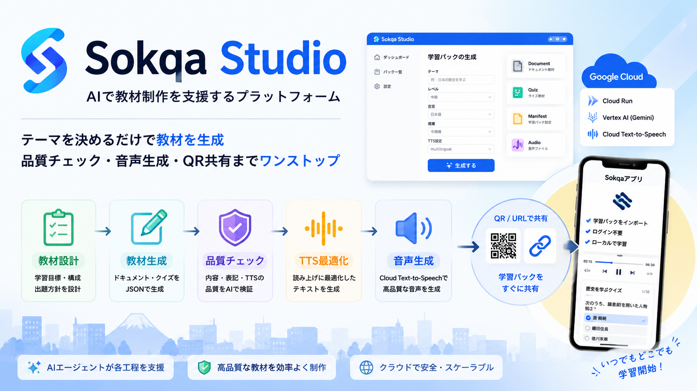
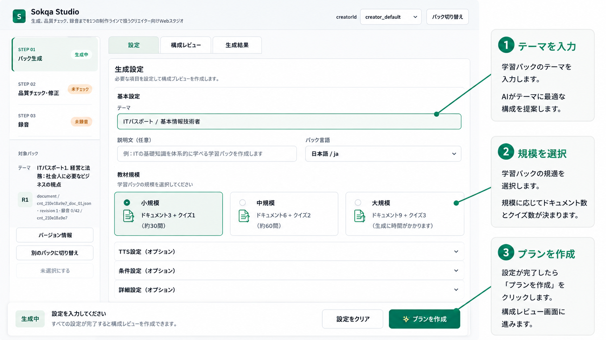
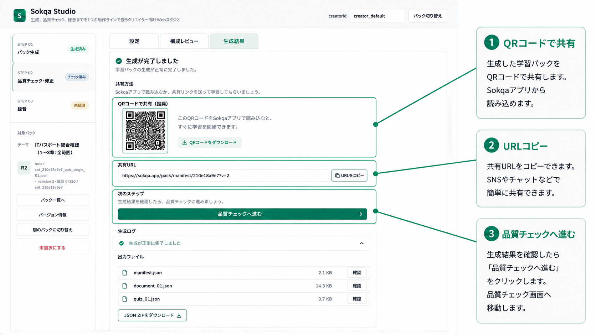
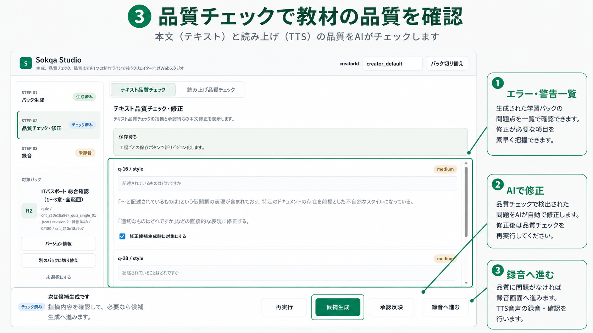
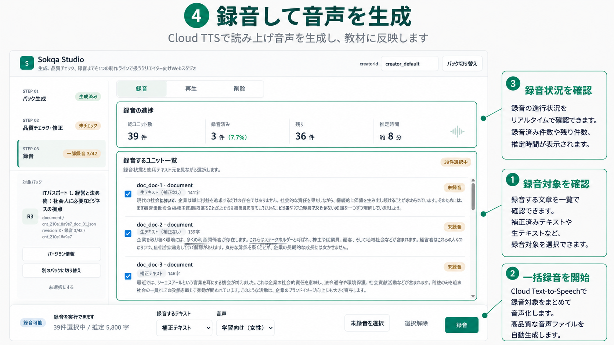
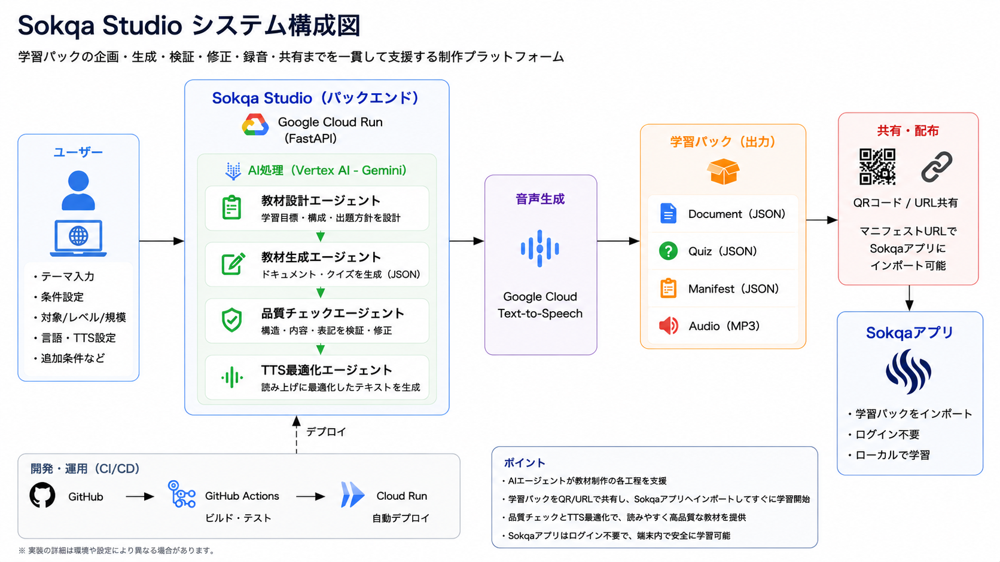

# Sokqa Studio

## Demo

Watch the Sokqa Studio demo video:

https://youtu.be/Bp8LoCt_U0I

This video demonstrates the complete workflow including learning pack generation, quality review, recording, and export.



## 概要

**Sokqa Studio** は、AIエージェントで教材制作を支援する Web プラットフォームです。  
テーマを入力するだけで、教材設計・生成・品質チェック・音声化・QR/Manifest共有までを一括で行えます。

AIが各工程を支援し、人は内容の確認と修正に集中できます。

## 主な特徴

- **AIによる教材設計**: テーマ、対象ユーザー、難易度から構成案を作成
- **ドキュメント・クイズの一括生成**: Sokqa 形式の document / quiz JSON と Manifest を生成
- **品質チェック**: 本文品質と読み補正品質を確認
- **音声教材生成**: 読み上げ用テキストを補正し、Google Cloud Text-to-Speech で音声を生成
- **QRコード共有**: Manifest URL を QR コード化し、Sokqa アプリへ導線を提供
- **Learning Pack 出力**: Document、Quiz、Manifest、Audio をまとめて学習パックとして管理

## Workflow

Sokqa Studioでは、教材制作を次の4ステップで進めます。

教材制作は「生成 → 品質チェック → 録音」の流れで進めます。学習パックは生成直後から共有でき、品質チェックや録音後もいつでも共有できます。

### 1. Generate Learning Pack

学習テーマを入力するだけで、AIが教材構成を設計し、ドキュメント・クイズを生成します。



### 2. Share Learning Pack

生成完了後はすぐにQRコードまたは共有URLを利用して学習パックを配布できます。  
品質チェックや録音は必要に応じて実行できます。



### 3. Quality Check & Fix

AIが本文・クイズ・読み上げテキストをチェックし、必要に応じて修正候補を提案します。



### 4. Generate Audio

Cloud Text-to-Speechを利用して録音対象を一括音声化します。  
高品質なMP3を教材へ反映できます。



## Architecture

### System Architecture



Sokqa Studio は、HTML/JavaScript フロントエンド、FastAPI バックエンド、Google Cloud を組み合わせた制作支援システムです。

| Area | Role |
| --- | --- |
| Frontend | `web/index.html` が生成、品質チェック、録音、共有の操作画面を提供します。 |
| Backend | FastAPI が計画作成、生成、品質チェック、録音、パック管理の API を提供します。 |
| Storage | local と Google Cloud Storage に対応し、生成物と Manifest を保存します。 |
| LLM | Google GenAI / Vertex AI 経由で Gemini を利用できます。mock provider も用意されています。 |
| Cloud | GitHub Actions から Cloud Run へデプロイする構成です。 |

制作フローの中では、主に次の役割が連携します。

- **Planner**: 教材パックの構成案を作成します。
- **Generator**: ドキュメント、クイズ、Manifest を生成します。
- **Quality**: 本文と読み補正の品質問題を検出し、修正候補を作ります。
- **TTS**: 読み上げ用テキストの補正と音声生成を扱います。

詳細な仕様は `docs/SPEC.md` と `docs/AGENT_DESIGN.md` を参照してください。

## Tech Stack

| Technology | Purpose |
| --- | --- |
| Python | バックエンド実装 |
| FastAPI | API と Web UI 配信 |
| HTML / JavaScript | フロントエンド |
| Google GenAI / Vertex AI | Gemini による計画、生成、品質チェック、補正 |
| Google Cloud Text-to-Speech | 音声生成 |
| Google Cloud Storage | 生成物と Manifest の保存 |
| Cloud Run | アプリケーション実行環境 |
| GitHub Actions | main ブランチへの push と手動実行による Cloud Run デプロイ |
| pytest | 自動テスト |

## Local Setup

### Install

```bash
python -m venv .venv
.venv\Scripts\activate
pip install -r requirements.txt
```

### Environment Variables

設定値は `.env.example` と `app/config.py` で確認できます。主な環境変数は次の通りです。

```env
APP_ENV
SOKQA_AUTHOR
PUBLIC_BASE_URL
STORAGE_BACKEND
LOCAL_STORAGE_DIR
TTS_RULES_PATH
TTS_USER_RULES_PATH
TTS_READING_MODE
TTS_CREDIT_PER_CHAR
CLOUD_TTS_LANGUAGE_CODE
CLOUD_TTS_VOICE
CLOUD_TTS_SPEAKING_RATE
CLOUD_TTS_PITCH
CLOUD_TTS_MAX_CONCURRENCY
CLOUD_TTS_RECORDING_REQUEST_MAX_UNITS
GCS_BUCKET
GCS_PREFIX
DEFAULT_CREATOR_ID
ALLOWED_MANIFEST_DOMAINS
GEMINI_PROVIDER
GEMINI_MODEL
GEMINI_MODEL_DOC
GEMINI_MODEL_QUIZ
GEMINI_MODEL_PLANNER
GEMINI_MODEL_QUALITY
GEMINI_MODEL_FIX
GOOGLE_CLOUD_PROJECT
GOOGLE_CLOUD_LOCATION
GOOGLE_GENAI_USE_VERTEXAI
```

### Run

```bash
uvicorn main:app --reload
```

ローカルでは `http://127.0.0.1:8000/` で Studio UI、`http://127.0.0.1:8000/docs` で Swagger UI を開けます。

Dockerfile では Cloud Run 向けに `uvicorn main:app --host 0.0.0.0 --port 8080` で起動します。

### Test

```bash
python -m pytest tests/ --basetemp .pytest_tmp -ra
```

## Deployment

デプロイは GitHub Actions で定義されています。

- Workflow: `.github/workflows/deploy-cloud-run.yml`
- Trigger: `main` ブランチへの push、または手動実行
- Deploy target: Cloud Run
- Cloud Run サービス名: `sokqa-course-pack-agent`
- Region: `asia-northeast1`
- Auth: Workload Identity Provider と Service Account を GitHub Secrets から利用

README 上のプロジェクト名は `Sokqa Studio` ですが、Cloud Run サービス名は現在 `sokqa-course-pack-agent` として定義されています。

## Related Project

Sokqa Studio は、学習アプリ **Sokqa** 向けの学習パック制作ツールです。

Studio で作成した学習パックは Sokqa アプリへインポートできます。Sokqa アプリはログイン不要で、端末内に保存した学習パックを使ってローカル完結・オフライン学習できます。

- Sokqa App: https://convly.jp/sokqa/

## Hackathon

Sokqa Studio は、教材制作を単発の生成ではなく、設計、生成、確認、音声化、共有まで続くワークフローとして扱うために作りました。

Cloud Run と GitHub Actions によるデプロイ構成を採用し、AIを使った制作体験と運用しやすい開発フローの両方を意識しています。DevOps × AI Agent Hackathon 提出作品です。

## License

MIT License
